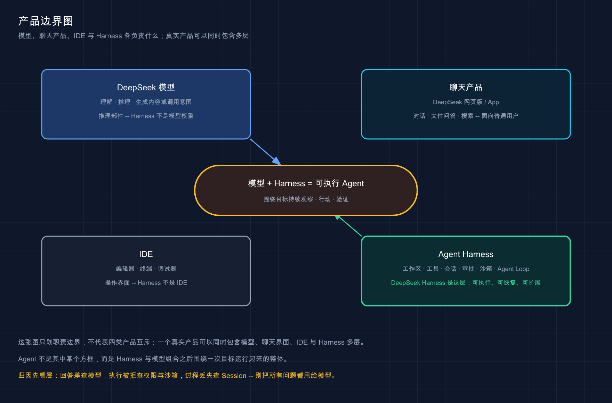

# 01 · DeepSeek Harness 是什么

> 📚 **系列导航**：这是 DeepSeek Harness 中文教程的第一篇。先不安装，也不碰 API Key，咱们只解决一个最容易被名字带偏的问题：DeepSeek Harness 到底是什么，为什么它值得单独做一套教程。

> [!WARNING] Developer Preview
> 本文事实按 DeepSeek Harness `0.1.1-rc.2` 与官方 commit `b150a55` 复核；Developer Preview 阶段版本变化快，动手前请先核对自己安装的版本。

很多人看到「DeepSeek」四个字，第一反应是模型；看到「Harness」，又以为是某个套壳聊天工具。

都不准确。

**DeepSeek Harness 不是一个新模型，也不是普通聊天客户端。它是一套把模型变成可执行 Agent 的开源运行框架。** 模型负责理解和推理，Harness 负责把工作区、工具、会话、审批、沙箱和任务循环接起来，让模型真的能在代码仓库里做事。

这也是本系列的核心判断：**DeepSeek 模型决定能力上限，DeepSeek Harness 决定模型能不能在真实环境里把任务稳定做完。**

**看完这一篇，你会拿到：**

- 一句话讲清 DeepSeek Harness 是什么，不再把它和 DeepSeek 模型混为一谈
- 一张边界表，分清模型、聊天产品、IDE 与 Harness 各自负责什么
- 看懂它为什么强调「一切皆插件」，以及这种设计对普通用户有什么实际影响
- 知道它当前适合谁、不适合谁，避免在 Developer Preview 阶段抱错预期
- 一个不安装软件的版本核对动作，确认教程固定基线真实存在

---

## 01 先给结论：它是 Agent 的执行系统

DeepSeek 官方对它的定义很直接：**由 DeepSeek AI 开发的开源 agent harness（智能体框架）**。

这里最关键的词不是「DeepSeek」，而是 **Harness**。这个英文原意有「挽具、把不同部件连接起来并控制它们」的意思。放到 AI 编程里，它连接的是下面这些东西：

- **模型**：理解你的目标，决定下一步做什么。
- **工作区**：让 Agent 知道项目在哪里，可以读写哪些文件。
- **工具**：文件编辑、Shell、PTY、LSP、Web、计划、子代理等真实能力。
- **会话**：保存消息、模型请求、工具调用与运行结果。
- **权限与沙箱**：决定一项操作能否执行、是否需要先问你。
- **Agent Loop**：把「模型请求 → 工具执行 → 结果回灌 → 再次判断」持续串起来。

**类比：模型是司机，Harness 是整辆车。** 司机再聪明，如果没有方向盘、刹车、仪表盘和车轮，也到不了目的地。Harness 不替模型思考，但它把模型的判断转换成真正的文件修改、命令执行和结果检查。

2026 年 8 月刚开始规划这套教程时，我原本也想按「DeepSeek 模型怎么接进编码工具」来写。在我们把 `0.1.1-rc.2` 跑起来并完成验收后，我发现决定任务能否落地的并不是模型名称，而是工作区、工具、审批、Session 和 Trajectory 能不能连成一条完整链路。那次方向调整直接把原来的普通模型教程扩成了 85 篇 Harness 内容图谱：**模型回答得聪明，只是起点；执行系统能把结果做出来并留下证据，才是 Agent。**

官方快速入门展示的 Agent 能力包括：读取和编辑工作区文件、运行命令、委派工作、维护计划，并在权限策略要求时向用户发起审批。**这些都不是模型参数本身提供的，而是 Harness 组装出来的执行环境。**

> 💡 **一句话总结**：DeepSeek Harness 是模型之外的执行系统，负责让模型看得见环境、动得了工具、记得住过程，并在边界内持续完成任务。

---

## 02 它不是什么

新工具最怕概念混在一起。下面这张表先把边界钉死：

| 名称 | 核心职责 | 典型输入输出 | DeepSeek Harness 是不是它 |
|---|---|---|---|
| DeepSeek 模型 | 理解、推理、生成文本或工具调用 | 输入消息，输出内容或调用意图 | 不是 |
| DeepSeek 网页版／App | 面向普通用户的聊天产品 | 对话、文件问答、搜索等 | 不是 |
| IDE | 写代码和浏览项目的界面 | 编辑器、终端、调试器 | 不是 |
| Agent | 围绕目标持续观察、行动、验证 | 一个能推进到结果的任务过程 | Harness 与模型组合后的运行结果 |
| Agent Harness | 连接模型、工具、环境、会话和安全策略 | 可执行、可恢复、可扩展的 Agent Runtime | 是 |

因此，下面几种说法都不严谨：

- 「装了 Harness，就等于在本地运行 DeepSeek 大模型。」-- 模型请求默认仍要发给配置的 Provider，Harness 不是模型权重。
- 「Harness 就是 DeepSeek 的 IDE。」-- Web UI 是一个操作入口，真正的核心是背后的运行时和插件树。
- 「Harness 只是一个 API 封装。」-- 它不仅发送模型请求，还维护会话、工具执行、权限、持久化与扩展机制。
- 「换个模型，Harness 就没价值了。」-- Harness 的 LLM 层本身就是可替换 seam，也可以接第三方或自定义 Provider。

这套边界很重要。否则你会把模型回答得不好归因给 Web UI，把沙箱拒绝归因给模型，或者认为换一个 IDE 就等于换了一套 Agent 能力。



这张图只划职责边界，不代表四类产品互斥；真实产品可以同时包含其中多层。

> 💡 **一句话总结**：模型是推理部件，IDE 是操作界面，Harness 是执行和编排系统；三者经常一起出现，但不是同一个东西。

---

## 03 「一切皆插件」到底意味着什么

DeepSeek Harness 最有辨识度的设计，不是按钮长什么样，而是官方反复强调的四个字：**一切皆插件**。

它由 Cordis 驱动。模型适配器、工具注册表、会话日志、Agent Loop、沙箱和审批策略，全部作为插件挂到一棵运行时插件树上。官方架构文档甚至明确说：**不存在一个必须打补丁才能扩展的特权内核。**

**类比：不是焊死的一体机，而是一块标准化背板。** 模型、文件系统、Shell、会话存储和 UI 都是插上去的模块。要替换某项能力，原则上是换掉对应模块，而不是复制整个项目再魔改核心代码。

| 传统写死方案 | DeepSeek Harness 插件化方案 |
|---|---|
| 模型调用写在主流程里 | 模型适配器注册到 LLM seam |
| 工具清单固定在核心代码 | 工具通过插件注册，并进入提示词组装 |
| 本地 Shell 与文件系统强绑定 | 文件、进程、沙箱可以替换 Provider |
| UI 与执行逻辑耦合 | Web、Headless、SDK 可以驱动同一套 Runtime |
| 卸载扩展可能残留副作用 | Cordis 插件卸载时撤销对应注册和副作用 |

这对普通用户有什么用？最直接的有三点：

1. **同一套 Harness 可以组合出不同模式。** Standard、PTC、Minimal、Creator 并不是四套重复产品，而是不同的 Preset 与工具组合。
2. **能力可以替换。** 例如把本地文件与进程 Provider 换成远程沙箱，Bash、PTY 和 LSP 可以一起迁移到新的执行世界。
3. **扩展不必先 fork 整个项目。** 新工具、模型适配器、设置卡片、会话节点都能沿已有扩展点接入。

我在整理这套教程的资料映射时，最直观的感受是：如果工具、权限和界面能力都写死在产品里，遇到公司网关、自定义审批或者内部工具时，用户只能等官方排期。DeepSeek Harness 的吸引力恰好在这里--我们沿着源码核对了 Provider、Tool、Preset、Settings Card 和 Conversation Node 等扩展入口，后续实测也跑通了自定义工具与动态 Plugin 生命周期。对我来说，插件化不是架构图上的漂亮名词，而是「需求来了，我能不能自己接进去」的分界线。

当然，插件化不是免费午餐。它会带来更多概念：Profile、Bundle、Patch、Service、Event、Capability Seam。**前半套教程先教你使用，后半套再拆架构，不会一上来就把包图拍在你脸上。**

> 💡 **一句话总结**：一切皆插件，不是营销口号，而是说模型、工具、会话和 Agent Loop 都能按统一机制组合、替换与卸载。

---

## 04 它现在能做什么

按固定版本的官方资料与本地运行基线，DeepSeek Harness 当前至少提供三层能力。

### 第一层：直接使用 Agent

- 通过 Web UI 选择工作区、模型和 Agent Preset。
- 读取、编辑文件，执行 Shell 与持久终端任务。
- 查看 Session、Trajectory、计划与工具调用过程。
- 根据权限策略进行审批，并通过沙箱限制执行边界。

### 第二层：组织复杂工作流

- 用 Plan、Todo、Goal 管理长任务。
- 用 Subagents、Workflows 和后台 Job 拆分工作。
- 用 Skills、LSP、Web 与其他工具补充上下文和执行能力。
- 通过 Headless 模式进行无 UI 自动化。

### 第三层：开发自己的 Harness 能力

- 开发工具、LLM Adapter、Agent Preset 与 Cordis 插件。
- 替换文件系统、进程、沙箱、会话持久化等 Provider。
- 通过 Python SDK、JSON-RPC、HTTP RPC 与 WebSocket 嵌入其他应用。
- 用 Creator／创造模式辅助开发 Harness 本身。

这里要克制一个冲动：**能在架构上组合，不等于当前版本的每条组合都已经稳定。** DeepSeek Harness 仍处于 Developer Preview，官方明确提示未来会出现破坏兼容性的变更。

> 💡 **一句话总结**：它既能作为现成编码 Agent 使用，也能作为 Agent 基础设施开发框架，但当前版本更适合愿意接受快速变化的开发者。

---

## 05 谁适合学，谁先别急

| 你的情况 | 建议 | 原因 |
|---|---|---|
| 想理解模型之外的 Agent 系统 | 值得系统学 | Harness 把工具、循环、会话与安全边界全部公开出来 |
| 已用过 Claude Code／Codex，想看开源实现 | 非常适合 | 可以把熟悉的产品能力映射到可读源码和插件结构 |
| 要开发内部 Agent 或垂直工具 | 值得跟进 | Provider、插件、SDK 与 Headless 都是可扩展入口 |
| 只想找一个完全稳定的日常编码工具 | 先观望 | Developer Preview 仍可能破坏兼容 |
| 只想本地离线跑满血 DeepSeek 模型 | 不匹配 | Harness 默认是 Agent Runtime，不是模型权重和推理引擎 |
| 不愿意处理 Node.js、API Key 和权限配置 | 先用成熟产品 | 当前上手成本高于普通聊天工具 |

我对这套教程的定位也因此很明确：**不把 DeepSeek Harness 吹成「谁都该立刻迁移」的成品，而是把它当作一个值得认真理解和跟进的开源 Agent Runtime。**

我准备先把 DeepSeek Harness 用在两类项目里：一类是像本站这样的 AI 编程教程验收，另一类是带内部工具、审批和审计要求的 Agent 工作流。我现在最看重的是它把工具执行、权限决定和 Session 事件都留成可复核记录；最担心的是 Developer Preview 阶段变化太快，教程固定的 `0.1.1-rc.2` 与后续版本可能迅速拉开差异。所以我的策略不是立刻迁移生产流程，而是先用隔离项目持续验证，再决定哪些能力值得长期投入。

如果你只是想快速尝鲜，读到第 13 篇就能跑通基本闭环；如果你真正关心 Agent 基础设施，45～77 才是这套教程和普通工具教程拉开差异的地方。

> 💡 **一句话总结**：它现在最适合 Agent 工具重度用户、框架开发者和内部平台团队；只求稳定省心的用户，可以等版本成熟再进场。

---

## 06 动手：不安装，先确认固定版本存在

这一篇不要求安装 Harness。先做一个零风险动作，确认后续教程使用的 npm 版本真实存在。

在终端执行：

```bash
npm view @deepseek-ai/dsh@0.1.1-rc.2 version
```

预期输出：

```text
0.1.1-rc.2
```

这条命令只查询 npm 元数据，不会安装包，也不会修改你的项目。如果网络无法访问 npm，可能出现超时或域名解析错误；那说明是网络问题，不代表版本不存在。

为什么要把版本写死？因为官方当前明确处于快速迭代期。直接运行不带版本的 `npx @deepseek-ai/dsh web`，未来拿到的实现可能已经和本文截图、菜单或配置不一致。**教程中的复现命令会优先固定 `0.1.1-rc.2`，升级时再整体跑回归。**

> 💡 **一句话总结**：先确认固定版本，再开始操作；Developer Preview 阶段最怕拿今天的教程配明天的程序。

---

## 小结

这一篇只需要记住三句话：

1. **DeepSeek Harness 不是模型，而是把模型变成可执行 Agent 的开源运行框架。**
2. **它的核心壁垒是插件化 Harness，不是另做一个聊天界面。**
3. **它仍处于 Developer Preview，值得研究，但不能按稳定商业成品来承诺。**

你现在应该已经能分清 DeepSeek 模型、Agent、IDE 与 Harness 的边界，也知道这套教程为什么要把大篇幅放在 Harness 本身。

---

下一篇：[02 · Agent = Model + Harness 到底是什么意思](./02-agent-model-harness.md)。咱们把模型和 Harness 拆开，看清一次 Agent 任务究竟是谁在思考、谁在执行、谁在记录。
