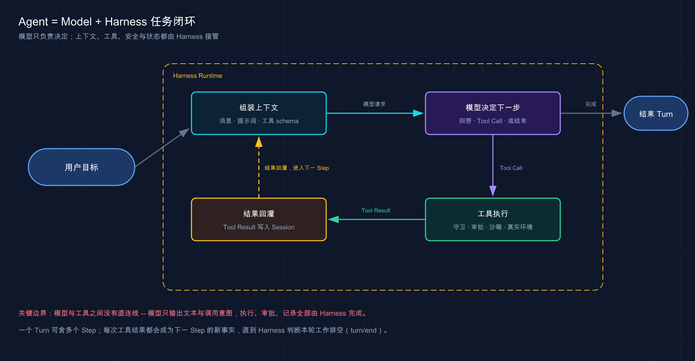

# 02 · Agent = Model + Harness 到底是什么意思

> 📚 **系列导航**：上一篇 [01 · DeepSeek Harness 是什么](./01-what-is-deepseek-harness.md) 把产品边界钉住了。这一篇继续拆机器：模型和 Harness 到底各干什么，为什么只换一个模型，不等于换了一套 Agent。

> [!WARNING] Developer Preview
> 本文结构事实已按固定官方快照复核；后续版本如有变化，以官方文档为准。

你给一个聊天模型发：「帮我修复登录接口的失败测试。」

它大概率会回一段建议或代码片段。你把同一句话发给编码 Agent，它却可能自己打开仓库、运行测试、定位文件、修改代码，再跑一遍测试确认。

**模型可能是同一个，结果为什么差这么多？**

答案就是这套教程最重要的公式：

> **Agent = Model + Harness**

这不是严格的数学等式，而是一张认知地图。**模型给出判断，Harness 提供环境、工具、循环、记录和安全边界；两者组合起来，才有一个能持续行动的 Agent。**

**看完这一篇，你会拿到：**

- 分清模型与 Harness 的职责，不再把所有效果都归功于模型
- 看懂一次 Agent Turn 如何由多个模型 Step 和工具调用组成
- 理解工具结果为什么必须回到模型，会话日志为什么不只是聊天记录
- 知道同一个模型换 Harness、同一个 Harness 换模型，分别会改变什么
- 用一张任务追踪卡，自己判断某个问题到底出在模型还是 Harness

---

## 01 模型负责「决定」，Harness 负责「让决定落地」

先把两边的职责摆在桌面上：

| 环节 | 模型负责什么 | Harness 负责什么 |
|---|---|---|
| 理解任务 | 从消息和上下文中推断目标 | 收集并组装消息、系统提示词、工具 schema |
| 选择行动 | 决定回答、调用哪个工具、传什么参数 | 注册工具、校验调用、把调用路由给执行方 |
| 接触环境 | 模型本身不能直接读取你的磁盘 | 提供文件、Shell、PTY、LSP、Web 等能力 |
| 获取反馈 | 根据工具结果决定下一步 | 执行工具，把结果记录并回灌给模型 |
| 记住过程 | 只能看到当前请求携带的历史 | 持久化 Session Event，并投影出下一次请求历史 |
| 控制风险 | 可以表达意图，但不能作为安全边界 | 执行权限、审批、沙箱和工具前后拦截 |
| 推进到结束 | 判断任务是否已完成 | 持续驱动 Step，处理取消、错误、恢复与续跑 |

**类比：模型像项目负责人，Harness 像整个执行团队和项目系统。** 负责人能判断「先跑测试，再看报错」，但他不能凭空得到测试结果。Harness 去启动命令、收集输出、记录进度，再把结果放回负责人桌上。

2026 年 8 月 29 日，我安排本教程用同一个 `deepseek-v4-flash`、同一份故意写错的加法项目和同一条修复指令，对照跑了 Standard、PTC、Minimal 与 Creator 四种 Harness 组合。四组最终都把 `a - b` 改回 `a + b`，但过程差异很大：Standard 用 5 个 Step，PTC 用 4 个 Step 加 5 次内部 dispatch，Minimal 则走了 11 个 Step。这个对照让我确认，同一个模型没有变，工具呈现和运行时组织一变，Agent 的行动路径就会明显变化。

这里有个容易忽略的事实：**模型并没有持续盯着你的电脑。** 每一步开始时，Harness 才把当时需要的消息、工具说明和调用配置组装成请求。模型返回后，这一次请求就结束了。之后发生的工具执行、审批和文件变化，仍由 Harness 接管。

> 💡 **一句话总结**：模型决定下一步应该做什么，Harness 负责提供真实世界、执行决定并把结果带回来。

---

## 02 一次任务不是一次模型回答

普通聊天容易让人形成一个错觉：你问一次，模型答一次，一轮就结束。

Agent 不是这样。DeepSeek Harness 官方把运行过程分成两个层级：

- **Step（步骤）**：一次模型请求，加上这次响应引发的工具执行。
- **Turn（轮次）**：从接纳一条输入开始，到不再有待处理工作为止；一个 Turn 可以包含零个或多个 Step。

拿「修复失败测试」举例，一次 Turn 可能这样展开：

| Step | 模型看到什么 | 模型决定什么 | Harness 做什么 |
|---:|---|---|---|
| 1 | 用户目标、仓库说明、工具列表 | 先运行测试 | 执行测试，记录失败输出 |
| 2 | 原始目标 + 测试失败结果 | 读取相关源文件 | 读取文件，记录内容 |
| 3 | 文件内容 + 报错上下文 | 修改某个函数 | 执行文件编辑，记录 diff |
| 4 | 修改结果 | 再跑测试 | 执行测试，记录通过结果 |
| 5 | 全部关键证据 | 给出总结并停止 | 写入最终消息，关闭 Turn |

官方架构中的主流程更精确：Harness 打开 Turn，领取下一批输入，组装提示词和工具 schema，发起模型请求，写入模型消息，再依次经过工具执行前检查、真实执行和执行后检查。只要工具结果还要求下一次模型判断，或者又有新输入到达，它就继续开启下一个 Step。

**这就是 Agent Loop。它不是「让模型多想几次」，而是让模型和环境在一个受控循环里反复交换事实。**



这张图展示一次 Turn 如何经过多个 Step，直到模型基于真实工具结果结束任务。

> 💡 **一句话总结**：一次 Agent 任务通常包含多次模型请求；每次工具结果都会成为下一步的新事实，直到 Harness 判断这轮工作已经排空。

---

## 03 工具结果为什么一定要回灌

假设模型说「我要运行测试」，Harness 也真的运行了，但没有把输出交还给模型。会发生什么？

模型只能继续猜。它不知道测试是通过、失败还是命令根本不存在，也就无法可靠决定下一步。

因此，一次工具调用至少要走完这条链：

```text
模型生成 tool call
→ Harness 校验工具和参数
→ 权限、审批与沙箱把关
→ Provider 接触真实环境
→ Harness 收集 tool result
→ 结果写入 Session Log
→ 下一次模型请求从日志重建上下文
```

在 DeepSeek Harness 里，工具不是直接被模型「遥控」的函数。它们先注册到带作用域的工具表，再经过 `tools/pre-execute`、`tools/execute`、`tools/post-execute` 三段流水线。前后两端可以附加权限、审计或结果改写策略。

**类比：工具调用像报销流程。** 模型提交一张申请单，Harness 先检查项目、额度和审批，再让真实执行方付款，最后把凭证归档。申请意图不等于资金已经转出；同样，模型生成了一次 Shell 调用，也不等于命令已经成功执行。

第 78 篇代码审查 Agent 的真实验收里，我们遇到过一次很典型的「看起来完成了」。模型找到了缺陷，最终结论也正确，但输出把 `id` 写成数字、把 `lines` 写成字符串，结果被 `verify-report.mjs` 以确定性合同拒绝。后来我不再把模型的总结当验收，而是同时要求结构校验器退出码、测试结果和文件哈希；这一次也正是合同的 fail-closed 机制，拦住了那份肉眼看起来挺像样的报告。

这也解释了为什么教程会反复要求「看 Tool Result，不只看最终回答」。**最终回答是模型的总结，工具结果和文件状态才是任务是否真的完成的证据。**

> 💡 **一句话总结**：工具调用只是意图，工具结果才是事实；Harness 的价值之一，就是把真实结果安全、完整地送回下一次模型判断。

---

## 04 Session Log 不是聊天记录备份

DeepSeek Harness 的会话日志采用只追加的 Session Event。用户消息、模型分片、完整回答、工具调用、工具结果、Turn 和 Step 边界，都会成为可持久化事件。

为什么要这么重？因为它承担的不只是「下次打开还能看见聊天」：

1. **重建模型上下文。** 下一次请求看到的历史由日志投影出来。
2. **恢复任务。** 进程重启后，可以重新列出 Session 和 Trajectory。
3. **保留审计证据。** 能追踪哪一步调用了什么工具、得到了什么结果。
4. **支持 Fork 与 Replay。** 后续能力可以在事件边界上派生新会话或重放界面。
5. **维持可重建性。** 官方原则是「模型可见即已记录」，模型看到的事实必须能从日志重建。

| 只保存聊天文本 | 保存 Session Event |
|---|---|
| 看得到用户和助手说了什么 | 还能看到请求配置、工具调用和执行结果 |
| 很难精确恢复中间状态 | 可以按事件边界投影和恢复 |
| UI 怎么显示往往不可重建 | 原始分片可保留流式界面保真 |
| 审计只能依赖最终总结 | 每一步事实都有来源 |

注意，日志完整不等于模型每次都看到全部原始事件。Harness 会从事件流派生适合模型协议的消息历史，并由上下文管理机制控制请求大小。**真源是事件流，模型上下文是事件流的一种投影。**

> 💡 **一句话总结**：Session Log 是 Agent 的事实账本，不只是聊天备份；上下文、恢复、轨迹和审计都从这本账派生。

---

## 05 同一个模型，为什么 Agent 表现会不同

现在回到最初的问题。同一个模型接到同一句任务，在不同 Harness 里可能表现完全不同，因为它们给模型的「工作条件」不同。

| 变化项 | 可能造成的结果差异 |
|---|---|
| 系统提示词 | 模型对角色、约束和完成标准的理解不同 |
| 工具 schema | 能调用的工具、参数表达和工具选择不同 |
| 文件与 Shell Provider | 能接触的环境、路径和命令能力不同 |
| Agent Loop | 工具失败后是否重试、何时停止不同 |
| 上下文投影 | 模型拿到的历史与关键证据不同 |
| 权限与沙箱 | 同样的调用可能执行、询问或拒绝 |
| Preset | Standard、PTC、Minimal、Creator 的能力集合不同 |

反过来也成立：同一套 Harness 换模型，推理质量、工具选择、指令遵循、速度和成本会改变。**模型与 Harness 不是谁替代谁，而是两个相乘的维度。**

一个聪明模型配上糟糕的 Harness，可能看不到关键文件、拿不到工具结果、失败后原地循环；一个结构清楚的 Harness 配上能力不足的模型，也可能选错工具、读不懂报错。

我现在判断编码 Agent，最看重三个指标：**改动范围是否守住、验证命令是否真的通过、执行轨迹能否复盘。** 第 11 篇的首任务就是我的基准样例：DeepSeek Harness 只改了 `calculator.js`，测试和 `package.json` 的 md5 都没变；独立重跑 `npm test` 是 1 通过、0 失败；Trajectory 又完整留下 6 个 Step 和 8 次工具调用。三项同时成立，我才会把它记为成功。

所以评测 Agent 时，不能只写模型名。至少要同时记录：模型、Provider、Harness 版本、Preset、权限、工具集和任务环境。

> 💡 **一句话总结**：Agent 体验是模型能力与 Harness 设计共同作用的结果；只报模型名，无法复现实验，也解释不了差异。

---

## 06 动手：给一个任务画出责任链

不需要安装任何东西。拿下面这句任务做练习：

```text
修复登录接口的失败测试，不改公开 API，最后告诉我改了什么、测试结果是什么。
```

照着下面五栏写一张任务追踪卡：

| 栏位 | 你应该填什么 | 本例的预期结果 |
|---|---|---|
| 模型判断 | 模型需要决定的行动 | 先运行相关测试，再读报错涉及的文件 |
| Harness 上下文 | 请求前必须组装的事实 | 用户约束、项目说明、可用工具、当前模型 |
| 工具执行 | 真实环境里发生的动作 | 运行测试、读取文件、编辑代码、再次测试 |
| 安全把关 | 哪些动作需要允许或审批 | Shell 与写文件按当前权限策略处理 |
| 完成证据 | 什么能证明任务结束 | diff 符合约束，目标测试退出码为 0 |

如果某个 Agent 最后只说「已经修好」，但你找不到 diff 和测试结果，那么责任链并没有闭合。预期的完整轨迹至少应该出现：

```text
用户目标
→ 第一次测试结果
→ 相关文件内容
→ 文件修改结果
→ 第二次测试结果
→ 带证据的最终总结
```

以后遇到 Agent 卡住，也按这张卡排查：是模型选错行动，Harness 没给上下文，工具没执行成功，还是安全策略拒绝了操作。

> 💡 **一句话总结**：把任务拆成判断、上下文、执行、安全和证据五栏，Agent 的问题就不会全部糊成一句「模型不行」。

---

## 小结

「Agent = Model + Harness」真正想表达的是：

- **模型负责理解与决策，但它不能直接接触你的环境。**
- **Harness 负责组装请求、执行工具、记录事实、控制边界并持续驱动循环。**
- **一次 Turn 可以包含多个 Step，工具结果会进入下一次模型请求。**
- **Session Event 是可重建的事实源，不只是聊天历史。**
- **Agent 表现必须同时看模型和 Harness，缺一边都解释不完整。**

你现在已经有了整套教程最重要的底层地图。后面不管讲 PTC、Session、沙箱还是插件，都可以放回这条责任链里理解。

---

下一篇：[03 · DeepSeek Harness、Claude Code、Codex、OpenCode 怎么选](./03-model-harness-comparison.md)。有了「模型 + Harness」这把尺子，正好把四款主流产品放到同一张桌子上量一遍。
