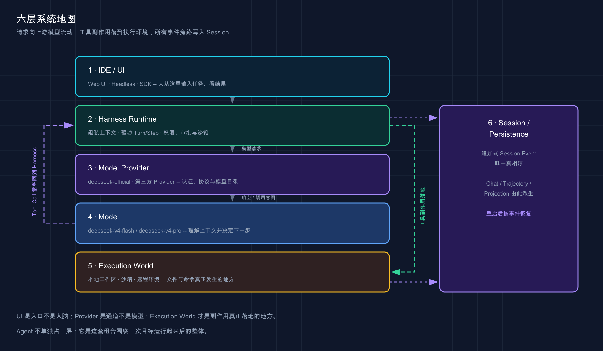

# 04 · 模型、Agent、Harness、IDE 之间是什么关系

> 📚 **系列导航**：上一篇 [03 · DeepSeek Harness、Claude Code、Codex、OpenCode 怎么选](./03-model-harness-comparison.md) 用「模型 + Harness」的尺子量了四款产品。这一篇把视野再拉远：模型、Agent、Harness、IDE、Provider 和执行环境到底怎样连成一条链。

> [!WARNING] Developer Preview
> 本文结构关系已按固定官方快照复核；后续版本如有变化，以官方文档为准。

用 AI 编程工具时，最容易听到这样的说法：

- 「这个 IDE 的模型很强。」
- 「我换了个模型，怎么工具还是不能用？」
- 「Web UI 能打开，为什么 Agent 读不到项目？」
- 「都是 DeepSeek，为什么聊天网页和 Harness 表现完全不同？」

这些问题表面上不一样，根因往往相同：**把不同层的东西混成了一个产品。**

先给结论：

> **IDE／UI 是入口，Harness 是运行系统，模型是推理部件，Agent 是它们在某个任务上的整体运行过程。**

再补两块经常被省略的拼图：Provider 负责把 Harness 接到模型服务，执行环境负责真正承载文件和命令。

**看完这一篇，你会拿到：**

- 一张六层关系图，分清 UI、Harness、Agent、模型、Provider 和执行环境
- 明白为什么换 IDE 不一定换 Harness，换模型也不会自动得到新工具
- 看懂 DeepSeek Harness 的 Web、Headless、SDK 与模型服务怎样分工
- 一套按层排错的方法，知道连接失败、工具失败和模型失败分别查哪里
- 一个任务追踪练习，把抽象概念落到真实编码流程

---

## 01 先把六层摆正

完整关系不止四个名词。为了后面能排错，咱们把常见系统拆成六层：

| 层级 | 它回答的问题 | DeepSeek Harness 中的例子 |
|---|---|---|
| IDE／UI | 人从哪里输入任务、看结果 | Web UI、未来的编辑器客户端 |
| Harness Runtime | 谁组装能力、驱动循环、记录过程 | `dsh` Web／Headless Runtime |
| Agent | 这次任务由谁持续推进 | 某个 Session 中运行的 Standard／PTC Agent |
| Model Provider | 请求怎样送到模型服务 | `deepseek-official`、第三方 Provider |
| Model | 谁理解上下文并决定下一步 | `deepseek-v4-flash`、`deepseek-v4-pro` |
| Execution World | 文件、命令和进程究竟在哪发生 | 本地工作区、受限沙箱、远程 Provider |

可以把主路径记成下面这样：

```text
人
→ IDE／Web UI
→ Harness Runtime
→ Model Provider
→ Model
→ Harness Runtime
→ 工具与安全流水线
→ Execution World
→ 结果写回 Session
→ UI 展示给人
```

Agent 不单独占据一台机器，也不是其中某个方框。**Agent 是 Harness 把模型、会话、工具和环境围绕一个目标组织起来之后，正在运行的那个整体。**

**类比：看一场手术直播。** 屏幕是 UI，手术室的流程和设备体系是 Harness，主刀医生的判断能力像模型，药品和器械供应像 Provider，真正的病人和手术台是执行环境；「这一台手术」才是 Agent Task。



这张图把交互入口、执行中枢、模型通道、推理能力、真实环境和状态记录拆成六层。

我在安排 Plan Mode 验收时差点把工具入口问题误判成模型问题：本教程通过 RPC 直接发送 `/plan` 文本后，它只跑成了一个普通 Turn，没有产生任何 plan 事件。后来我们在真实 Web UI 里从 `/` 命令面板选择 `plan`，输入区才进入计划状态，最终正常出现「计划待审」卡片。模型没换，提示内容也没本质变化，问题实际出在客户端命令处理这一层，而不是模型不理解规划。

> 💡 **一句话总结**：UI 是入口，模型是决策部件，Harness 是运行系统，Agent 是整套系统围绕一次目标发生的工作过程。

---

## 02 IDE／UI：负责交互，不等于 Agent 大脑

IDE 最直观，所以最容易被高估。它确实很重要：

- 展示项目文件、diff、终端和诊断。
- 把当前文件、选区或光标位置交给 Agent。
- 提供输入框、模型选择、审批按钮和会话列表。
- 把 Session Event 渲染成人能看懂的过程。

但 IDE 本身通常不负责模型推理，也不一定拥有 Agent Loop。它可能只是一个客户端，通过协议连接到本地或远程 Harness。

在固定版本的 DeepSeek Harness 中，Web UI 由浏览器访问，背后的 Host 才持有工作区、会话、Provider 和 Agent Runtime。G02 实测还确认了当前 Web 载体：HTTP POST 负责上行 RPC，WebSocket 负责下行事件流。**这个传输细节会变，但「界面与运行时分层」是更稳定的原则。**

| UI 能做到 | UI 单独做不到 |
|---|---|
| 收集你的任务和选择 | 凭空读取本地文件 |
| 展示 diff 与 Trajectory | 绕过 Harness 权限执行命令 |
| 发送审批决定 | 自己成为安全边界 |
| 切换模型或 Preset | 让模型获得未注册的工具 |

所以「Web 页面打开了」只证明前端能访问，不证明模型已配置、工作区已选中，更不证明 Shell 和沙箱都能正常运行。

> 💡 **一句话总结**：IDE／UI 是驾驶舱，不是发动机；它让人操控和观察 Agent，但核心执行能力仍在 Harness Runtime。

---

## 03 Harness：夹在模型和真实环境之间

Harness 的位置最特殊。它一头连接模型，一头连接真实环境，中间还要维护会话和安全边界。

模型方向，它负责：

- 选择 Provider、模型和推理强度。
- 组装系统提示词、历史消息和工具 schema。
- 解析流式内容、推理块和工具调用。
- 把工具结果投影回下一次模型请求。

环境方向，它负责：

- 注册文件、Shell、PTY、LSP、Web 等工具。
- 根据当前 Agent Scope 决定哪些工具可见。
- 执行权限、审批和沙箱策略。
- 把文件变化、命令输出和错误变成稳定结果。

状态方向，它负责：

- 保存 Session Event 和 Trajectory。
- 驱动 Turn／Step 生命周期。
- 处理取消、错误、重试、恢复和续跑。
- 为 UI、Headless 与 SDK 提供同一事实源。

**类比：Harness 像机场塔台。** 它不制造飞机，也不替飞行员驾驶，但它决定跑道怎么分配、什么时候允许起飞、当前航班状态如何记录。少了塔台，多架飞机和地面设备就无法安全协同。

我觉得 Harness 带来的核心变化，不是回答更长，而是把「建议」变成「有证据的执行」。第 11 篇实测里，模型不是只贴一段修复代码，而是先读文件、跑出失败、修改实现、再跑测试，最后留下 1 Turn、6 Step、8 次工具调用和完整 Tool Result。早期聊天式写代码通常停在「你可以这样改」，现在我真正关心的是它有没有在正确目录里改、有没有跑过验证，以及失败时能不能从轨迹倒查。

> 💡 **一句话总结**：Harness 是中枢协调层，把模型意图转换成受控环境动作，再把真实结果变回模型可以继续判断的上下文。

---

## 04 Provider 与 Model：通道和大脑不是一回事

模型和 Provider 也经常被混淆。

- **Model** 是具体模型 ID 和它所代表的能力，例如 `deepseek-v4-flash`。
- **Provider** 是 Harness 如何认证、发送协议请求、解析流式响应并公布模型目录的连接实现，例如 `deepseek-official`。

同一个模型名可能通过不同 Provider 访问：官方 API、公司网关或第三方兼容服务。它们可能使用不同端点、鉴权、协议兼容字段、限速和价格。反过来，一个 Provider 也可能公布多个模型。

| 你改变什么 | 通常会改变什么 | 不会自动改变什么 |
|---|---|---|
| 换模型 | 推理、速度、上下文、成本、工具选择质量 | Harness 工具和权限体系 |
| 换 Provider | 端点、认证、协议兼容、可用模型和计费方 | Agent Loop 的总体结构 |
| 换 Preset | 模型可见工具、提示词和工作方式 | Provider 账号余额 |
| 换 UI | 操作体验、上下文采集和展示方式 | 模型本身的能力上限 |
| 换执行 Provider | 文件与命令真正发生的位置 | 模型服务端点 |

这就是为什么「我选了 DeepSeek 模型，为什么还提示缺少凭据」不矛盾。模型选择只是一个 ID；Provider 仍要有可用 API Key，才能把请求发出去。

> 💡 **一句话总结**：模型是被调用的能力，Provider 是通往模型的连接；选中模型，不等于连接已经可用。

---

## 05 Execution World：真正会改动东西的地方

当模型调用 `bash` 或文件编辑工具时，最终一定有一个真实环境承受副作用。这个环境可能是：

- 当前电脑上的本地工作区。
- 受 macOS／Linux／Windows 沙箱限制的本地进程。
- 容器、远程主机或云端隔离环境。
- 自定义文件系统和进程 Provider 组合出来的执行世界。

DeepSeek Harness 的 capability seam 设计专门强调这一点。文件系统、Shell、进程和 LSP 不必永远绑定本机；替换 Provider，可以在保持面向模型工具不变的情况下，把执行世界迁到别处。

这层是风险真正落地的地方。模型输出一段危险命令只是文本；Harness 允许并执行它，副作用才会发生。因此安全判断必须看完整链条：

```text
模型提出调用
→ 工具是否存在
→ 权限策略是否允许
→ 是否需要人工审批
→ 沙箱能否建立边界
→ 执行 Provider 在哪里运行
```

这轮教程验收我最终选择了「本机执行，但所有状态和工作区都放进可丢弃的隔离目录」。真实 Key 只通过环境变量注入，`DSH_HOME`、npm cache、Python venv 和任务仓库全部放在 `/tmp`，没有触碰真实 `~/.dsh`。我没有直接上云端，也没有在自己的真实项目里开 Full access，因为此时最重要的是看清本机沙箱、文件和进程行为；需要高权限的任务则只在可重建夹具里运行，把副作用范围钉死。

> 💡 **一句话总结**：执行环境才是文件和命令真正发生变化的地方；安全不能只看模型说了什么，还要看 Harness 最终允许在哪里执行。

---

## 06 按层排错：别再一句「它坏了」

有了六层地图，排错会简单很多：

| 现象 | 优先检查层 | 典型原因 |
|---|---|---|
| 页面打不开或按钮没有反应 | UI／通信 | Host 未启动、端口错误、事件流断开 |
| 能打开页面但输入框不可用 | Workspace／Harness | 尚未选择工作区或默认模型失效 |
| 提示缺少凭据、401 | Provider | API Key 未保存、引用错误或已失效 |
| 回答质量差、工具选择混乱 | Model／Prompt | 模型不适合、上下文不足、提示词冲突 |
| 工具在列表里但执行失败 | Harness／Execution World | 参数错误、命令不存在、Provider 异常 |
| 弹出审批 | Permission | 当前策略要求人工决定，不是系统故障 |
| 审批通过仍拒绝执行 | Sandbox | 沙箱不可用并按 fail-closed 停止 |
| 重启后找不到过程 | Session／Persistence | 使用了不同 DSH_HOME、未正常持久化或数据损坏 |

最典型的误判，是把「审批通过但沙箱无法建立」当成模型不听话。G02 的受限环境实测正好说明：审批链路可以成功，命令仍会因为嵌套沙箱不可用而 fail-closed。**这是安全层拒绝，不是模型层失败。**

> 💡 **一句话总结**：先按 UI、Harness、Provider、Model、Execution World、Session 分层，再定位问题；别把所有故障都甩给模型。

---

## 07 动手：追踪一次任务穿过六层

拿这个最小任务做纸面演练：

```text
读取 package.json，告诉我项目名，只读文件，不要修改任何内容。
```

按顺序检查每一层的预期：

1. **UI**：任务被提交，当前工作区已经选中。
2. **Harness**：组装只读任务、模型配置与可用工具。
3. **Provider**：携带有效凭据，把请求发给选定模型。
4. **Model**：选择文件读取工具，而不是凭空猜项目名。
5. **Execution World**：从当前工作区读取 `package.json`，不产生写入。
6. **Session**：记录用户消息、工具调用、文件结果与最终回答。

完整结果应该同时满足：

```text
回答中的项目名 = package.json 的 name 字段
文件修改数量 = 0
Trajectory 中存在文件读取调用和成功结果
```

如果回答正确但没有读取记录，它可能是猜的；如果读取成功却回答错误，问题更靠近模型；如果读取被拒绝，则检查工作区、工具、权限和执行 Provider。

> 💡 **一句话总结**：沿六层追踪输入、请求、工具和证据，你就能判断一个正确答案到底是可靠执行，还是碰巧猜中。

---

## 小结

把整篇压成一张地图：

- **IDE／UI**：人操作和观察的入口。
- **Harness Runtime**：组装能力、驱动循环、记录状态和控制边界。
- **Agent**：这套组合围绕一次目标运行起来后的整体。
- **Provider**：连接模型服务的通道和协议适配。
- **Model**：理解上下文并决定下一步的推理部件。
- **Execution World**：文件、命令和进程真正发生的环境。

以后看到任何 AI 编程产品，先按这六层拆一次。产品名字会变，界面会变，底层责任关系不会轻易变。

---

下一篇：[05 · DeepSeek 模型目录、API Key、价格与调用方式](./05-models-api-pricing.md)。咱们把实时变化最快的模型和价格集中到一页，并分清官方 API 能力与 Harness 固定版本目录。
