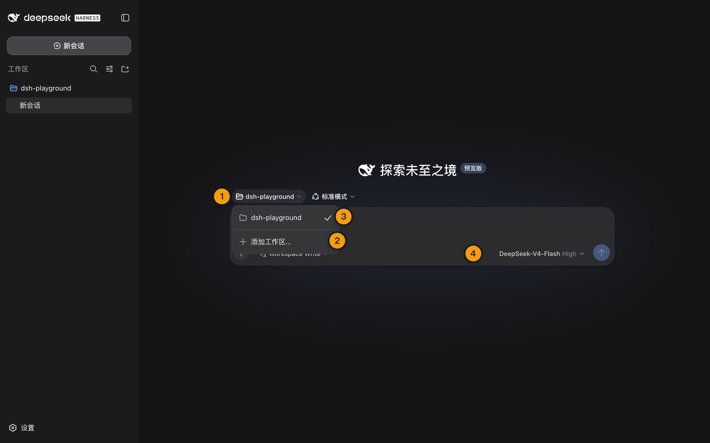

# 08 · Web UI 界面与工作区

> 📚 **系列导航**：上一篇 [07 · 用 npx 启动 Harness](./07-npx-start.md) 已经把页面跑起来。这一篇先不急着聊天，咱们把工作区、Session 和真实执行位置对齐。

> [!WARNING] Developer Preview
> 本文已验证 Web 首页、Host 描述、工作区创建／列表 RPC 和底层协议；文中截图来自固定版本真实 Web UI，新版本界面可能略有差异。

第一次打开 DeepSeek Harness，你可能会看到页面已经正常加载，输入框却不能发消息。

这不是卡死，也不是缺少 API Key。

**全新的 Web UI 默认没有选中任何工作区，选中之前，会话输入框就是不可用的。** 这是 Harness 在阻止一个没有明确执行位置的 Agent 直接开始工作。

**看完这一篇，你会拿到：**

- 理解 Web UI、Harness Host、Workspace 和 Session 的关系
- 知道启动目录为什么重要，又为什么不会自动成为已选工作区
- 会添加、选择和核对一个工作区
- 分清 Workspace 的持久分组作用与沙箱安全边界
- 知道删除 Workspace 记录不会删除目录和 Session 日志
- 用只读状态判断页面问题发生在浏览器、Host 还是工作区层

---

## 01 页面背后不是纯前端

浏览器里的 Web UI 只是操作入口。真正持有工作区、配置、凭据、Session 和工具执行能力的是本地 Harness Host。

```text
浏览器 Web UI
      │
      │ HTTP POST 上行请求
      │ WebSocket 下行事件
      ▼
Harness Host
      │
      ├── Workspace Registry
      ├── Session／Trajectory
      ├── Provider／Model
      └── 文件、Shell、审批与沙箱
```

本次固定版复验确认：

| 检查 | 结果 |
|---|---|
| 首页 | HTTP 200，标题为 `DeepSeek Harness` |
| 普通 `GET /api` | HTTP 404 |
| 普通 `GET /api/events.mux` | HTTP 426，要求 WebSocket Upgrade |
| 无 JSON 类型的 RPC POST | HTTP 415 |
| 正确 JSON RPC | Host 与 Workspace 方法可用 |

因此，页面能显示但交互失效时，不能只刷新前端。Host 进程是否仍在、WebSocket 是否连接、当前是否选中 Workspace，都可能是根因。

**类比：Web UI 是驾驶舱仪表，Host 才是飞机本体。** 仪表亮起只证明页面资源加载了，不证明发动机、通信和目的地都已就绪。

> 💡 **一句话总结**：浏览器负责交互，Host 持有真实状态和执行能力；页面加载成功只是第一层。

---

## 02 启动目录和选中工作区不是一回事

官方指南同时给了两个看似冲突的事实：

1. `dsh` 会把启动时所在目录作为默认文件系统位置。
2. 全新的 Web UI 不会选中任何工作区，需要你手工添加并选择。

它们分别属于不同层：

| 概念 | 作用 | 本次实测 |
|---|---|---|
| Host `cwd` | 进程启动位置，也是默认文件系统位置 | 与启动命令所在隔离目录一致 |
| Workspace 记录 | 一个规范目录路径、稳定 ID、显示标题和 Session 账本 | 初始列表为空 |
| 当前选中 Workspace | 新会话实际要归属和执行的位置 | 全新 UI 尚未选择 |

固定版 `host.describe` 在本次复验中返回：默认 Provider 为 `deepseek-official`，默认模型为 `deepseek-v4-flash`，attached Session 数为 0，`cwd` 与启动目录一致。

与此同时，首次 `workspace.list` 返回 0 条记录。**所以「Host 知道自己从哪里启动」不等于「用户已经确认让 Agent 在那里工作」。**

我在这次 Web UI 验收设计中没有等到「改错目录」才补救，而是要求把 Harness 启动位置、`DSH_HOME` 和任务工作区分开，再从界面明确选择 `/tmp` 下的夹具。第 11 篇任务结束后，我们通过文件哈希确认真正变化的是所选工作区里的 `calculator.js`，当前教程仓库没有被碰。这个检查让我更确定：终端从哪里启动只是 Host 进程的位置，界面选中的 Workspace 才是 Agent 实际工作的 cwd。

> 💡 **一句话总结**：启动目录是 Host 的默认位置，选中 Workspace 是用户给新会话的明确归属，两步不能合并理解。

---

## 03 动手：添加并选择工作区

保持 Harness 在 `dsh-playground` 中运行，然后在 Web UI 操作：

```text
选择工作区
→ 添加工作区
→ 选择 dsh-playground 目录
→ 在列表中选中它
```

官方当前流程要求所选路径已经存在，而且必须是目录。Host 会对路径做 `realpath` 规范化：尾部斜杠、`..` 和符号链接都会被解析。

选中后检查三个结果：

- 工作区标题显示为 `dsh-playground`，或你为它设置的显示名称。
- 会话输入框从不可用变为可输入。
- 新建 Session 时，当前工作目录指向这个工作区。

本次底层 RPC 复验使用一个已经存在的隔离目录：

```text
首次 workspace.create：created = true
再次添加同一规范路径：created = false
workspace.list：从 0 条变为 1 条
返回路径：与规范化后的目标目录一致
```

也就是说，重复添加同一个真实目录不会制造第二条 Workspace，而是返回已有记录。

| 添加结果 | 原因 | 处理 |
|---|---|---|
| 目录成功出现 | 路径存在且 Host 可访问 | 选中后创建 Session |
| 路径不存在 | 目录未创建或拼错 | 先在文件系统创建目录 |
| 选择了文件 | Workspace 只接受目录 | 回到上一级选择文件夹 |
| 符号链接看似新目录却命中旧记录 | 两者解析到同一真实路径 | 使用已有 Workspace |
| 输入框仍不可用 | 只添加但没有选中，或模型默认值失效 | 先确认选中状态，再看模型选择器 |

> 💡 **一句话总结**：添加是把目录登记进 Host，选择才是让当前新会话真正落到这个目录。

---



这张图展示工作区从添加到选中的完整路径；只有选中后，新 Session 才有明确执行目录。

## 04 Workspace 到底保存了什么

Workspace 不是目录副本，也不是把项目上传到 DeepSeek。它是 Host 对一个本地目录的持久记录，核心包括：

- 稳定的 `WorkspaceId`，不是直接拿路径当 ID。
- 规范化后的真实目录路径。
- 可修改的显示标题。
- 创建与更新时间。
- 按顺序记录的 Session ID 账本。

Session 要归属于某个 Workspace，需要同时满足两件事：Workspace 账本里有它的 ID，而且 Session Header 的规范 `cwd` 与 Workspace 路径一致。

这套设计带来几个实际结果：

| 操作 | 会发生什么 | 不会发生什么 |
|---|---|---|
| 重命名 Workspace | 改显示标题 | 不重命名磁盘目录 |
| 调整 Workspace 顺序 | 改侧边栏持久顺序 | 不移动项目文件 |
| 删除 Workspace 记录 | 从 Workspace 列表移除 | 不删除目录，不删除 Session 日志 |
| 归档 Session | 从普通列表隐藏 | 不删除 Session 日志 |
| 目录暂时被移动 | Workspace 状态可变为 `missing-dir` | 记录不会被自动删除 |

这里最重要的是删除边界。**删除 Workspace 不是删除项目。** 官方实现会保留目录和所有 Session 日志，相关 Session 进入 Ungrouped。真正删除磁盘文件是另一类高风险操作，不能从 Workspace 列表的管理动作外推。

这轮真实 Key 验收大约跑了 35 个任务 Turn，我们没有把它们堆进一个 Session。模型目录、首任务、四模式、SDK 和安全测试分别使用独立 `DSH_HOME` 或独立工作区；同一组对照再用一致的任务名和新鲜副本。这样做牺牲了一点启动速度，但事后看 Trajectory 时能立刻知道某个 Session 属于哪组验收，也不会把上一个任务的上下文带进下一组数据。

> 💡 **一句话总结**：Workspace 保存目录身份和 Session 归属，不复制项目；重命名、归档和删除记录都不等于操作磁盘文件。

---

## 05 工作区不是安全围栏

这是必须单独强调的一节。

Workspace 让 Agent 以某个目录作为 `cwd`，文件工具和 Session 也围绕它组织。但它本身是 Host 侧的产品能力，不属于 Agent Loop 主干，不会自动变成一道「绝对禁止访问外部路径」的安全墙。

真正决定副作用边界的是：

```text
Workspace
→ 当前权限预设
→ 工具请求的沙箱模式
→ 平台沙箱后端能否执行
→ 用户是否批准升级
```

| 配置 | 工作区外访问应该怎样理解 |
|---|---|
| `read-only` | 文件写入应被拒绝，实际强制依赖平台沙箱 |
| `workspace-write` | 写入应限制在工作区和允许的临时目录 |
| `danger-full-access` | 不能再把 Workspace 当作写入边界 |

目录选择器也只是用户体验入口，不天然构成服务器文件系统的安全根。官方浏览式选择器明确说明，它可以浏览全盘；真正的安全控制必须由 Host 信任边界、权限和沙箱承担。

第一次练习继续使用 `dsh-playground`，不要选用户主目录。真实项目则先确认 Git 状态、未提交修改、敏感文件和可恢复方式，再让 Agent 写入。

> 💡 **一句话总结**：Workspace 决定任务落点和 Session 归属，权限与沙箱才决定 Agent 最终能改到哪里。

---

## 06 Session 为什么跟着 Workspace 走

选中 Workspace 后创建的新 Session，会使用该目录作为工作位置，并被附加到 Workspace 的 Session 账本。

Web UI 的侧边栏负责把 Workspace 与 Session 组织起来。固定版当前支持：

- Workspace 分组和单列表两种呈现。
- 手动排序与最近更新排序。
- Workspace 添加、重命名、重排和删除记录。
- Session 重命名、归档与 Fork。
- 标题、Workspace 名和当前对话内容搜索。

这些界面能力会快速迭代，首发教程不逐像素承诺按钮位置。更稳定的原则是：**Workspace 是项目容器，Session 是围绕该项目的一条持久任务轨迹。**

新 Session 还没有第一条提示词时，可能只是一个空白占位。首条任务真正开始后，它才进入可重命名、Fork 和归档的正常生命周期。

我的实际规则是：**需要控制变量的任务一定新开 Session，需要验证连续性的任务才沿用。** Standard、PTC、Minimal、Creator 四模式对照各用新鲜副本和新 Session，避免历史上下文影响 Step 数；验证 Session 恢复和同一 session id 续用时，则故意沿用旧会话。早期如果把模式对照塞进同一 Session，看似省事，模型却已经读过答案，后面的耗时和工具调用就不再可比，所以这次从设计上直接避开了这种错误。

> 💡 **一句话总结**：一个 Workspace 可以承载多条 Session；项目边界稳定，任务轨迹彼此独立，才能避免上下文越聊越乱。

---

## 07 动手：做一次只读工作区验收

这一步暂时不发模型请求，只检查界面状态：

1. Harness 从 `dsh-playground` 启动。
2. Web UI 已添加并选中 `dsh-playground`。
3. 输入框已经可用。
4. 模型选择器能看到 Provider／模型状态，即使 Key 尚未配置。
5. 侧边栏出现当前 Workspace。
6. 终端中的 Harness 进程保持运行，没有新增错误。

预期状态：

```text
首页可访问：是
当前 Workspace：dsh-playground
会话输入框：可用
真实模型请求：尚未发送
项目文件修改：0
```

如果输入框不可用，按这个顺序排查：

| 顺序 | 检查 | 原因 |
|---:|---|---|
| 1 | Harness 终端是否仍在运行 | Host 退出后 UI 无法继续工作 |
| 2 | 页面是否连接正确端口 | 可能打开了旧地址 |
| 3 | Workspace 是否已添加并选中 | 全新 UI 的主要门禁 |
| 4 | 目录是否仍然存在 | Workspace 可能处于 `missing-dir` |
| 5 | 模型默认值是否有效 | 已删除 Provider 会让输入框要求重新选模型 |

> 💡 **一句话总结**：本篇验收只要求 Workspace 和输入状态正确，不需要消耗 Token，也不把「能看见模型」误报成「真实 API 已连通」。

---

## 小结

这一篇把 Web UI 与真实执行位置对齐了：

1. Web UI 是入口，Host 才持有 Workspace、Session、配置与工具。
2. Host 启动目录与当前选中 Workspace 是两个概念。
3. Workspace 添加后还要明确选中，输入框才可用。
4. 重复添加同一规范路径会复用已有 Workspace。
5. Workspace 管理动作不会删除真实目录或 Session 日志。
6. Workspace 不是安全围栏，副作用边界由权限和沙箱决定。
7. 本篇底层状态和真实浏览器工作区界面均已验证，3 处经历已按项目主理人口径确认。

你现在应该已经能把项目目录加入 Harness，并清楚 Agent 将在哪个目录创建 Session、读取文件和执行命令。

---

下一篇：[09 · 配置 DeepSeek 官方 Provider 与默认模型](./09-deepseek-provider.md)。工作区已经选好，下一步才是让真实模型请求能够出去。
