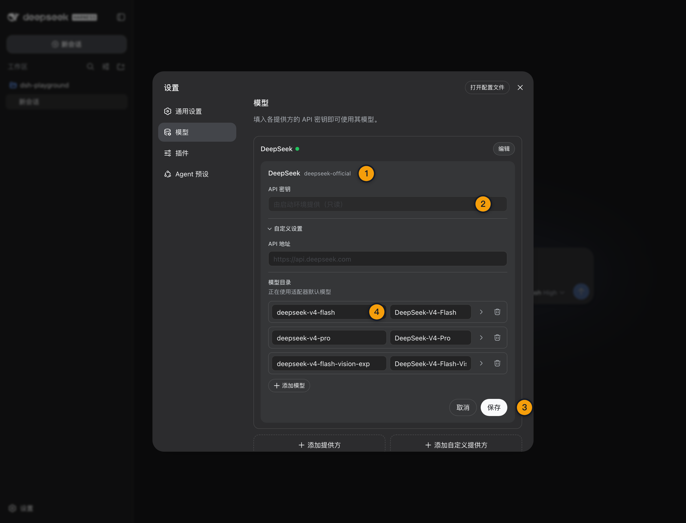

# 09 · 配置 DeepSeek 官方 Provider 与默认模型

> 📚 **系列导航**：上一篇 [08 · Web UI 界面与工作区](./08-web-ui-workspace.md) 已经确定项目位置。这一篇配置 DeepSeek 官方 Provider，但不会把「界面有模型」冒充成「真实 API 已跑通」。

> [!WARNING] 实时外部事实
> 本文已验证 `deepseek-official` 路由、模型目录、默认模型、凭据脱敏状态和真实最小 Agent Turn，并于 2026-08-30 重查官方 Provider 指南与 DeepSeek 模型目录；在线目录如有变化，以官方文档为准。

Web UI 打开了，工作区也选中了，模型选择器里甚至已经能看到 `deepseek-v4-flash`。

很多人会在这里误判：**能选模型，就以为 Provider 已经连通。**

固定版没有 API Key 时，`deepseek-official` 仍然是 active，三个默认模型也照常出现在目录里；真正发请求时才会以 `MISSING_CREDENTIAL` 失败。

所以本篇的验收标准不是「下拉框有名字」，而是：**密钥安全保存、默认模型明确、最小只读 Turn 成功、Trajectory 有真实请求和 usage。**

**看完这一篇，你会拿到：**

- 理解 `deepseek-official` Provider 与三个默认模型的关系
- 在 Web UI 中保存只写 API Key，不让明文回到浏览器或进入仓库
- 会选择默认模型，并理解新旧 Session 的模型继承差异
- 分清 active Provider、可见目录、真实鉴权和成功 Agent Turn 四层证据
- 用一个最小只读任务验收 Provider、模型、工具和 usage
- 根据稳定错误码判断凭据、余额、限流、上下文或网络问题

---

## 01 先认准官方 Provider 路由

固定版自带一条 DeepSeek 官方适配器：

```text
Provider ID：deepseek-official
默认模型：deepseek-v4-flash
默认 Base URL：https://api.deepseek.com
默认凭据引用：DEEPSEEK_API_KEY
```

省略自定义模型列表时，它会公布三个模型：

| 模型 ID | 固定版目录能力 | 本篇用途 |
|---|---|---|
| `deepseek-v4-flash` | 文本，1M 上下文 | 首次连通与低成本基线 |
| `deepseek-v4-pro` | 文本，1M 上下文 | 后续复杂任务对照 |
| `deepseek-v4-flash-vision-exp` | 文本、图片，1M 上下文 | 实验性视觉路线，真实图片请求待补 |

本次隔离 Host 复验得到：

```text
可配置 Provider 条目：38
active Provider：deepseek-official
默认模型：deepseek-v4-flash
模型目录失败数：0
```

但这些结果只证明插件已经加载、目录可以解析。没有真实 Key 时，凭据状态仍然是：

```text
configured: false
writable: true
```

| 证据 | 能证明什么 | 不能证明什么 |
|---|---|---|
| Provider 为 active | 适配器路由已注册 | 远端鉴权成功 |
| 模型出现在选择器 | 本地目录公布了模型 | 当前账号可调用 |
| 凭据显示 configured | 某个凭据来源可解析 | 余额、权限、网络正常 |
| 最小 Agent Turn 成功 | 完整链路至少成功一次 | 永远不会限流或服务异常 |

固定版第一次启动时，界面已经能列出 `deepseek-official` 和三个模型，`session.models.routable` 也是 `true`，但这并不等于账号链路可用。本教程故意在不注入 Key 的 Headless 环境跑了一次，进程以退出码 1 结束，stderr 明确报 `MISSING_CREDENTIAL`。最终定位很清楚：模型目录和路由来自本地 Harness 配置，真正可用还取决于凭据和真实请求，不能拿下拉框当连通证明。

> 💡 **一句话总结**：active 和可见目录属于本地 Harness 证据，只有真实 Turn 才能证明 Provider 链路可用。

---

## 02 在 Web UI 中保存 API Key

先从 DeepSeek 开放平台创建专用于教程测试的 API Key，并控制余额和权限。不要复用长期生产 Key。

回到 Harness Web UI：

```text
设置
→ 模型
→ DeepSeek 卡片
→ 输入 API Key
→ 保存
```

官方当前说明：

- API Key 是**只写**字段。
- 保存后，页面只收到脱敏描述符，永远不会收到明文 Key。
- 明文值由本地凭据层管理，默认存入 `$DSH_HOME/.credentials.yaml`。
- `settings` 只保存 `DEEPSEEK_API_KEY` 这类凭据引用。
- 适配器每次模型请求都会重新解析凭据，保存后下一次请求生效，不需要重启 Host。

**类比：设置页像银行柜台的投递口。** 你可以把密钥交给本地凭据层，但柜台显示屏只告诉你「已配置」，不会再把完整密钥吐回浏览器。

| 做法 | 判断 | 风险 |
|---|---|---|
| Web UI 只写字段保存 | 推荐 | 本机凭据文件仍需保护 |
| 受控环境变量临时提供 | 可用于 Headless 或临时验证 | 注意进程环境与 Shell 历史 |
| 写进项目 `.env` | 本教程不推荐 | 容易被工具读取、误提交或打包 |
| 写进 Markdown／截图 | 禁止 | 进入 Git、构建产物或分享链路 |
| 打印完整 Key 排错 | 禁止 | 日志本身会成为泄漏源 |

如果当前进程环境已经提供 `DEEPSEEK_API_KEY`，凭据描述可能显示为只读，因为环境层会遮蔽本地可写层。此时界面拒绝覆盖不是保存故障，而是在避免「看似写入成功，实际请求仍读取旧环境变量」的假象。

> 💡 **一句话总结**：优先用 Web UI 的只写入口保存，检查「已配置」状态，不通过打印或回读明文来验证。

---



这张图只证明本地配置入口和脱敏状态；真实 API 是否可用仍要看最小 Agent Turn。

## 03 选择默认模型

凭据保存后，在模型选择器中选择：

```text
DeepSeek
→ deepseek-v4-flash
```

官方配置文档说明，选择模型还会把它设为**新 Session 的默认值**。这句话有两个边界：

1. 新建 Session 会使用新的默认模型。
2. 已经发送过请求的 Session 会保留自身日志里记录的模型，不会被全局默认值静默改写。

| 操作 | 新 Session | 已经运行过的 Session |
|---|---|---|
| Flash 改成 Pro | 默认使用 Pro | 保留原有路由记录 |
| 删除当前默认 Provider | 必须重新选模型 | 历史仍记录旧模型，但后续路由可能不可用 |
| 更新 API Key | 下一次请求读取新凭据 | 下一次请求同样读取新凭据 |

如果已保存默认值指向后来被删除的 Provider，输入框会显示「选择模型」，在重新选择之前阻止输入。这不是对话框坏了，而是 Harness 不愿意把任务交给一条已经不存在的路由。

第一次连通建议选 `deepseek-v4-flash`。原因只有两个：它是固定版默认值，而且当前价格低于 Pro。没有同任务实测之前，不提前声称它一定更快或更适合所有编码任务。

我安排本教程用同一条固定回复任务对照过 Flash 和 Pro。Flash 的输入／输出是 7618／25 Token，耗时约 0.7 秒；Pro 是 7596／24 Token，耗时约 1.5 秒，两次答案都正确。这个任务太小，无法证明 Pro 的质量优势，所以我没有因为名称听起来更强就改默认值，而是继续用 Flash 做教程基线：便宜、响应更快，复杂任务再单独验证 Pro。

> 💡 **一句话总结**：模型选择器同时决定当前路线和新 Session 默认值，但不会偷偷改写已经产生请求的旧 Session。

---

## 04 动手：先做安全的配置状态检查

如果你通过环境变量提供 Key，可以只检查有没有配置，不打印内容。

macOS／Linux／Windows PowerShell 都可以执行：

```bash
node -e 'console.log(process.env.DEEPSEEK_API_KEY ? "DEEPSEEK_API_KEY=CONFIGURED" : "DEEPSEEK_API_KEY=MISSING")'
```

输出二选一：

```text
DEEPSEEK_API_KEY=CONFIGURED
```

```text
DEEPSEEK_API_KEY=MISSING
```

如果你通过 Web UI 保存，Shell 环境显示 `MISSING` 完全正常。Web UI 凭据文件和进程环境是两种不同来源，不要为了让这条命令显示 `CONFIGURED`，又把 Key 复制进 Shell。

界面验收只看：

```text
DeepSeek 凭据状态：已配置
完整 Key 是否重新显示：否
模型选择器：可以选择 deepseek-v4-flash
Host 是否要求重启：否
```

这一步仍然不能证明远端调用成功。它只证明本地凭据层与模型设置已经准备好。

> 💡 **一句话总结**：环境变量检查只覆盖环境来源；Web UI 保存的 Key 应通过脱敏配置状态确认，而不是强行回读。

---

## 05 动手：用最小只读 Turn 验收真实链路

在 `dsh-playground` 中确认 `package.json` 内容为：

```json
{
  "name": "dsh-playground",
  "private": true
}
```

新建 Session，选择 `deepseek-v4-flash`，发送：

```text
读取当前工作区的 package.json，只返回 name 字段的值。不要修改文件，不要运行与读取无关的命令。
```

成功标准不是只看最后四个字，而是同时满足：

| 验收项 | 预期 |
|---|---|
| 最终回答 | `dsh-playground` |
| 文件变化 | 0 个 |
| Trajectory | 存在一次成功的文件读取调用 |
| Provider | `deepseek-official` |
| Model | `deepseek-v4-flash` |
| Turn | 正常出现 `turn/end` |
| Usage | 有真实输入／输出 Token 数据 |

本文已于 2026 年 8 月 29 日使用环境变量注入的真实 Key 执行这一步，并记录北京时间、模型、任务、最终结果、工具调用、usage 与 Turn 状态；Key 本体没有进入文档、截图或 Git。

2026 年 8 月 29 日 01:22 之后，我们用环境变量注入的真实 Key 跑了最小只读 Turn。Provider 是 `deepseek-official`，模型是 `deepseek-v4-flash`，任务只要求回复固定标记，没有调用工具，也没有文件变化；输入 7618、输出 25、缓存读取 0、推理 19，Turn 约 0.7 秒并以 `completed` 结束。账单绝对金额没有记录，因此这里只报告真实 usage，不拿估算冒充扣费结果。

> 💡 **一句话总结**：本地显示已配置不算闭环；最小只读 Turn、工具证据与真实 usage 同时出现，才达到 V2。

---

## 06 根据错误码定位，不要反复粘贴 Key

固定版 DeepSeek 适配器会把常见失败整理为稳定错误码：

| 错误或状态 | 含义 | 优先处理 |
|---|---|---|
| `MISSING_CREDENTIAL` | 所有凭据来源都没有可用 Key | 回到模型页检查配置状态 |
| `INVALID_CREDENTIAL` | Key 格式无法安全放入请求头 | 重新创建并保存，不打印原值 |
| `AUTH` | DeepSeek 返回 401／403 | 检查 Key 是否错误、失效或无权限 |
| `QUOTA` | 余额、点数或配额耗尽 | 查看开放平台账号状态 |
| `RATE_LIMIT` | 其他 429 限流 | 降低并发，按错误信息等待 |
| `CONTEXT_WINDOW_EXCEEDED` | 请求超过上下文限制 | 新开 Session、压缩或减少输入 |
| `INVALID_REQUEST` | 其他 400 或 413 | 检查模型、附件和请求配置 |
| `TRANSPORT` | DNS、连接、TLS 或代理失败 | 检查网络和 `api.deepseek.com` 可达性 |
| `TIMEOUT` | 流式读取超过空闲预算 | 检查网络、服务状态与任务规模 |
| `SERVER` | DeepSeek 5xx | 记录请求 ID，等待或按策略重试 |

适配器默认流式空闲超时为 300,000 ms，并向 Harness 注册重试策略。**但有重试不等于可以无脑连续点发送。** 先记录第一次错误码、HTTP 状态与请求 ID，再决定是凭据、余额、限流、网络还是服务端问题。

遇到 401 时，最差的排错方式是把完整 Key 贴进聊天、issue 或截图让别人看。正确方式是轮换 Key、检查脱敏状态和账号权限，泄漏过的 Key 直接作废。

> 💡 **一句话总结**：先按稳定错误码归层，再处理凭据、账号、网络或服务；重复粘贴 Key 既无助排错，又扩大泄漏面。

---

## 07 三个容易混淆的默认值

完成配置前，再把三个层级分开：

| 层级 | 当前固定值 | 作用 |
|---|---|---|
| Harness 默认 Provider | `deepseek-official` | 决定使用哪条适配器路线 |
| Harness 默认 Model | `deepseek-v4-flash` | 新 Session 的起始模型 |
| DeepSeek 官方服务 | 账号实时可用目录 | 决定远端真正接受哪些模型请求 |

模型目录中的 ID 会原样传给 DeepSeek API。Harness 的默认目录是建议列表，不是远端权限证明，也不是硬白名单。

此外，官方模型最大输出与 Harness 默认请求值也不是一回事：当前官方模型页面标注最大输出 384K，固定版适配器默认 `maxTokens` 是 256,000。详细价格与规格集中维护在 [05 · DeepSeek 模型目录、API Key、价格与调用方式](./05-models-api-pricing.md)，这里不复制易过期价格表。

> 💡 **一句话总结**：Provider、Harness 默认模型和账号实时目录属于三层事实，名称碰巧一致也不能合并成一个结论。

---

## 小结

这一篇完成了真实 Provider 之前能做的全部准备：

1. 固定版官方路由 ID 是 `deepseek-official`。
2. 默认模型是 `deepseek-v4-flash`，目录另含 Pro 与视觉实验模型。
3. API Key 通过 Web UI 只写字段进入本地凭据层，明文不返回页面。
4. 保存凭据和切换默认模型都在下一次请求生效，不需要重启。
5. active Provider 和可见模型目录不能证明真实 API 可用。
6. 最小只读 Turn 必须同时核对答案、工具、文件变化、模型、Turn 结束和 usage。
7. 本篇目录、凭据状态和真实 Key 最小 Turn 已形成完整闭环，视觉模型仍待单独验证。

你现在应该已经知道怎样安全配置 DeepSeek 官方 Provider，也能明确判断自己拿到的是本地配置证据，还是完整的真实调用证据。

---

下一篇：[10 · 配置第三方与自定义 Provider](./10-custom-provider.md)。等真实 Key 补齐后，B3 会继续把官方 Provider、第三方 Provider 和第一次完整代码任务串成同一条验收链。
