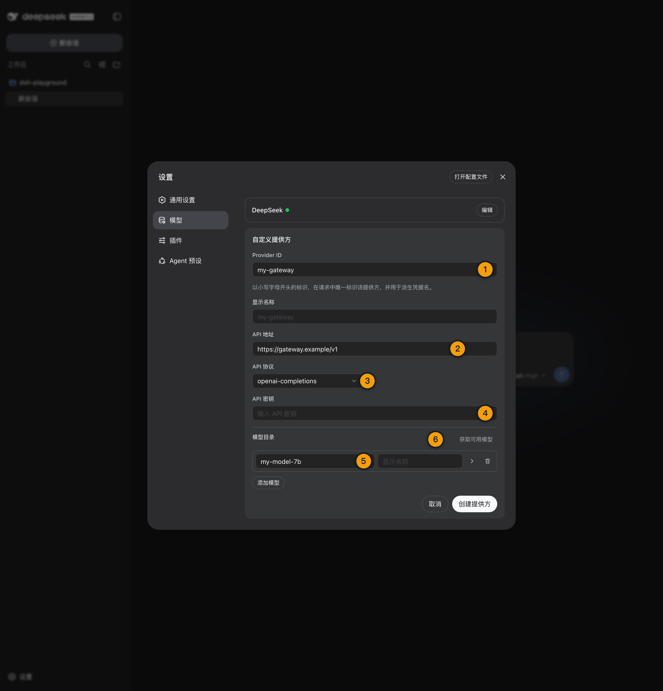

# 10 · 配置第三方与自定义 Provider

> 📚 **系列导航**：上一篇 [09 · 配置 DeepSeek 官方 Provider 与默认模型](./09-deepseek-provider.md) 已经走通官方路由的配置方法。这一篇把模型通道扩展到目录 Provider、公司网关和自建兼容服务。

> [!WARNING] Developer Preview／真实第三方 Provider 待补
> 本文已复核固定快照并于 2026-08-30 重查官方 Provider 配置文档，固定版 Provider 目录与 Mock 路由已跑通完整 Agent Loop；真实第三方账号的鉴权、模型发现和最小 Turn 尚未实测，请以官方文档为准。

DeepSeek Harness 能列出很多 Provider，不代表你应该把它们全部配置一遍。

**Provider 的价值不是数量，而是把「Harness 怎么发请求」与「模型服务怎么接收请求」准确对上。** 地址、协议、凭据和模型目录只要有一项错位，界面可能照样显示模型，真实请求却会全部失败。

这一篇只解决一件事：让你知道何时使用目录 Provider，何时创建自定义 Provider，以及怎样用最小请求证明配置真的可用。

**看完这一篇，你会拿到：**

- 分清可配置目录、已保存配置、active 路由与真实可用服务
- 会在 Web UI 添加目录 Provider 和自定义 Provider
- 理解 Provider ID 为什么创建后不应修改
- 看懂 `api`、`baseURL`、`apiKeyEnv`、`models` 与 `compat`
- 避免把密钥直接写进配置、请求头或仓库
- 用模型发现和最小只读 Turn 分两层验收兼容服务
- 根据 `MISSING_CREDENTIAL`、`UNKNOWN_MODEL`、401 与请求形状错误排查

---

## 01 先分清四种「有 Provider」

固定版运行时能返回 38 个可配置 Provider 条目，但本次隔离环境只有 `deepseek-official` 是 active。

这两个数字并不矛盾，因为它们说的是不同层：

| 层级 | 含义 | 能否证明远端可用 |
|---|---|---|
| 可配置目录 | 适配器知道这个 Provider 的配置入口 | 不能 |
| 已保存配置 | 用户已填写并保存一条路由 | 不能 |
| active 路由 | 路由已注册到 Harness，可被模型选择器引用 | 不能 |
| 成功 Agent Turn | 凭据、协议、模型和远端请求至少成功一次 | 能，限本次请求 |

**类比：Provider 目录像手机通讯录。** 有联系人姓名不等于电话已接通；active 只说明号码已经拨号面板可选，真正接通还得看鉴权、网络和协议。

固定版的通用多 Provider 适配器是 `dsh-llm-pi-ai`。它既能使用已安装目录提供的端点、协议和模型，也能接入 OpenAI 兼容网关或自建服务。

固定版运行时一次能列出 38 个可配置 Provider，只看这个数字很容易产生「支持这么多，选一个就能用」的错觉。实际在没有凭据时，即使模型目录可见、路由标记为可用，Headless 请求仍会报 `MISSING_CREDENTIAL`。这次我把判断标准改成三层：目录里存在、凭据来源可解析、最小 Turn 成功；少一层，都不能对外说账号已经可用。

> 💡 **一句话总结**：目录、配置、active 与成功请求是四层证据，不能看到模型名字就宣布接通。

---

## 02 目录 Provider 和自定义 Provider 怎么选

Web UI 的模型设置页提供两条入口：

| 入口 | 适合场景 | 你需要提供什么 |
|---|---|---|
| 添加 Provider | Anthropic、OpenAI 等已安装目录中的服务 | 对应服务的凭据，必要时补原生认证信息 |
| 添加自定义 Provider | 公司网关、自建服务、目录中不存在的兼容服务 | Provider ID、Base URL、协议、凭据、至少一个模型 |

优先使用目录 Provider。原因不是它更「官方」，而是目录已经给出端点、协议格式和模型元数据，你少维护一组容易漂移的字段。

但目录 Provider 不等于都只填 API Key。官方当前明确提醒：

- Bedrock 需要 AWS 凭据和区域。
- Vertex 需要 ADC 与项目配置。
- Azure 还需要 `api-version`。
- Codex 使用 OAuth。

如果服务不在目录里，或者你经过公司代理访问模型，就创建自定义 Provider。**不要为了复用一个看似相近的目录项，硬把不同协议的网关塞进去。**

一条 Provider 路由只对应一种协议。若同一个网关同时暴露 Chat Completions 与 Responses 两套接口，应该拆成两个 Provider ID，而不是期望单条路由自动判断。

> 💡 **一句话总结**：目录能准确描述服务就优先复用；端点或协议不同，就创建边界清楚的自定义路由。

---

## 03 动手：在 Web UI 添加目录 Provider

进入：

```text
设置
→ 模型
→ 添加 Provider
→ 选择目标服务
→ 按该服务的认证方式填写
→ 保存
```

保存前先做三项检查：

1. Provider 名称与账号所属服务一致。
2. 使用专门的测试凭据，不复用生产密钥。
3. 原生认证服务的区域、项目、版本或 OAuth 已经准备好。

保存后的预期状态：

```text
Provider：出现在已配置列表
凭据：只显示脱敏状态
模型：目录中的候选模型可见
真实请求：尚未证明成功
```

目录 Provider 的候选模型来自已安装 catalog。它不需要为了填充选择器去请求远端 `/models`，所以「模型列表出现」仍然是本地证据。

如果目标只是 DeepSeek 官方服务，不要在这里再造一条自定义 `deepseek` 路由，直接沿用上一篇的 `deepseek-official`，能少一层协议和目录维护。

> 💡 **一句话总结**：目录 Provider 保存成功只完成本地注册，下一步仍要用真实 Turn 验收鉴权和远端能力。

---

## 04 动手：创建自定义 Provider

进入：

```text
设置
→ 模型
→ 添加自定义 Provider
```

填写一条最小 OpenAI Chat Completions 兼容路由：

```text
Provider ID：my-gateway
显示名称：My Gateway
API 地址：https://gateway.example/v1
API 协议：openai-completions
凭据：使用专门的网关 Key
模型 ID：my-model
```

这里最容易低估的是 Provider ID。它必须使用小写稳定标识，并且创建后应当视为永久身份，因为请求、Session、默认模型和凭据引用都会记录它。

| 字段 | 可以随部署修改 | 变更影响 |
|---|---|---|
| Provider ID | 不应原地改名 | 会破坏旧 Session、默认值和凭据引用的身份连续性 |
| 显示名称 | 可以 | 只影响展示 |
| Base URL | 可以 | 下一次请求改走新端点 |
| 协议 | 可以，但要重新验收 | 请求格式会改变 |
| 凭据 | 可以 | 下一次请求重新解析 |
| 模型列表 | 可以 | 选择器与新请求可用模型变化 |

确实需要改名时，正确做法是新增一个 Provider，验收后再处理旧路由，而不是直接把 ID 当显示名称编辑。

保存前如果点击「获取可用模型」，Harness 会使用表单当前显示的 Base URL 和凭据查询候选项。选中候选项只更新草稿，**没有点击保存之前，不会落盘 Provider。**

> 💡 **一句话总结**：Provider ID 是持久身份，不是随手改的标题；显示名称才负责给人看。

---



这张图展示自定义路由的最小身份与协议字段；表单保存成功仍不代表真实模型请求可用。

## 05 需要高级兼容时再改 settings.yaml

Web 表单覆盖常用字段，但图片模态与部分协议兼容开关需要编辑 `$DSH_HOME/settings.yaml`。

下面是一份完整的自定义路由片段：

```yaml
llm-pi-ai:
  providers:
    my-gateway:
      displayName: My Gateway
      apiKeyEnv: MY_GATEWAY_API_KEY
      api: openai-completions
      baseURL: https://gateway.example/v1
      compat:
        supportsDeveloperRole: false
        maxTokensField: max_tokens
      models:
        - id: my-model
          name: My Model
          contextWindow: 65536
          maxTokens: 4096
```

`apiKeyEnv` 填的是**凭据引用名称**，不是密钥明文。启动 Harness 的进程环境或本地凭据层需要能解析 `MY_GATEWAY_API_KEY`。

不要这样写：

```yaml
apiKeyEnv: sk-real-secret-value
```

也不要为了省事把 `Authorization` 明文放进自定义 `headers`。配置文件可能进入备份、日志、截图或 Git；凭据引用才是正确边界。

如果自建模型支持图片，需对模型作出明确声明：

```yaml
models:
  - id: vision-model
    input: [text, image]
```

这只是你对端点能力的断言，Harness 不会替你探测真假。少声明时，图片会在发送前被拒绝；多声明时，图片进入 Session 后才被远端拒绝，同一个会话还可能持续重放这条无法成功的输入。

本教程搭建过一个只监听回环地址的 OpenAI 兼容 Mock 网关，并在隔离 `settings.yaml` 里注册 `my-gateway`。配置生效后，Provider 目录从 38 条变成 39 条，`my-model` 能被选中；Mock 日志确认真实请求走的是 `/chat/completions`，模型 ID 正确，输出上限也按配置变成 4096。这个实验没有冒充真实第三方账号，但它把 Base URL、协议、模型目录和完整 Agent Turn 四层配置逐一走通了。

> 💡 **一句话总结**：高级配置只写路由事实和凭据引用，不把密钥明文混进 settings、headers 或文章。

---

## 06 models 和 modelOverrides 不是一回事

这是直接编辑配置时最容易踩的坑。

| 配置 | 语义 | 适用场景 |
|---|---|---|
| 省略 `models` | 保留已安装 catalog 的全部模型 | 目录 Provider 不改模型范围 |
| 写 `models` 列表 | **替换**这条路由的 catalog | 自定义路由，或主动收窄目录 |
| 写 `modelOverrides` | 只修改某个已安装模型 | 保留其余 catalog 模型 |

例如，只想修正一个目录模型的上下文或推理档位，应使用：

```yaml
llm-pi-ai:
  providers:
    anthropic:
      modelOverrides:
        claude-sonnet-4-5:
          contextWindow: 200000
```

如果改成：

```yaml
models:
  - id: claude-sonnet-4-5
```

这条路由就只保留列表里写出的模型，不是「额外补一个」。

自定义路由则必须提供非空 `models` 列表。未配置的模型会在网络请求之前以 `UNKNOWN_MODEL` 失败，不会偷偷把任意字符串发给远端。

> 💡 **一句话总结**：`models` 是整表替换，`modelOverrides` 是单点修正；搞反会让目录里的其他模型消失。

---

## 07 网关地址能通，为什么请求仍然失败

OpenAI 兼容不是一个完全一致的协议认证。很多网关接受相似 JSON，却不接受 OpenAI 当前请求形状中的某些字段。

官方当前把两个高频差异单独列出：

| 差异 | OpenAI 风格默认 | 常见兼容网关要求 |
|---|---|---|
| 系统指令角色 | 推理模型可能使用 `developer` | 只接受 `system` |
| 输出上限字段 | `max_completion_tokens` | `max_tokens` |

对应配置是：

```yaml
compat:
  supportsDeveloperRole: false
  maxTokensField: max_tokens
```

这些开关仍然是声明，不是探测。每个开关还受所选协议约束，拼错字段、写在不支持的协议下，或者只写键不写值，配置都会被拒绝。

如果只有一个模型需要特殊兼容，可以把 `compat` 放到该模型条目，而不是影响整条路由。

我没有要求用一个真实第三方服务制造「地址和 Key 都对但格式不兼容」的故事来凑案例，因为真实第三方 Provider 仍在待验收清单里。本教程实际做的是让 Mock 精确记录请求路径、模型字段和 `maxTokens`：只有配置为 `openai-completions` 后，请求才按预期落到 `/chat/completions`，完整 Turn 才能结束。它证明了协议字段必须对齐，但不证明任意公司网关都兼容--这个边界我宁可明写，也不把本地 Mock 包装成线上成功经验。

> 💡 **一句话总结**：兼容网关失败时先对请求形状，不要只盯着 URL 和 Key 反复重试。

---

## 08 动手：两层验收一条自定义路由

第一层先做模型发现。在自定义 Provider 表单中点击「获取可用模型」。

预期分支：

| 结果 | 说明 | 下一步 |
|---|---|---|
| 返回候选模型 | `GET /models`、凭据与 Base URL 至少可用 | 选择模型并保存 |
| HTTP 401 | 凭据无效或没有权限 | 轮换测试 Key，检查脱敏状态 |
| 404／不支持 | 服务没有兼容 `/models` | 手工输入准确模型 ID |
| 无候选但无报错 | 不能证明目标模型可调用 | 查看服务官方目录后手工填写 |

第二层新建 Session，使用刚保存的 Provider 和模型，发送最小只读任务：

```text
读取当前工作区 package.json，只返回 name 字段的值。不要修改文件，不要执行与读取无关的命令。
```

完整成功标准：

```text
Provider：my-gateway
Model：my-model
最终回答：与 package.json 的 name 一致
文件修改：0
Trajectory：有模型请求、文件读取和 turn/end
Usage：存在真实输入／输出数据
```

本文当前没有真实第三方凭据，因此没有伪造上述结果。固定版 Mock Provider 已证明自定义兼容路由可以驱动请求、工具与 Session 链路，但它只证明 Harness 连接机制，不证明任何第三方服务的模型质量或协议兼容。

> 💡 **一句话总结**：模型发现只验目录接口，最小 Agent Turn 才同时验收模型请求、工具回灌和 Session 结束。

---

## 09 常见错误按层排查

| 现象 | 所在层 | 处理 |
|---|---|---|
| `MISSING_CREDENTIAL` | 凭据引用 | 检查 `apiKeyEnv` 指向的环境变量或凭据状态 |
| `UNKNOWN_MODEL` | 本地路由目录 | 把准确模型 ID 加入配置，或重新选择已配置模型 |
| 获取模型返回 401 | 远端鉴权 | 检查测试 Key 和账号权限 |
| 地址可达但所有请求被拒 | 请求兼容 | 核对 `developer` 角色、Token 字段和协议 |
| 图片发送前被拒 | 本地模态声明 | 为真实支持图片的模型补 `input` |
| 图片到远端后被拒 | 能力声明过宽 | 移除错误的 `image` 声明，并新开 Session |
| 删 Provider 后输入框锁定 | 默认路由失效 | 重新选择 Provider／模型 |
| 改配置后当前 Step 没变化 | 请求快照边界 | 等当前 Step 结束，下一 Step 才读取新路由 |

Provider 与模型路由会在每个 Step 创建快照。配置变化对下一次请求生效，不会改写正在飞行的请求，也不会重写旧 Session 已记录的路由。

> 💡 **一句话总结**：先判断失败发生在凭据、目录、协议、能力声明还是 Session 路由，再做对应修复。

---

## 小结

这一篇把第三方模型接入的边界讲清楚了：

1. Provider 目录有条目不等于远端可用。
2. 已安装目录能准确描述服务时，优先使用目录 Provider。
3. 公司网关和自建服务使用稳定、独立的自定义 Provider ID。
4. `apiKeyEnv` 是凭据引用，不是密钥值。
5. `models` 替换整个目录，`modelOverrides` 只修改单个模型。
6. OpenAI 兼容网关还要核对角色、Token 字段和协议差异。
7. `/models` 发现与最小 Agent Turn 是两层不同验收。
8. 本文配置事实已复核，真实第三方鉴权与任务闭环仍待主人统一补测。

你现在应该已经能判断一条模型路由该复用目录还是单独创建，也知道怎样在不泄漏凭据的前提下验证它。

---

下一篇：[11 · 跑通第一个代码任务](./11-first-task.md)。Provider 准备好以后，咱们不再用一句聊天判断成功，而是用一个故意失败的测试建立第一条可验收闭环。
