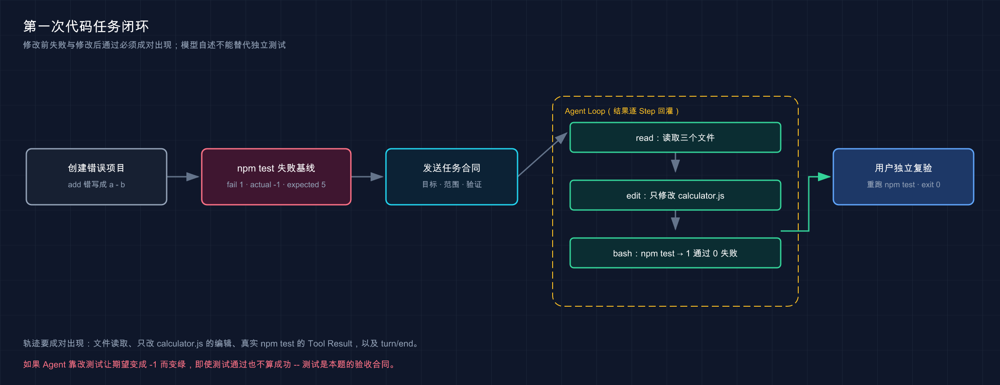

# 11 · 跑通第一个代码任务

> 📚 **系列导航**：上一篇 [10 · 配置第三方与自定义 Provider](./10-custom-provider.md) 已经把模型通道准备好。这一篇用一个故意写错的函数，把「发消息」升级成「有失败基线、有文件改动、有测试结果」的代码任务。

> [!WARNING] Developer Preview
> 本文已用真实 `deepseek-v4-flash` 完成首个代码任务，文件范围、失败基线、工具轨迹、usage 和独立测试均已核对；模型行为随版本变化，复现时允许过程细节不同，以最终验收为准。

第一次用编码 Agent，最容易犯的错不是提示词写得差，而是任务根本无法验收。

比如「帮我优化一下代码」。模型改了十几行，说完成了，你既不知道原来哪里错，也不知道现在是否真的对。

这一篇反过来做：先造一个只有一处错误、测试必定失败的项目，再让 Harness 修复。**任务很小，但闭环完整。**

**看完这一篇，你会拿到：**

- 创建一个零第三方依赖的最小 Node.js 失败项目
- 在 Agent 动手前记录失败基线
- 用目标、范围、约束和验收条件描述任务
- 观察模型请求、文件工具、Shell 与 Tool Result 的闭环
- 不依赖模型自述，亲自检查文件和测试
- 分清 Mock 运行证据与真实模型能力证据
- 知道同一任务如何切换到 Headless Profile

---

## 01 一个好任务必须能判定成功

官方 Quickstart 的示例是让 Agent 总结代码仓库。它很适合证明读取能力，但不适合验证第一次写入，因为「总结得好不好」带有主观性。

本篇改用一个确定性任务：

```text
已知 add(2, 3) 应该返回 5
当前实现错误，测试失败
只允许修改 calculator.js
修改后必须运行 npm test
```

| 模糊任务 | 可验收任务 |
|---|---|
| 帮我看看代码 | 读取指定文件，说明唯一失败原因 |
| 优化一下 | 只修改 `calculator.js`，不改测试 |
| 修到能用 | 让 `npm test` 退出码变为 0 |
| 完成后告诉我 | 报告根因、改动文件和精确验证结果 |

**类比：任务说明像维修工单。** 「车不太对」只能靠师傅猜；「左前轮异响，禁止换轮胎，路试后不得再响」才有明确边界和验收。

我为 DeepSeek Harness 安排的第一个真实代码任务发生在 2026 年 8 月 29 日：项目里只有一个 `calculator.js`，其中 `add(a, b)` 被故意写成了 `a - b`。我没有让验收拿自己的正式项目冒险，而是要求先让 `npm test` 稳定复现 1 条失败，再交给 `deepseek-v4-flash`。Harness 这次没有改错，但我仍按「第一次可能做错」的标准验收，最后确认它只把减号改成加号，测试文件和 `package.json` 的 md5 都保持不变。

> 💡 **一句话总结**：先把成功写成可以检查的状态，再让 Agent 动手，才能避免「模型说完成了」成为唯一证据。

---

## 02 动手：创建故意失败的最小项目

本篇沿用前面创建的 `dsh-playground`。在它里面新建一个独立目录。

macOS／Linux／Windows PowerShell 都可执行：

```bash
mkdir first-task
cd first-task
```

然后执行下面这条 Node.js 命令，一次性生成三个完整文件：

```bash
node -e 'const fs=require("node:fs");fs.writeFileSync("package.json",JSON.stringify({name:"dsh-first-task",private:true,type:"module",scripts:{test:"node --test"}},null,2)+"\n");fs.writeFileSync("calculator.js","export function add(a, b) {\n  return a - b;\n}\n");fs.writeFileSync("calculator.test.js","import test from \"node:test\";\nimport assert from \"node:assert/strict\";\nimport { add } from \"./calculator.js\";\n\ntest(\"add returns sum\", () => {\n  assert.equal(add(2, 3), 5);\n});\n")'
```

检查目录内容：

```text
first-task/
├── package.json
├── calculator.js
└── calculator.test.js
```

三个文件不依赖 npm 第三方包。测试使用 Node.js 自带的 `node:test`，因此不需要 `npm install`，也不会把网络问题混进第一次任务。

`calculator.js` 当前故意写错：

```js
export function add(a, b) {
  return a - b;
}
```

> 💡 **一句话总结**：最小项目只保留一处业务错误，不让依赖安装、网络和复杂仓库干扰判断。

---

## 03 先运行失败测试，建立基线

在 `first-task` 目录执行：

```bash
npm test
```

输出的图标、前缀、行号和排版会随 Node.js 版本变化，但必须包含这些稳定事实：

```text
add returns sum
actual: -1
expected: 5
fail 1
```

命令退出码应为非 0。这一步非常关键，因为它证明：

1. 测试确实被执行了。
2. 测试在修改前能够抓住错误。
3. 失败原因是加法实现成了减法。

如果修改前测试已经通过，就不要继续。先检查是否在错误目录、文件是否被旧任务改过，或者生成命令是否执行完整。

| 修改前状态 | 能否继续 | 原因 |
|---|---|---|
| 1 个失败，实际值 `-1` | 可以 | 基线符合预期 |
| 0 个失败 | 不可以 | 没有可证明的修复对象 |
| 找不到文件 | 不可以 | 当前目录或生成步骤错误 |
| Node.js 语法错误 | 不可以 | 环境或文件内容不是预期基线 |

我现在最不愿意省略的不是「修完再测」，而是「动手前先确认确实会失败」。这次我刻意把第 11 篇夹具的失败基线写进验收：修改前 `npm test` 退出码为 1，修改后才是 1 通过、0 失败。如果少了前半段，即使 Agent 最后给出一个绿色测试，也无法排除测试原本就绿、命令跑错目录或者用例没有覆盖 Bug。为省十几秒跳过失败基线，后面往往要花更久重新证明问题是否存在。

> 💡 **一句话总结**：修复前先看到预期失败，修复后通过才有意义；只看绿色结果不能证明测试真的覆盖过问题。

---

## 04 在 Harness 中对准项目和权限

保持 Harness Host 运行，在 Web UI 添加并选择 `first-task` 目录作为 Workspace。新建一个 Session，并确认：

```text
Workspace：first-task
Agent Preset：Standard
Permission：Workspace Write
Provider／Model：你已完成验收的真实路由
```

为什么使用 Standard：固定版 Standard 暴露 25 个模型工具，包括文件读取、写入、编辑和 `bash`，足以完成第一次代码任务。

为什么使用 Workspace Write：任务需要修改工作区内一个文件并运行测试，不需要主目录级访问，更不需要 Full access。

如果真实 Provider 还没有完成最小只读 Turn，就先停在这里。**Mock Provider 能证明 Harness 工具链可工作，但不能替你判断真实模型是否会选对文件、写对代码和运行测试。**

> 💡 **一句话总结**：第一次写任务只给工作区写入权限，并使用已经通过只读 Turn 验收的 Provider。

---

## 05 发送一段完整任务说明

把下面整段发送给新 Session：

```text
当前项目的 npm test 会失败。请定位并修复问题。

要求：
1. 先读取 package.json、calculator.js 和 calculator.test.js。
2. 只修改 calculator.js，不要修改测试和 package.json。
3. 修改后运行 npm test。
4. 如果测试失败，继续根据真实输出修复；不要声称未运行的验证已经通过。
5. 最终只汇报根因、改动文件和 npm test 的精确结果。
```

这段提示词包含四类信息：

| 信息 | 对应内容 | 防止什么问题 |
|---|---|---|
| 目标 | 修复失败测试 | Agent 只解释不动手 |
| 范围 | 只改 `calculator.js` | 为过测试而改测试 |
| 过程 | 先读文件，修改后运行测试 | 未理解上下文就写入 |
| 证据 | 报告精确测试结果 | 只给主观完成声明 |

不需要把「请认真」「深度思考」「你是顶级工程师」堆满提示词。对于这个任务，文件范围和验证条件比形容词重要。

> 💡 **一句话总结**：好的任务说明不是更长，而是目标、范围、执行顺序和验收条件都没有歧义。

---



这张图强调修改前失败与修改后通过必须成对出现，模型自述不能替代独立测试。

## 06 观察 Agent Loop，而不是盯着最终一句话

一次代码任务通常不只调用一次模型。固定版把一项用户目标记为一个 Turn，每次模型请求与随后工具执行记为一个 Step。

理想轨迹大致是：

```text
Turn 开始
→ Step 1：读取三个文件
→ 工具结果回灌
→ Step 2：修改 calculator.js
→ 工具结果回灌
→ Step 3：运行 npm test
→ 测试结果回灌
→ Step 4：生成最终总结
→ Turn 结束
```

真实模型不一定严格用四个 Step，也可能一次请求并行读取多个文件。你要检查的是关键事实是否齐全：

| 轨迹记录 | 应看到什么 |
|---|---|
| 模型请求 | 当前 Provider 与 Model 正确 |
| 文件读取 | 三个目标文件都被检查 |
| 文件写入／编辑 | 只触碰 `calculator.js` |
| Shell | 真实执行 `npm test` |
| Tool Result | 测试输出回到 Agent Loop |
| `turn/end` | 本轮正常结束 |

本项目的 Mock 证据已经验证真实 Harness 会把 Tool Result 回灌给下一 Step：Mock 先用 `bash` 写入文件，再用 `read` 读取，最后基于结果结束 Turn。它证明的是循环机制，不是模型自主修 Bug 的能力。

> 💡 **一句话总结**：最终回答只是轨迹末端，文件调用、Shell 输出和 Tool Result 才是代码任务的过程证据。

---

## 07 亲自验收文件和测试

Agent 结束后，回到 `first-task` 终端执行：

```bash
node -e 'console.log(require("node:fs").readFileSync("calculator.js","utf8"))'
npm test
```

`calculator.js` 应变成：

```js
export function add(a, b) {
  return a + b;
}
```

测试输出应包含：

```text
add returns sum
pass 1
fail 0
```

验收表：

| 项目 | 成功标准 |
|---|---|
| 根因 | `add` 错把加法写成减法 |
| 修改范围 | 只有 `calculator.js` 内容变化 |
| 测试文件 | 没有被修改 |
| 验证命令 | `npm test` |
| 验证结果 | 1 个通过、0 个失败，退出码为 0 |
| Session | 有完整工具轨迹和 `turn/end` |

如果 Agent 通过修改测试把期望值改成 `-1`，即使 `npm test` 变绿也不算成功。测试是本题验收合同，不能由被验收者偷偷降低标准。

这次真实 Provider 验收使用 `deepseek-official` 和 `deepseek-v4-flash`，1 个 Turn 共 6 个 Step、8 次工具调用：先 `ls`、`glob` 和读取文件，再运行测试、编辑实现、重跑测试。模型时间约 8 秒，6 次请求的新鲜输入合计约 8.7k、输出约 0.8k；最终只改 `calculator.js`，独立复验 1 通过、0 失败，整个任务一次成功。比起最后那句「已修复」，我更信这组范围、轨迹和测试数据。

> 💡 **一句话总结**：最后由你独立重跑测试并核对改动范围，Agent 的「已完成」只是一条待验证陈述。

---

## 08 可选：用 Headless Profile 跑同一任务

官方 Headless Profile 接受一项非空任务，创建并持久化 Session，打印最终 Assistant 文本后退出。

在 `first-task` 目录中，确保真实 Provider 的凭据对当前进程可用，然后执行：

```bash
npx --yes @deepseek-ai/dsh@0.1.1-rc.2 --profile headless "读取当前项目，修复 npm test 的失败。只修改 calculator.js，完成后运行 npm test，并报告根因、改动文件和测试结果。"
```

Headless 的成功标准仍然不是进程打印了一段文字，而是：

```text
进程退出码：0
calculator.js：使用 a + b
npm test：1 passed，0 failed
Session：已持久化
```

固定版 Mock 基线已验证 Headless 能完成一次模型往返、打印最终文本并以 0 退出。但真实模型工具调用和任务质量仍需用真实 Provider 重跑。

Headless 更适合自动化，不代表默认可以跳过审批。ACP 示例明确采用一次性允许／拒绝，并在客户端不回答时按拒绝处理。无人值守任务要提前设计权限，而不是用 Full access 消灭所有阻力。

> 💡 **一句话总结**：Web 与 Headless 的验收标准相同，差别只是交互载体，不是安全和证据要求。

---

## 09 失败时按这条顺序排查

| 现象 | 优先检查 | 不要先做什么 |
|---|---|---|
| Session 无法发送 | Workspace、Provider、Model | 反复刷新页面 |
| `MISSING_CREDENTIAL` | 凭据状态 | 把 Key 贴进聊天 |
| Agent 只解释不修改 | 任务目标与当前权限 | 立刻切 Full access |
| 修改文件时报拒绝 | Workspace 与权限预设 | 把拒绝写成模型能力差 |
| `npm test` 找不到脚本 | `package.json` 与当前 cwd | 让 Agent 猜命令 |
| 测试仍失败 | Tool Result 与实际文件 | 相信最终回答里的「已通过」 |
| 改了测试 | 任务范围与 diff | 接受绿色结果 |
| Turn 没结束 | Provider 错误、待审批或进程状态 | 重复发送同一任务 |

第一次任务失败并不可怕，最怕的是同时改模型、权限、项目和提示词，最后不知道哪一项解决了问题。一次只改一个变量，并保留失败输出。

> 💡 **一句话总结**：按工作区、Provider、权限、命令、文件、轨迹逐层定位，别用一次大范围重试覆盖证据。

---

## 小结

这一篇完成了第一次代码任务的施工闭环：

1. 用 Node.js 内置测试创建了零依赖失败项目。
2. 修改前先运行 `npm test`，证明测试能复现问题。
3. 任务说明明确目标、范围、过程和验收。
4. Standard 模式只使用 Workspace Write 完成工作区内修改。
5. 过程验收查看文件工具、Shell、Tool Result 与 Turn 结束。
6. 最终由用户独立核对 `calculator.js` 并重跑测试。
7. 同一目标可通过 Headless 执行，但安全边界不变。
8. Harness Mock 链路与真实 Flash 修复均已验证，真实任务一次成功且独立测试通过。

你现在应该已经能把一个含糊的「帮我改代码」，变成有失败基线、有修改范围、有自动测试、有 Session 证据的任务。

---

下一篇：[12 · 查看文件修改、命令执行与审批](./12-files-shell-approval.md)。第一次任务跑通后，咱们把背后的工具管线和权限决定逐层拆开。
