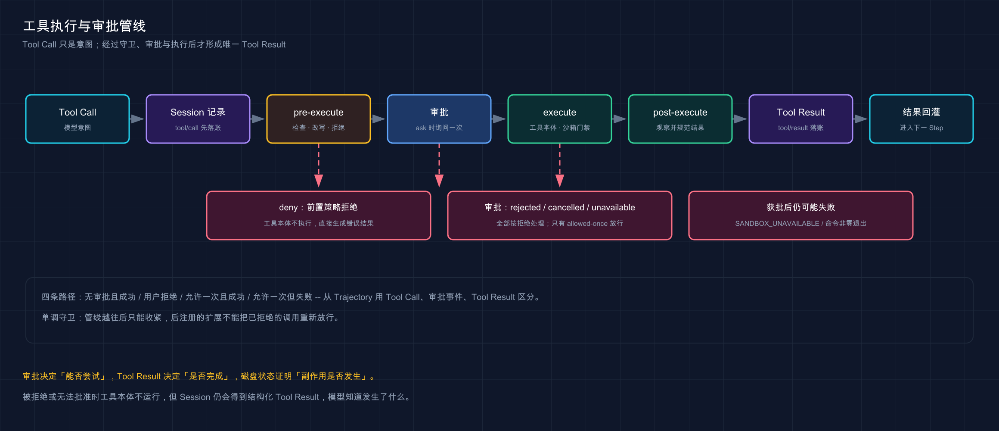
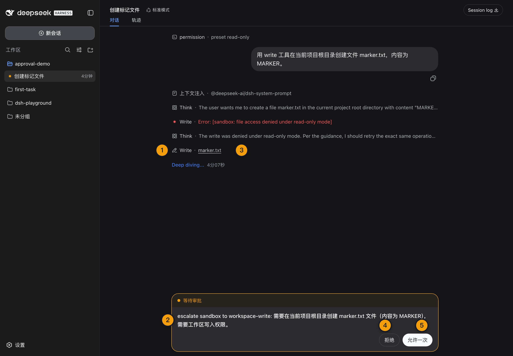

# 12 · 查看文件修改、命令执行与审批

> 📚 **系列导航**：上一篇 [11 · 跑通第一个代码任务](./11-first-task.md) 已经完成「读文件、改代码、跑测试」闭环。这一篇不再只看结果，而是解释每次工具调用如何被检查、拒绝、审批、执行和记录。

> [!WARNING] Developer Preview／跨平台待补
> 本文已在普通 macOS 环境完成受限沙箱四路径，并在真实浏览器中核对审批卡片、拒绝与 `allowed-once`；Windows／Linux 的沙箱与审批差异尚未实测。

Agent 要改一个文件，背后并不是「模型直接碰磁盘」。

模型只会提出工具调用。Harness 先记录它，再经过守卫、审批、沙箱和工具执行，最后把统一的 Tool Result 回灌给下一次模型请求。

**这条管线才是 Harness 最核心的价值之一：把模型的意图变成可约束、可拒绝、可审计的系统动作。**

**看完这一篇，你会拿到：**

- 看懂文件读写、Shell 与 Tool Result 在 Agent Loop 中的位置
- 理解工具调用为什么先记录、后执行
- 分清 Workspace、沙箱模式、审批策略和权限预设
- 知道 `workspace-write` 与 `danger-full-access` 的真实组合
- 理解拒绝、允许一次、取消和无应答的不同结果
- 用安全任务观察一次文件修改和命令执行
- 根据 Trajectory 判断未执行、已拒绝、获批后失败和真实成功

---

## 01 模型不能绕过 Harness 直接执行命令

固定版工具执行管线可以简化为：

```text
模型生成 Tool Call
→ Session 先记录 tool/call
→ tools/pre-execute
→ 单调守卫检查
→ 必要时请求审批
→ tools/execute
→ 工具本体与文件系统门禁
→ tools/post-execute
→ 统一 Tool Result
→ Session 记录 tool/result
→ 结果回灌下一 Step
```

「单调守卫」的意思是，管线越往后只能继续收紧，不能把前面已经拒绝的动作重新放宽。被拒绝或无法批准时，工具本体不会运行，但 Session 仍会得到一个结构化 Tool Result，让模型知道发生了什么。

| 阶段 | 负责什么 | 是否已经产生副作用 |
|---|---|---|
| `tool/call` | 记录模型想做什么 | 否 |
| `pre-execute` | 检查、改写或拒绝意图 | 否 |
| 审批 | 询问这一次动作能否继续 | 否 |
| `execute` | 调用 Shell／文件工具 | 可能 |
| `post-execute` | 观察和规范结果 | 副作用已由工具决定 |
| `tool/result` | 记录并回灌结果 | 否 |

**类比：这像机场安检。** 登机牌记录了你想去哪，安检与边检决定能不能继续，真正起飞才产生位移；被拦下也会有明确结果，不会假装这趟航班从没出现。



这张图展示模型意图如何经过守卫、审批与执行，最终形成唯一 Tool Result。

我安排 macOS 普通终端复测时，故意让 Agent 在 `workspace-write` 下往 `/var/tmp` 写文件。第一次 `bash` 被 Seatbelt 拒绝，Tool Result 明确给出 `file access denied under workspace-write mode`，目标文件也没有创建；Headless 没有审批通道时，提权重试继续被确定性拒绝。我没有为了跑通而要求改成 Full access，因为这条用例要验证的正是「越界写入失败时不能偷偷降级」。

> 💡 **一句话总结**：Tool Call 是模型意图，Tool Result 才是 Harness 对执行结果的权威记录，两者之间还有完整安全管线。

---

## 02 文件工具和 Shell 分别适合什么

Standard 模式同时提供文件读取、写入、编辑与 `bash`。它们不是同一个工具换皮：

| 任务 | 优先工具 | 原因 |
|---|---|---|
| 读取源码 | `read` | 直接返回文件内容，语义清楚 |
| 局部修改 | `edit` | 更容易限制修改范围 |
| 创建完整小文件 | `write` | 内容和目标路径明确 |
| 运行测试／构建 | `bash` | 需要真实进程与退出码 |
| 批量查找 | `bash` 中的 `rg` 等命令 | 使用项目已有 CLI 能力 |

文件工具更容易表达「哪个文件发生什么变化」，Shell 更灵活，也更容易产生广泛副作用。能用局部编辑完成的工作，不必把整份文件塞进一条 Shell 重写命令。

无论使用哪种工具，最终都要核对：

```text
cwd 是否正确
目标路径是否在预期范围
命令和参数是否完整
退出码是否为 0
stdout／stderr 是否符合预期
文件是否真实变化
```

> 💡 **一句话总结**：文件工具负责精确内容变更，Shell 负责真实进程验证；两者都必须服从同一权限与记录边界。

---

## 03 权限预设其实捆绑了两个旋钮

固定版产品组合后的默认权限表有三个可切换预设：

| 权限预设 | 沙箱模式 | 审批策略 | 适合场景 |
|---|---|---|---|
| `read-only` | `read-only` | `ask` | 只读观察与评审，写入需申请升级 |
| `workspace-write` | `workspace-write` | `ask` | 日常项目修改，默认推荐 |
| `danger-full-access` | `danger-full-access` | `never` | 明确受控且确实需要无限制访问的场景 |

两个旋钮分别回答不同问题：

- **沙箱模式**：这条命令技术上被允许访问哪些路径和能力。
- **审批策略**：工具申请更高能力时，是询问用户，还是直接拒绝。

`danger-full-access + never` 不是「危险时再问」。它的含义是已经不施加沙箱限制，同时禁用审批提示。Web UI 因此会把它显示为 Full access，并要求用户先确认风险，再允许切换。

`read-only` 既是底层沙箱模式，也是固定版默认权限表中的独立预设。本项目 G02 为验证审批管线，把隔离 Session 的默认权限设为 `read-only`，新 Session 的权限投影值就是 `read-only`，而不是派生的 `custom`。`custom` 只在旋钮组合不匹配任何预设表项时出现。补充一个分层细节：权限预设插件自身的内建默认只有 `workspace-write` 与 `danger-full-access` 两项，`read-only` 一项由固定版产品组合层加入。

这轮教程验收里，我没有给所有任务统一开最高权限。只读探索和安全探针用 `read-only`，普通修改优先用 `workspace-write`；只有需要跑完整代码任务、且工作区位于可随时删除重建的 `/tmp` 夹具时，才使用 `danger-full-access`。实际影响是部分受限任务要多走一次审批或明确失败，但真实教程仓库、个人 `~/.dsh` 和工作目录都没有被试验任务污染，这个代价我愿意接受。

> 💡 **一句话总结**：权限预设只是沙箱与审批的组合入口，真正强制执行仍由两个底层旋钮完成。

---

## 04 审批只回答「这一次能不能继续」

固定版审批结果是一个闭合集合：

| Harness 结果 | 界面含义 | 是否放行 |
|---|---|---|
| `allowed-once` | 允许一次 | 是，仅当前请求 |
| `rejected` | 明确拒绝 | 否 |
| `cancelled` | 请求被取消 | 否 |
| `unavailable` | 没有可用应答者或应答失败 | 否 |

只有 `allowed-once` 会放行。缺少 UI、客户端断开、回答器抛错或返回非法值，都不会默认允许，而是失败关闭。

当审批策略是 `ask`：

```text
工具申请更高能力
→ Harness 写入 approval/asked
→ UI 展示理由和对应 Tool Call
→ 用户选择拒绝或允许一次
→ Harness 写入 approval/decided
→ 工具管线继续或返回拒绝结果
```

当审批策略是 `never`，Harness 不会弹框，而是确定性返回 `rejected`。

审批事件只写日志，不直接进入模型 transcript。模型看到的是由调用方产生的 Tool Result，以及当前运行时权限上下文。

> 💡 **一句话总结**：审批不是永久授权开关，`allowed-once` 只覆盖当前所询问的动作，所有异常与无应答都按拒绝处理。

---

## 05 动手：观察一次正常工作区写入

沿用上一篇修好的 `first-task` Workspace。新建 Standard Session，权限选择 Workspace Write，然后发送：

```text
读取 calculator.js，在文件末尾增加一行注释：// verified by dsh
只修改这个文件。修改后运行 npm test，并报告修改文件和测试结果。
```

预期行为：

```text
读取 calculator.js：成功
编辑 calculator.js：成功
运行 npm test：成功
审批弹框：通常不会出现
最终测试：1 passed，0 failed
```

这里没有审批是正常现象。当前任务只在 Workspace Write 已允许的目录内改一个文件并运行项目测试，没有理由主动申请更广泛权限。

完成后在终端独立检查：

```bash
node -e 'console.log(require("node:fs").readFileSync("calculator.js","utf8"))'
npm test
```

文件应包含：

```js
export function add(a, b) {
  return a + b;
}
// verified by dsh
```

测试仍应包含：

```text
add returns sum
pass 1
fail 0
```

> 💡 **一句话总结**：安全预设的目标不是每一步都弹框，而是让工作区内正常动作顺畅、越界请求才进入审批。

---

## 06 四条执行路径怎么从轨迹中区分

本篇要区分的不只是「成功／失败」，而是四条完全不同的路径：

| 路径 | Tool Call | 审批事件 | 工具本体 | Tool Result | 副作用 |
|---|---|---|---|---|---|
| 无需审批且成功 | 有 | 无 | 执行 | 成功 | 有或无，取决于工具 |
| 用户拒绝 | 有 | asked + rejected | 不执行 | 拒绝 | 无 |
| 允许一次且执行成功 | 有 | asked + allowed-once | 执行 | 成功 | 有或无 |
| 允许一次但执行失败 | 有 | asked + allowed-once | 尝试执行 | 失败 | 不一定 |

第四条尤其重要：**审批成功不等于命令成功。** 它只说明安全门允许工具尝试；路径不存在、命令退出非 0、网络错误或沙箱后端不可用，仍会让工具失败。

G02 隔离实测正好覆盖了第四条：

```text
read-only 下写入被拒
→ Mock 使用相同命令申请 workspace-write
→ WebSocket 收到 approval/requested
→ 客户端回传 allowed-once，accepted = true
→ Session 记录 approval/asked 与 approval/decided
→ macOS 嵌套 sandbox-exec 启动失败
→ Tool Result 为 SANDBOX_UNAVAILABLE
→ 目标文件没有创建
```

这不能写成「用户拒绝」，也不能写成「Harness 批准后绕过沙箱」。真实含义是：审批层允许尝试，平台沙箱层失败，Harness 按 fail-closed 拒绝无约束降级。

> 💡 **一句话总结**：审批决定能否尝试，工具结果决定是否完成，文件系统状态才证明副作用是否发生。

---



这张图展示审批只决定当前动作能否尝试；命令最终是否成功仍要看 Tool Result。

## 07 真遇到审批卡片时怎么判断

当前 Web UI 会用审批面板暂时接管输入区，展示理由、对应的运行中命令，以及「拒绝／允许一次」。

点击之前按顺序检查：

1. 当前 Workspace 是否正确。
2. 完整命令是否与任务目标一致。
3. 路径是否超出工作区。
4. 是否涉及删除、覆盖、密钥、系统配置或外部写操作。
5. 更小权限或更窄命令能否完成任务。
6. 失败后是否可恢复。

| 场景 | 建议 |
|---|---|
| 工作区内正常测试，却莫名申请更高权限 | 先拒绝，要求解释必要性 |
| 只读检查申请写入 | 拒绝，重新限定任务 |
| 命令包含项目外路径 | 默认拒绝，核对真实需要 |
| 明确的一次性安全升级 | 核对命令后允许一次 |
| 看不懂命令或参数 | 拒绝，不靠猜放行 |

不要把弹框当作打断工作流的烦人提示。它是模型意图与真实副作用之间最后一道人类决策面。

浏览器验收时，我们把 Access 切到 Read Only，再要求写入隔离工作区。模型提权后，审批卡片完整展示了命令目的和理由；我要求只有确认路径仍在 `/tmp` 夹具内，才选择「允许一次」，不改成长期 Full access。批准后文件真实落盘并能回读，Session 同时留下 `approval/asked`、`approval/decided outcome: allowed-once` 和 Tool Result。另一次截图任务则选择「拒绝」收尾，确保没有悬停审批和残留副作用。

> 💡 **一句话总结**：看不懂就拒绝，能缩小就缩小；一次性批准的前提是命令、路径和影响都已核对。

---

## 08 为什么不建议第一次练习就开 Full access

本项目的无沙箱基线确实在 `danger-full-access` 下完成了完整工具闭环：

1. `bash` 写入 `g02-danger-proof.txt`。
2. `read` 读取文件内容。
3. Agent 基于真实 Tool Result 返回最终回答。

两个工具都成功，文件内容为 `G02_DANGER_SHELL_OK`，Trajectory 有 43 个事件，没有审批请求。

但这只是隔离临时目录中的运行验证，不能得出「Full access 更稳定，所以日常都开」的结论。

| Workspace Write | Full access |
|---|---|
| 工作区内日常修改 | 主机级广泛访问 |
| 越界可进入审批 | 审批策略为 `never` |
| 适合第一次任务 | 只适合边界已知的受控场景 |
| 沙箱不可用时应失败关闭 | 本身不提供工作区写入限制 |

真正的效率不是少点一次按钮，而是即使模型判断错，影响范围也被限制在你准备好的项目里。

> 💡 **一句话总结**：Full access 证明工具能跑，不证明它适合日常；默认从 Workspace Write 开始。

---

## 09 排错：先判断卡在哪一层

| 现象 | 证据 | 根因层 |
|---|---|---|
| 没有 Tool Call | Trajectory 只有模型文本 | 模型决策或任务表达 |
| Tool Call 后立即拒绝 | 有 Tool Result，无执行输出 | 守卫、策略或沙箱门禁 |
| 一直等待 | Session 显示 pending approval | 用户审批 |
| 已允许但仍失败 | `approval/decided = allowed-once` 加失败 Tool Result | 工具、平台沙箱或命令本身 |
| 命令退出非 0 | 有 stdout／stderr 与退出状态 | 项目或命令 |
| Tool Result 成功但文件不对 | 实际磁盘状态不符 | 路径、cwd 或验收遗漏 |
| `SANDBOX_UNAVAILABLE` | 明确沙箱后端错误 | 平台隔离能力 |

遇到沙箱不可用时，不要改成无沙箱重跑来「证明能用」。先保留错误证据，再到普通终端验证同一受限模式。Harness 失败关闭比静默降级更安全。

> 💡 **一句话总结**：用 Tool Call、审批事件、Tool Result 和磁盘状态四组证据定位，不用最终回答倒推过程。

---

## 小结

这一篇把文件、Shell 与审批拆成了可检查的管线：

1. 模型只产生 Tool Call，Harness 才负责真实执行。
2. 工具调用先记录，再经过守卫、审批、执行和结果规范化。
3. 文件工具适合精确修改，Shell 适合运行真实命令和测试。
4. 默认 `workspace-write` 组合工作区沙箱与 `ask` 审批。
5. `danger-full-access` 组合无限制执行与 `never`，不会危险时再问。
6. 只有 `allowed-once` 放行，其余审批结果全部失败关闭。
7. 获批只代表可以尝试，不能替代 Tool Result 和磁盘验收。
8. 当前隔离证据已完成；普通 macOS 终端受限沙箱四路径与浏览器审批卡片已于 2026-08-29 验收（REAL-KEY-ACCEPTANCE-R2.md §十一、REAL-KEY-ACCEPTANCE-R3.md §九），Windows／Linux 矩阵仍待主人补测。

你现在应该已经能从 Trajectory 判断一条命令是没执行、被拒绝、获批后失败，还是确实完成了副作用。

---

下一篇：[13 · Session 与 Trajectory 轨迹](./13-session-trajectory.md)。工具管线产生的每一条事实，接下来都会回到同一个持久事件账本里。
