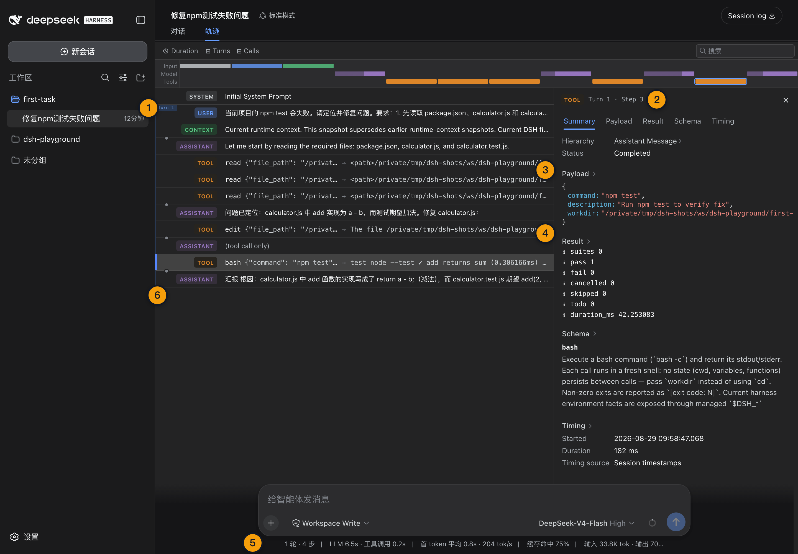
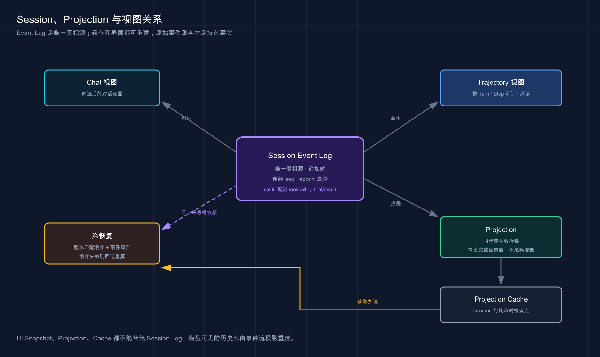

# 13 · Session 与 Trajectory 轨迹

> 📚 **系列导航**：上一篇 [12 · 查看文件修改、命令执行与审批](./12-files-shell-approval.md) 已经把 Tool Call、审批和 Tool Result 串起来。这一篇回答最后一个问题：这些事实保存在哪里，重启后为什么还能看见。

> [!WARNING] Developer Preview／部分边界待补
> 本文已验证固定版 Session 创建、完整事件序列、JSONL 持久化与正常重启恢复，浏览器 Trajectory 已验收；Crash、并发写入、Fork 与 Replay 的边界情形将在后续批次补充。

很多聊天产品把「会话」理解成一串气泡。DeepSeek Harness 的 Session 不是。

它要记录用户目标、模型请求、流式回复、工具调用、审批、权限、Token 和结束状态，才能让 UI、重启恢复和后续调试看到同一份事实。

**Session 是追加式事件账本，Chat 与 Trajectory 只是这本账的两种视图。**

**看完这一篇，你会拿到：**

- 分清 Session、Turn、Step、Event、Projection 和 Trajectory
- 知道 Chat 为什么不是独立真相源
- 会在 Trajectory 查看工具、耗时、输入、输出和 Token
- 用事件对判断一次任务是否真正闭环
- 理解 Session 如何持久化并在正常重启后恢复
- 明确 Projection 缓存与原始事件日志的关系
- 不把正常恢复外推成 Crash、Fork 或 Replay 已验证

---

## 01 六个概念先摆正

| 概念 | 一句话定义 | 本篇例子 |
|---|---|---|
| Session | 一条持久、追加式事件日志 | `first-task` 的整段任务历史 |
| Turn | 一个用户目标对应的工作切片 | 「修复失败测试」 |
| Step | 一次模型请求加随后工具执行 | 读文件、改文件、跑测试中的一轮 |
| Event | 已提交到 Session 的原子事实 | `tool/call`、`tool/result` |
| Projection | 从事件折叠出的当前状态 | Token 汇总、权限、任务状态 |
| Trajectory | 面向人的事件轨迹视图 | 按 Turn／Step 查看时间线 |

**类比：Session 像一本不可擦除的项目流水账。** Event 是每笔原始记录，Projection 是实时余额，Chat 是给普通用户看的摘要账单，Trajectory 是审计员查看的逐笔明细。

一次 Turn 可以包含多个 Step。一次 Step 则对应一轮模型请求与该轮产生的工具执行。模型拿到 Tool Result 后继续思考，就进入下一 Step，但仍属于同一个用户目标。

第 11 篇首任务如果只看聊天结尾，只能看到一句「测试已通过」。真正让我敢把它写进教程的是 Trajectory：里面能还原先读文件、第一次测试失败、执行 `edit`、第二次测试通过的顺序，还能确认总共 6 个 Step、8 次工具调用。没有这条轨迹，我就无法回答模型是否先改测试、是否跑错命令、失败基线到底有没有出现，只能重新跑一遍任务。

> 💡 **一句话总结**：Session 管完整生命周期，Turn 管用户目标，Step 管一次模型与工具往返，Trajectory 负责把它们展示出来。

---

## 02 Session Log 是唯一真相源

固定版 Session 采用类型化、追加式 `SessionEvent` 日志。它不是一边保存聊天消息、一边另存工具状态，再想办法让两边同步。

**所有可恢复状态都应从同一条事件序列派生。**

关键事件包括：

| 事件 | 记录什么 |
|---|---|
| `turn/start` | 一个用户目标开始 |
| `user/message` | 持久、模型可见的用户输入 |
| `step/start` | 一次模型请求周期开始 |
| `request/header` | 本次请求路由等头部事实 |
| `request/context` | 发送前组装的上下文事实 |
| `assistant/chunk` | 流式增量 |
| `assistant/message` | 完整 Assistant 消息与可选 usage |
| `tool/call` | 模型提出的工具调用与原始参数 |
| `tool/result` | 该调用唯一的规范结果 |
| `step/end` | 本 Step 结束 |
| `turn/end` | 本 Turn 结束 |

每条事件有连续 `seq`，时间使用 Unix epoch 毫秒。`tool/call` 的 `callId` 与对应 `tool/result` 配对；如果适配器上报 Token 用量，它附在 `assistant/message`，不会再造一条独立 usage 事件。

Chat 表面只需要展示用户消息、Assistant 消息和必要工具结果，不代表其他事件不存在。审批、权限、请求上下文和步骤边界仍保存在 Session Log 中。

> 💡 **一句话总结**：Chat 是筛选后的对话表面，Session Log 才是工具、审批、请求与生命周期共享的唯一事实源。

---

## 03 Trajectory 展示什么，又不做什么

Trajectory 按 Turn 组织事件记录，用粗分隔线标记 Turn，用紧凑标记区分 Step。选择一条记录后，局部检查器可以查看：

- Token 用量。
- 持续时间。
- Input。
- Output。
- Timing。
- Assistant 的 TTFT 与解码时间。

| Chat 视图 | Trajectory 视图 |
|---|---|
| 适合阅读对话结果 | 适合审计执行过程 |
| 隐藏大量内部事件 | 保留 Turn／Step／工具记录 |
| 关注「说了什么」 | 关注「如何做到、何时发生」 |
| 内容结构简洁 | 可检查 Token、耗时、输入输出 |

长轨迹默认打开在当前尾部，向上滚动会暂停自动跟随，避免新事件把你拉回底部；到已加载范围顶部时再加载更早一页，并只挂载可见行附近的窗口。

Trajectory 不读取也不修改 Chat 的 conversation snapshot。它从共享 Session 窗口组装自己的记录，不向模型请求添加内容，也没有 KV Cache 影响。

我安排用 Trajectory 做四模式对照时，最有价值的不是看最终文本，而是看动作被记在哪一层。Standard 直接显示 7 次模型 Tool Call；PTC 外层只有 3 次 `run_code`，里面的 5 次读取、编辑和测试在浏览器里显示为 `SUBTOOL`。如果只统计外层调用，会错误得出 PTC「只做了三次动作」；把内部 dispatch 展开后，我才把统计口径改成外层调用和内部动作分开记录。

> 💡 **一句话总结**：Trajectory 是 Session 的只读审计视图，不会改变对话内容、模型请求或任务执行。

---

## 04 动手：检查上一篇任务的完整轨迹

打开 `first-task` 对应 Session，切换到 Trajectory 标签。按顺序寻找：

```text
turn/start
→ user/message
→ step/start
→ request/header／request/context
→ assistant/message 或 tool/call
→ tool/result
→ 后续 step/start
→ assistant/message
→ step/end
→ turn/end
```

真实模型的 Step 数和工具顺序可能不同，但上一篇任务至少应能回答这些问题：

| 检查问题 | 从哪里看 |
|---|---|
| 使用哪个 Provider／Model | 请求头或模型路由记录 |
| 是否真的读取三个文件 | `tool/call` 与配对结果 |
| 修改了哪个文件 | 文件工具输入与结果 |
| 是否真的运行 `npm test` | Shell Tool Call 与 stdout／stderr |
| 测试是否成功 | Tool Result 的退出状态与输出 |
| 是否等待过审批 | `approval/asked`／`approval/decided` |
| 是否正常结束 | `turn/end` |
| Token 和耗时多少 | Assistant／Trajectory 检查器 |

如果最终回答说「测试通过」，但轨迹里没有 `npm test` 对应的 Tool Call，不算执行过验证。如果有 Tool Call 但 Tool Result 是拒绝或非 0，也不算通过。

> 💡 **一句话总结**：用调用与结果成对核对任务，不让最终文本替代真实命令证据。

---



这张图把最终回答还原成模型请求、工具执行、结果回灌与 Turn 结束的完整证据链。

## 05 看懂一次完整工具循环

G02 的无沙箱隔离证据提供了一条确定性轨迹：

```text
用户启动 Turn
→ Mock Provider 请求 bash 写入 g02-danger-proof.txt
→ Harness 执行并记录成功 Tool Result
→ 下一 Step 请求 read 读取同一文件
→ Harness 返回 G02_DANGER_SHELL_OK
→ 下一 Step 输出 G02_DANGER_FLOW_DONE
→ turn/end
```

该 Session 共 43 个事件。文件真实存在、内容正确、两个 Tool Result 成功，且最终回答在读取结果之后产生。

这条证据能证明：

- Provider 请求进入 Agent Loop。
- Tool Call 被执行。
- Shell 副作用真实落盘。
- 文件读取结果回灌下一 Step。
- 多 Step 最终形成一个 Turn。
- Session 保存完整轨迹。

它不能证明：

- DeepSeek 模型会自主选择正确工具。
- 真实模型能稳定完成同样任务。
- Mock Token 数等于真实模型消耗。
- 无沙箱模式适合日常项目。

| 证据 | Harness 链路 | 模型能力 |
|---|---|---|
| Mock 依次发出固定 Tool Call | 已证明 | 未证明 |
| 工具真实写入并读取文件 | 已证明 | 未证明 |
| 最终回答引用 Tool Result | 回灌机制已证明 | 自主推理未证明 |
| Trajectory 有 Token 字段 | 计量链路已证明 | 真实 usage 未证明 |

> 💡 **一句话总结**：确定性 Mock 适合验证 Harness 机制，真实 Provider 才能评价模型选择、任务质量与真实用量。

---



这张图说明缓存和界面都可以重建，原始事件账本才是持久事实。

## 06 Projection 为什么不是第二份状态

原始事件适合审计，但每次打开页面都从头扫描长日志会越来越慢。Projection 解决的是读取效率，不是再造真相源。

它的规则可以写成：

```text
上一个 Projection 状态
+ 一条已提交 Event
= 新的完整 Projection 状态
```

每个 Projection 都是同步、纯函数式折叠。它输出的是变更后的**完整当前值**，不是一段裸增量。这样客户端拿到任意一次更新，都能把它当作该序号下的完整状态。

固定版还会为 Projection 写持久缓存：

- `turn/end` 强制检查点。
- Session 从 live 变 cold 时强制检查点。
- 冷读取先使用版本匹配的缓存，再读取后续事件尾部。
- 缓存版本失效或日志缩短时，回退到更完整的重算路径。

| 数据 | 角色 | 能否替代 Session Log |
|---|---|---|
| Session Event | 原始事实 | 是唯一真相源 |
| Projection State | 当前折叠状态 | 不能 |
| Projection Cache | 加速冷读取 | 不能，可失效重建 |
| UI Snapshot | 客户端某个序号的视图 | 不能 |

**类比：Projection 像银行余额缓存。** 它让你不用每次重算全部流水，但余额出问题时仍要回到账本；不能删掉流水，只留最后一个数字。

> 💡 **一句话总结**：Projection 是可重建的读取模型，Event Log 才是不可替代的持久事实。

---

## 07 动手：验证正常退出后的 Session 恢复

先保证当前任务已经出现 `turn/end`，再回到运行 Harness 的终端，按 `Ctrl+C` 正常停止。

使用**相同用户、相同 `DSH_HOME` 和相同工作目录**重新启动固定版：

```bash
npx --yes @deepseek-ai/dsh@0.1.1-rc.2 web
```

重新打开终端打印的地址，选择原来的 Workspace，然后检查：

```text
旧 Session：仍在列表中
运行状态：已结束，不应伪装为仍在执行
历史消息：可以恢复
工具结果：仍能查看
Trajectory：旧 Turn／Step 仍存在
项目文件：保持上次真实磁盘状态
```

本项目固定版隔离复验的具体结果是：

```text
重启后 session.list：发现 7 个持久 Session
目标 Session running：false
目标 session.history：恢复 43 个事件
Shell 结果：保留
最终回答：保留
```

这证明 JSONL 持久化至少覆盖正常退出后的 Session 列表、Preset、cwd 和完整历史恢复。

如果重启后列表为空，先检查是否换了 `DSH_HOME`、换了系统用户、在隔离环境中使用了新的 Home，或者打开了另一个 Host 端口。不要第一时间判断数据丢失。

2026 年 8 月 27 日做持久化基线时，我们正常停止 Web Host，再用同一个 `DSH_HOME` 重启。`session.list` 重新发现了 7 个持久化 Session，目标 Session 以 `running: false` 的冷状态恢复，Preset、工作目录、历史和 Trajectory 都还在，其中无沙箱工具闭环的轨迹有 43 个事件。那次没有出现数据丢失；后续只要换了隔离 Home，列表就会自然不同，所以我现在先核对 `DSH_HOME`，再判断恢复是否异常。

> 💡 **一句话总结**：相同持久化目录下正常停止再启动，应该恢复冷 Session 与历史；先核对 Home，再判断持久化故障。

---

## 08 当前证据不能外推到什么

工程文档最容易犯的错，是把一条成功路径写成所有可靠性承诺。

| 当前已验证 | 当前未验证 |
|---|---|
| 正常 `Ctrl+C` 后重启 | 进程被强杀或机器断电 |
| 单进程写入 JSONL | 多进程并发写同一 Session |
| 已结束 Session 冷恢复 | 正在执行的 Turn 崩溃恢复 |
| 原 Session 历史读取 | Fork 复制语义 |
| 事件重新加载 | Replay 是否重执行工具 |
| Mock 工具轨迹恢复 | 真实 Provider 长任务恢复 |

Crash 恢复涉及日志尾部截断、检查点一致性与副作用幂等；Fork 涉及父子 Session 的历史边界；Replay 还必须回答「只重建状态，还是重新执行工具」。这些都不能从「正常重启能看见旧聊天」推出来。

因此本文只使用准确表述：**固定版在本次 JSONL 组合中通过正常退出后的冷 Session 恢复。**

> 💡 **一句话总结**：正常重启证据只覆盖正常重启，不自动证明 Crash、并发、Fork 或 Replay 可靠。

---

## 09 用 Trajectory 排查三类常见问题

### 模型为什么重复调用工具

检查前一个 Tool Result 是否被拒绝、截断、返回错误，或者模型没有拿到预期内容。不要只看两条相似 Tool Call。

### 任务为什么看似卡住

检查最后一条事件：

| 最后状态 | 可能原因 |
|---|---|
| pending approval | 等待用户决定 |
| Tool Call 无最终结果 | 工具仍运行、被取消或连接异常 |
| Assistant 流式记录未结束 | Provider 仍在输出或断流 |
| `step/end` 无 `turn/end` | Agent 可能继续下一 Step |
| `turn/end` | 本轮已结束，问题可能在 UI 状态 |

### Token 为什么比预期多

查看每个 Step 的 Input、Output、usage 与上下文压力。工具结果、大文件内容和重复历史都会进入后续请求上下文。Trajectory 能展示记录到的用量，但只有真实 Provider usage 才能用于费用判断。

> 💡 **一句话总结**：重复、卡住和 Token 异常都应从最后事件与各 Step 输入输出定位，不靠聊天气泡猜测。

---

## 小结

这一篇把 Session 与 Trajectory 的关系讲清楚了：

1. Session 是追加式事件账本，也是唯一真相源。
2. Turn 对应用户目标，Step 对应一次模型请求和工具执行。
3. Chat 是精简对话表面，Trajectory 是按 Turn／Step 组织的审计视图。
4. Tool Call 和 Tool Result 必须按 `callId` 成对检查。
5. Projection 从事件同步折叠当前状态，缓存可以失效重建。
6. 固定版已恢复 7 个冷 Session 和目标 Session 的 43 条事件。
7. Mock 证明 Harness 链路，不证明真实模型能力或真实 Token。
8. Crash、并发、Fork 和 Replay 仍在当前验收范围之外。

你现在应该已经能从 Session 事件判断一次任务做了什么、在哪一步失败、是否真正结束，以及重启后恢复了哪些事实。

---

下一篇：[16 · 怎么给 Harness 下达任务](./16-task-instructions.md)。首个 Agent 闭环完成后，下一步会把任务说明拆成可复用的日常工作方法。
