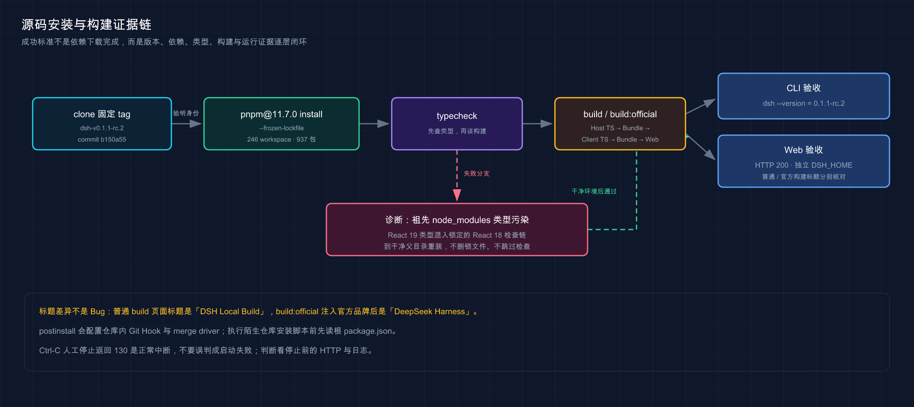

# 14 · 从源码安装与本地开发

> 📚 **系列导航**：上一篇 [44 · 沙箱、fail-closed、文件系统边界与命令安全](./44-sandbox-security.md) 划清了执行边界。本篇进入开发者路径：不再只运行 npm 成品，而是把固定版本的整个 Harness 仓库装起来、构建出来并确认你运行的确实是自己的源码产物。

> [!WARNING] Developer Preview／跨环境复测待补
> 本文已在 macOS ARM64、Node.js `26.7.0` 与一次性 pnpm `11.7.0` 下完成固定 tag 的冻结安装、受控类型检查、普通构建、官方构建、CLI 和 Web HTTP 验证；干净父目录、Node.js 22.19、Windows 与 Linux 尚未实测。

如果只是使用 DeepSeek Harness，[第 07 篇](./07-npx-start.md) 的固定版本 `npx` 是更短、更稳的入口。源码安装不是高级感更强的替代命令，它会把 246 个 workspace、937 个依赖包、构建顺序、Git Hook 和本机类型解析一起带进来。

什么时候值得承受这些复杂度？当你要阅读 Agent Loop、修改 Preset、开发插件、调试 Web 客户端，或者复现某个 commit 的行为时。

**源码安装的验收标准不是「`pnpm install` 没报错」，而是版本、依赖图、类型检查、构建产物、CLI 和 Web 六层证据能够互相对上。**

**看完这一篇，你会拿到：**

- 判断该用 `npx` 还是源码 checkout
- 固定 tag、commit、Node.js 与 pnpm 版本
- 在独立目录完成冻结依赖安装
- 看懂 `postinstall` 会修改什么
- 区分普通本地构建与官方品牌构建
- 从源码启动 CLI 与 Web，并用 HTTP 验收
- 识别父目录 `node_modules` 造成的 React 类型污染
- 建立「改动--验证--重建--运行」的最小开发循环

---

## 01 先确认你真的需要源码安装

两种入口解决的问题不同：

| 入口 | 最适合 | 优点 | 代价 |
|---|---|---|---|
| `npx @deepseek-ai/dsh@<version>` | 使用 Web／Headless、学习 Harness 能力 | 命令短，不需要理解 monorepo | 不能直接改 Harness 源码 |
| 固定 tag 的源码 checkout | 阅读、调试、修改、开发插件或贡献上游 | 版本、源码、锁文件和构建链在同一仓库 | 安装更慢，更容易受本机工具链影响 |

不要因为已经 clone 仓库，就默认源码路径更适合日常任务。当前固定版的源码构建要经过 Host TypeScript、Host Bundle、Client TypeScript、Client Bundle 和 Web，多一层就多一层失败面。

一个实用判断是：

```text
只想运行 Harness
→ 用固定版本 npx

需要回答「某段源码为什么这样工作」
或需要修改、调试、开发
→ 用固定 tag 源码
```

2026 年 8 月 28 日，我安排本教程从固定版 `npx` 切到源码 checkout，不是因为成品不能用，而是后半套教程需要核对 Plugin、Preset、Session 和 Capability Seam 的真实实现。源码固定在 tag `dsh-v0.1.1-rc.2` 和 commit `b150a55`，冻结安装处理了 246 个 workspace、937 个 package，最终普通构建和官方构建都通过。最大的收获是能把教程里的架构词逐个落到源码和测试，而不是根据 README 猜内部关系。

> 💡 **一句话总结**：源码安装服务于研究和开发；只想使用 Harness 时，固定版本 `npx` 仍是更小的故障面。

---

## 02 固定四个版本坐标

源码教程最怕一句「clone 最新版」。今天的 `master` 即使恰好等于教程 commit，明天也可能前进。本文固定四个坐标：

| 坐标 | 固定值 | 用途 |
|---|---|---|
| Git tag | `dsh-v0.1.1-rc.2` | 人能读懂的发布标识 |
| Git commit | `b150a551b8d465e31e418e1b2eaf5e79bbb7d28e` | 精确源码身份 |
| Node.js | `^22.19.0 || >=24.0.0` | 根 `package.json` 的引擎范围 |
| pnpm | `11.7.0` | 根 `packageManager` 声明 |

官方开发文档还要求 Git `2.26+`。开始前先检查，不要等安装失败后才猜版本：

```bash
git --version
node --version
npm --version
```

Node.js `23.x` 不满足 `^22.19.0 || >=24.0.0`。`22.18.x` 也不满足，因为最低点是 `22.19.0`。本文实测环境是 Node.js `26.7.0`；这能证明 26 路径，不等于 22.19 路径已经通过。

另注意：Node.js `24.0`–`24.11.1` 区间内固定版 `0.1.1-rc.2` 存在启动可能失败且 HMR 失效的已知问题，官方在 `0.1.2-alpha.2`（2026-08-30 发布）中修复；使用 Node.js 24 的读者请先避开该区间，再按本篇操作。

pnpm 也不要只看机器上「有一个 pnpm」。本机全局版本是 `10.33.0`，仓库声明的是 `11.7.0`。本文用一次性命令调用准确版本：

```bash
npx --yes pnpm@11.7.0 --version
```

输出应为：

```text
11.7.0
```

官方文档推荐 Corepack；如果你的 Node.js 环境已经提供它，可以按官方方式启用。但不要为了跟教程一致修改全局工具链，精确的一次性 pnpm 足以完成本篇实验。

> 💡 **一句话总结**：复现源码行为要同时固定 tag、commit、Node.js 范围和 pnpm，不能只记一个 DSH 版本号。

---

## 03 在隔离目录 clone 固定 tag

不要把第一次源码构建放进正在工作的真实项目，也不要让它直接使用真实 `~/.dsh`。先创建可丢弃目录：

```bash
DSH_SOURCE_ROOT="$(mktemp -d)"
printf '%s\n' "$DSH_SOURCE_ROOT"
```

再 clone 固定 tag：

```bash
git clone \
  --branch dsh-v0.1.1-rc.2 \
  --depth 1 \
  https://github.com/deepseek-ai/deepseek-harness.git \
  "$DSH_SOURCE_ROOT/source"

cd "$DSH_SOURCE_ROOT/source"
```

逐项核对身份：

```bash
git rev-parse HEAD
git describe --tags --exact-match
node -p "require('./package.json').version"
node -p "require('./package.json').packageManager"
node -p "JSON.stringify(require('./package.json').engines)"
```

本文版本的预期关键输出是：

```text
b150a551b8d465e31e418e1b2eaf5e79bbb7d28e
dsh-v0.1.1-rc.2
0.1.1-rc.2
pnpm@11.7.0
{"node":"^22.19.0 || >=24.0.0"}
```

如果 commit 或 tag 不一致，先停下，不要继续安装后再用日志解释差异。仓库处于 detached HEAD 是按 tag 浅 clone 的正常结果；需要开发自己的分支时，在确认身份后再新建本地分支。

> 💡 **一句话总结**：安装前先把源码身份验明，才能把后面的成功或失败归因到正确版本。

---

## 04 用锁文件安装，并看懂安装副作用

在仓库根目录执行：

```bash
npx --yes pnpm@11.7.0 install --frozen-lockfile
```

`--frozen-lockfile` 的价值是拒绝安装过程偷偷改写锁文件。源码 tag 与它自带的 `pnpm-lock.yaml` 共同定义依赖图；如果锁文件与声明不一致，正确结果是失败并要求你调查，而不是现场生成另一套依赖。

本文实测安装处理了 246 个 workspace 和 937 个 package，退出码为 `0`。过程中出现了三类不等于失败的输出：

- macOS 不支持某些 Linux 可选包的警告。
- workspace cycle 警告。
- 部分 package bin 尚未构建的 warning。

判断原则只有两个：最终退出码，以及后续类型检查和构建是否真正通过。不要看到一行黄色输出就宣判失败，也不要因为最终写着 `Done` 就忽略后续构建。

还要知道，依赖安装不是纯下载。固定版根 `postinstall` 会在当前 clone 中配置 Lefthook Git Hooks 和翻译文件的 Git merge driver。它不会替你修改系统 Git，但会改变这个工作树的 Git 配置与 Hook 行为。

在陌生仓库执行任何安装脚本前，都应该先读根 `package.json` 的 `scripts`。本篇能直接执行，是因为已经核对固定 commit 的脚本内容，并且整个仓库位于可丢弃目录。

> 💡 **一句话总结**：冻结安装锁住依赖图，但 `postinstall` 仍会产生仓库内副作用，执行前必须先读脚本。

---

## 05 先类型检查，再决定能不能构建

官方开发文档把新 clone 的完成条件写为：

```bash
npx --yes pnpm@11.7.0 run typecheck
```

本文第一次原样执行没有通过，出现 5 个 `ReactNode` 类型错误。错误看起来像仓库自己的 React 类型不兼容，但进一步核对发现：

```text
仓库锁定：@types/react@18.3.31
仓库父级泄漏：/tmp/node_modules/@types/react@19.1.0
```

React 19 的 `ReactNode` 比 React 18 多出 `bigint` 和 `Promise` 等成员，TypeScript 向父目录查找后把两套类型放到同一检查链里，于是固定源码在安装成功后仍然报错。

遇到同类错误时按这个顺序排查：

1. 确认当前 Node.js、pnpm、tag 和 commit。
2. 确认 `install --frozen-lockfile` 真正成功。
3. 从源码目录一路向上检查是否存在意外的 `node_modules/@types/react`。
4. 在父目录干净的位置重新 clone、安装和 typecheck。
5. 仍失败时保存完整错误、解析路径和版本，再查上游 Discussion／Issue。

不要一上来删除锁文件、升级 `@types/react` 或给类型错误加绕过标记。那会把「环境污染」改写成「你自己的未验证依赖图」。

本文为了证明根因，只在临时 clone 中把根类型解析限制回锁定的 React 18，随后 `typecheck:contracts-ready` 通过。这个诊断动作不是官方修复，教程不提供可复制的链接命令。最稳妥的用户动作仍是在没有祖先 `node_modules` 的干净路径重试，并等待上游对同形问题给出正式结论。

> 💡 **一句话总结**：类型检查失败先核对解析到的真实类型来源，不要用改锁文件或跳过检查掩盖环境污染。

---

## 06 理解两种构建，不要把标题差异当 Bug

类型边界确认后，执行普通构建：

```bash
npx --yes pnpm@11.7.0 run build
```

固定版会依次完成：

```text
Host TypeScript
→ Host Bundle
→ Client TypeScript
→ Client Bundle
→ Web
```

普通构建不是官方发行构建。它使用调用方默认的 `DSH_CLIENT_*` 品牌变量，本文生成页面的标题是：

```text
DSH Local Build
```

需要验证与官方 npm 成品相同的品牌注入时，再运行：

```bash
npx --yes pnpm@11.7.0 run build:official
```

重新启动后，页面标题应变成：

```text
DeepSeek Harness
```

两种构建都通过，证明构建链可用；标题不同是品牌输入不同，不是代码构建了一半。开发日常优先普通 `build`，只有检查官方发行外观或发布链等价性时才用 `build:official`。

初次安装阶段出现的 missing bin warning 也要放到这里复判：本文后续完整构建成功，说明那些 bin 是「尚未生成」，不是「依赖永久缺失」。如果构建后仍找不到 bin，才进入真实排错。



这张图展示源码安装的成功标准不是依赖下载完成，而是版本、类型、构建和运行证据逐层闭环。

> 💡 **一句话总结**：普通构建面向本地开发，官方构建注入官方品牌；两者成功标准相同，但页面标题本来就可以不同。

---

## 07 从源码启动 CLI 与 Web，并独立验收

固定版根脚本的 `pnpm dsh` 会通过 `tsx` 运行源码 CLI 入口。先检查版本：

```bash
npx --yes pnpm@11.7.0 dsh --version
```

预期输出：

```text
0.1.1-rc.2
```

再给状态目录做隔离，启动 Web：

```bash
export DSH_HOME="$DSH_SOURCE_ROOT/dsh-home"
export DSH_AGENTS_HOME="$DSH_SOURCE_ROOT/agents-home"

npx --yes pnpm@11.7.0 dsh web \
  --no-open \
  --host 127.0.0.1 \
  --port 4173
```

终端会打印实际端口。另开一个终端，用打印出来的地址验收：

```bash
curl --fail --silent --show-error http://127.0.0.1:4173/ > /dev/null
```

如果 `4173` 已被占用，先选择一个明确的空闲端口，并在启动与 `curl` 命令中同时替换。

成功标准：

```text
CLI 版本 = 0.1.1-rc.2
Web 首页 = HTTP 200
普通 build 标题 = DSH Local Build
build:official 标题 = DeepSeek Harness
状态写入 = 独立 DSH_HOME
```

`pnpm dsh web` 使用已经生成的 Web 产物，不会因为源码刚改过就自动重建。修改 Client 或 Web 后必须先跑对应验证与构建，再重启或刷新服务。

按 Ctrl-C 停止时，pnpm 包装层可能打印 `ELIFECYCLE` 并返回 `130`。这是收到中断信号的正常表现；判断启动是否成功应看停止前的 HTTP、页面资源和服务日志，而不是把人工停止的退出码当成启动错误。

> 💡 **一句话总结**：源码启动要同时验 CLI 版本、Web HTTP、页面品牌和隔离状态目录，不能只看进程有没有常驻。

---

## 08 建立最小本地开发循环

源码安装完成后，不要每改一行就无差别跑所有脚本。先按改动层级选择最小闭环：

| 改动 | 最低验证 | 运行前动作 |
|---|---|---|
| README／开发文档 | 文档规则与链接检查 | 通常不需要重建 DSH |
| Host TypeScript | 相关测试／typecheck | 重新构建 Host 或完整 build |
| Client／Web | typecheck 与相关 Client 检查 | 重新构建 Client／Web |
| 跨 Host 与 Client 合同 | `typecheck:contracts-ready` 加相关测试 | 完整 `build` |
| 发行品牌或入口 | 完整检查 | `build:official` |

一个稳妥的通用循环是：

```text
确认当前 tag／分支和干净基线
→ 做一组范围明确的修改
→ 跑与修改最接近的测试或类型检查
→ 跑完整 build
→ 从源码启动 CLI／Web
→ 用外部命令验收结果
→ 检查 git diff
```

如果构建产物似乎没有更新，再考虑：

```bash
npx --yes pnpm@11.7.0 run clean
npx --yes pnpm@11.7.0 run build
```

`clean` 会移除生成产物，只在怀疑旧产物污染时使用；它不是每次开发的固定仪式。执行前先确认工作区没有把个人文件错误放进生成目录。

验收一度准备为了 5 个 `ReactNode` 类型错误去改 Harness 源码，继续追查后才发现根因是父目录 `/tmp/node_modules` 的 React 19 类型污染了仓库锁定的 React 18。于是我没有让项目提交任何上游源码修改，只要求在临时环境把类型解析限制回 `@types/react@18.3.31`，再跑 `typecheck:contracts-ready` 和完整构建。这个「最终没改源码」的经历反而更重要：先证明错误属于项目代码，再动补丁，否则很容易把环境污染写成一处假修复。

> 💡 **一句话总结**：本地开发应围绕改动范围建立最小验证，再用完整构建和外部验收收口。

---

## 09 一份可直接照着验收的清单

完成源码安装后，逐条打勾：

- [ ] Git 版本至少 `2.26`。
- [ ] Node.js 满足 `^22.19.0 || >=24.0.0`。
- [ ] 实际调用的 pnpm 是 `11.7.0`。
- [ ] HEAD 是 `b150a551b8d465e31e418e1b2eaf5e79bbb7d28e`。
- [ ] 当前 tag 是 `dsh-v0.1.1-rc.2`。
- [ ] `install --frozen-lockfile` 退出码为 `0`。
- [ ] 已知晓 clone 内的 Hook 与 merge driver 副作用。
- [ ] 父目录没有意外 `node_modules` 污染类型解析。
- [ ] 类型检查通过，或失败时已记录准确解析来源。
- [ ] `pnpm run build` 通过。
- [ ] `pnpm dsh --version` 返回 `0.1.1-rc.2`。
- [ ] Web 首页返回 HTTP 200。
- [ ] `DSH_HOME` 与真实用户状态隔离。
- [ ] 人工 Ctrl-C 的 `130` 没有被误判为启动失败。

本文当前证据中，固定源码安装、诊断后的类型检查、两种构建、CLI 与 Web 均已通过；原样干净父目录、Node.js 22.19、Windows 和 Linux 还不能打勾。

这次源码构建环境是 macOS 26.4 ARM64、Node.js v26.7.0、pnpm 11.7.0，commit 固定为 `b150a55`。冻结安装退出码 0；原样 typecheck 因外部 React 19 污染失败，受控类型解析后通过；普通构建与 `build:official` 都成功，Web 首页均返回 HTTP 200，标题分别是 `DSH Local Build` 和 `DeepSeek Harness`。本教程没有跑 Node.js 22.19、Windows 与 Linux，因此这段经验只代表当前 macOS 环境，不包装成跨平台结论。

> 💡 **一句话总结**：源码安装只有在身份、依赖、类型、构建、运行和状态隔离全部有证据时才算完成。

---

## 小结

从源码安装 DeepSeek Harness 的核心不是背一串 pnpm 命令，而是把可复现链路锁紧：固定 tag 与 commit，用仓库声明的 Node.js 和 pnpm，以冻结锁文件安装，先做类型检查，再做普通或官方构建，最后从源码启动 CLI／Web 并独立验收。

本文也留下了一个比成功日志更有价值的失败证据：仓库外的 React 19 类型可以污染固定版 React 18 检查。碰到类似错误时，先查解析路径，不要删锁文件或绕过类型检查。

下一篇：[15 · 升级、降级、卸载与安装排错](./15-version-maintenance.md)。
