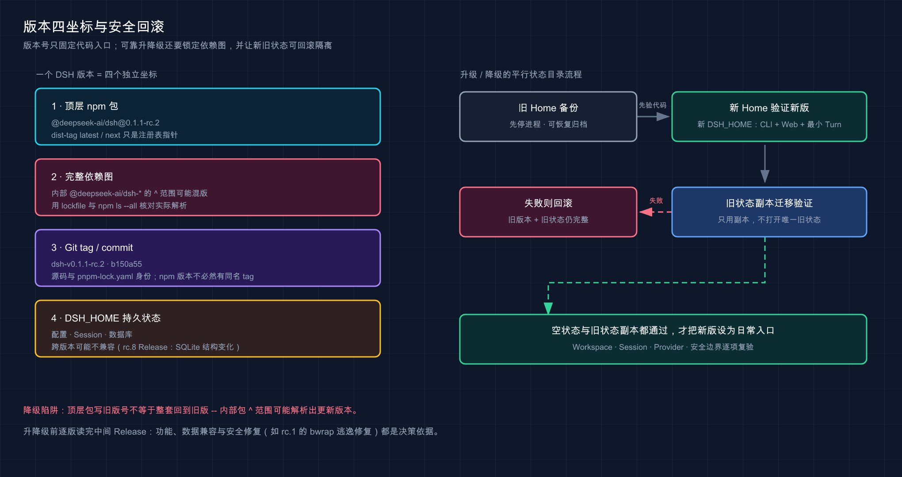

# 15 · 升级、降级、卸载与安装排错

> 📚 **系列导航**：上一篇 [14 · 从源码安装与本地开发](./14-source-install.md) 已经把固定 tag 构建出来。这一篇解决版本开始变化后最棘手的问题：怎样升级而不破坏旧状态，怎样真的降级，怎样按安装方式卸载，以及安装或启动失败时先查哪一层。

> [!WARNING] Developer Preview／历史版本运行待补
> 本文版本事实已于 2026-08-31 在线重查：npm `latest`／`next` 为 `0.1.1-rc.2`，新增 `alpha` 通道 `0.1.2-alpha.2`，共 11 个顶层版本、6 个可见 Git tag；历史版本安装、跨平台与真实状态升降级尚未实测。

「我把命令里的 rc.2 改成 rc.1，所以已经降级了。」

这在简单的单包工具里可能成立，在 DeepSeek Harness 当前预发布 monorepo 里不够。顶层 CLI 包、几十个内部包、Git 源码、锁文件和 `DSH_HOME` 中的持久状态各有自己的版本边界。

**真正可回滚的版本维护，必须同时控制代码、完整依赖图和状态目录。**

**看完这一篇，你会拿到：**

- 看懂 `latest`、`next`、npm 版本、Git tag 与 Release 的差异
- 在升级前保存可复核基线
- 用新状态目录验证新版本，不直接污染旧 Session
- 理解为什么固定顶层 npm 包不等于固定内部依赖图
- 选择可靠的降级路径
- 按 `npx`、项目安装、全局安装和源码 checkout 分别卸载
- 处理缓存、版本错位、类型污染、旧构建与端口问题
- 用一张验收表判断升级或降级是否真的完成

---

## 01 一个 DSH 版本其实有四个坐标

先把「版本」拆开：

| 坐标 | 例子 | 它能证明什么 | 它不能证明什么 |
|---|---|---|---|
| 顶层 npm 包 | `@deepseek-ai/dsh@0.1.1-rc.2` | 入口包的声明版本 | 所有内部包都同版 |
| 完整 npm 依赖图 | 多个 `@deepseek-ai/dsh-*` 实际解析版本 | 本次安装真正运行的包组合 | 源码 commit 身份 |
| Git tag／commit | `dsh-v0.1.1-rc.2`／`b150a551b8d465e31e418e1b2eaf5e79bbb7d28e` | 源码与锁文件身份 | npm 缓存和状态格式 |
| 持久状态 | `DSH_HOME` 下配置、Session、数据库 | 当前实例保存的用户状态 | 能被任意旧版安全读取 |

还有一个容易混淆的显示值：固定版运行时 `host.describe.version` 实测为 `0.0.1`，而 CLI／npm 版本是 `0.1.1-rc.2`。判断安装版本要用：

```bash
npx --yes @deepseek-ai/dsh@0.1.1-rc.2 --version
```

不要把 Host 应用内部暴露值当成 CLI 版本。

为什么要拆四层？因为升级可能只换了顶层入口，降级可能仍混入新内部包，而复用旧 `DSH_HOME` 又可能触发数据结构不兼容。只看最终页面能打开，无法证明这三件事都正确。

> 💡 **一句话总结**：代码版本、依赖图和持久状态是三个独立风险面，单个 `--version` 只能回答其中一部分。

---

## 02 写作当日的在线版本事实

截至 `2026-08-31` 北京时间，在线核对结果是：

| 项目 | 当前事实 |
|---|---|
| npm `latest` | `0.1.1-rc.2` |
| npm `next` | `0.1.1-rc.2` |
| npm `alpha` | `0.1.2-alpha.2`（2026-08-30 新增；`0.1.2-alpha.1` 未推上 npm） |
| npm 顶层公开版本 | 11 个 |
| 最新 GitHub Release | `dsh-v0.1.2-alpha.2`（prerelease，2026-08-30 发布，经 `alpha` dist-tag 推上 npm）；固定版 `dsh-v0.1.1-rc.2` 同为 prerelease |
| 最新 Release 附件 | 无二进制附件 |
| 可见 Git tag | rc.7、rc.8、rc.1、rc.2、alpha.1、alpha.2 共 6 个 |

用 npm 自己核对，而不是抄教程里的日期事实：

```bash
npm view @deepseek-ai/dsh dist-tags --json
npm view @deepseek-ai/dsh versions --json
npm view @deepseek-ai/dsh@0.1.1-rc.2 version dist.tarball dist.integrity
```

`latest` 与 `next` 当前都指向 rc.2，不代表它已经是稳定版。`alpha` 指向更新的 `0.1.2-alpha.2`，但包名仍带 `alpha`，GitHub Release 也标为 prerelease，官方 README 明确处于 Developer Preview。

npm 一共有 11 个顶层版本，不等于 GitHub 有 11 个对应 tag。当前公开 Git tag 只有 6 个，所以不要自动拼出一个 tag URL，或假设每个早期 npm 包都能用同名源码 tag 重建。

这也是为什么本篇把日期放进正文：版本事实属于高频变化项，读者执行前必须重新查询。

> 💡 **一句话总结**：dist-tag 是注册表当前指针，不是稳定性承诺；npm 版本与 Git tag 也不是天然一一对应。

---

## 03 升级前先建立可回滚基线

升级前不要先运行新版本。先记录旧实例：

```bash
CURRENT_DSH_VERSION="0.1.1-rc.2"
CURRENT_DSH_HOME="${DSH_HOME:-$HOME/.dsh}"

npx --yes "@deepseek-ai/dsh@$CURRENT_DSH_VERSION" --version
printf 'dsh_home=%s\n' "$CURRENT_DSH_HOME"
npm view @deepseek-ai/dsh dist-tags --json
```

再完成四项人工检查：

- 正常停止所有正在使用该状态目录的 DSH 进程。
- 记录当前版本、Node.js 版本、启动命令和 `DSH_HOME`。
- 读从当前版到目标版之间的每条 Release，特别是安全修复与数据不兼容说明。
- 对有价值的状态目录做可恢复备份，不把备份写回原目录。

如果真实 Session 和配置有价值，备份至少要能够回答：

```text
备份来自哪个 DSH 版本
备份时间是什么
原 DSH_HOME 在哪里
备份路径在哪里
恢复前需要停止哪些进程
```

本文不提供直接删除状态的命令。即使你认为旧状态没用了，先移动到带版本与日期的归档目录也比立刻删除更可恢复。

2026 年 8 月 28 日核对历史版本时，本教程发现一个比「CLI 能启动」更隐蔽的问题：`@deepseek-ai/dsh@0.1.1-rc.1` 的内部依赖范围使用 `^0.1.1-rc.1`，当前安装可能混入 rc.2 子包。与此同时，rc.8 的 Release 还明确提醒 SQLite 数据结构不兼容。虽然这次没有造成真实数据损失，但它足以让我停止直接拿旧 Home 升级测试，改成固定源码 tag、保留锁文件并隔离状态目录。

> 💡 **一句话总结**：升级前先固定旧版本、启动方式和状态备份，否则出现问题时没有可比较、可恢复的基线。

---

## 04 用平行状态目录验证升级

Developer Preview 阶段最稳妥的升级方式不是「原地覆盖」，而是让新版本使用新的 `DSH_HOME`：

```bash
DSH_UPGRADE_ROOT="$(mktemp -d)"
export DSH_HOME="$DSH_UPGRADE_ROOT/dsh-home"
export DSH_AGENTS_HOME="$DSH_UPGRADE_ROOT/agents-home"
export npm_config_cache="$DSH_UPGRADE_ROOT/npm-cache"

npx --yes @deepseek-ai/dsh@0.1.1-rc.2 --version
npx --yes @deepseek-ai/dsh@0.1.1-rc.2 web \
  --no-open \
  --host 127.0.0.1 \
  --port 0
```

先验新空状态：

| 层 | 成功标准 |
|---|---|
| 包入口 | `--version` 等于目标版本 |
| Web | 首页 HTTP 200，静态资源正常 |
| 配置 | 只读取新状态目录，没有继承未知旧配置 |
| Workspace | 能添加专用测试目录 |
| Session | 能创建、完成最小 Turn、重启后恢复 |
| 安全 | 权限、审批和沙箱边界没有被升级绕过 |

新空状态通过后，才用**旧状态的副本**做迁移验证。不要直接让新版本打开唯一一份旧状态。若迁移过程自动改写数据库或配置，副本失败仍能回到原版与原状态。

验证副本时至少检查：

```text
旧 Session 数量与代表性历史
Provider 配置状态，不读取或打印 Key
Workspace 列表
新建 Session 与新任务
正常停止后再次启动
```

只有空状态和旧状态副本都通过，才考虑把新版本设为日常入口。

> 💡 **一句话总结**：先用新 Home 验代码，再用旧 Home 的副本验迁移，避免把版本试验和唯一状态绑在一起。

---

## 05 降级最容易踩的是「顶层精确、内部混版」

看起来最直接的降级命令是：

```bash
npx --yes @deepseek-ai/dsh@0.1.1-rc.1 --version
```

但本文没有把它写成「可靠降级完成」。在线核对发现，rc.1 顶层包对多个内部包声明的是：

```text
^0.1.1-rc.1
```

当注册表已经存在 rc.2 时，这个范围可以解析出 rc.2 内部包。也就是说：

```text
顶层 dsh = rc.1
内部 @deepseek-ai/dsh-* = 可能混入 rc.2
```

所以可靠性从低到高是：

| 路径 | 适用场景 | 主要限制 |
|---|---|---|
| 临时 `npx @deepseek-ai/dsh@0.1.1-rc.1` | 快速观察顶层入口 | 必须核对完整解析图，不能自动称为完整降级 |
| 项目安装加保存的 lockfile | 复现曾经锁定的 npm 组合 | 需要那一时点的可靠锁文件 |
| Git tag／commit 加自带 `pnpm-lock.yaml` | 对应 tag 存在时复现源码 | 仍要通过该版本构建，早期 npm 版未必有 tag |

项目安装后可以用这些命令检查实际解析：

```bash
npm ls --all
npm explain @deepseek-ai/dsh
```

对 scoped 内部包，应逐个核对实际版本，而不是只看根节点。源码路径则要核对：

```bash
git rev-parse HEAD
git describe --tags --exact-match
npx --yes pnpm@11.7.0 install --frozen-lockfile
```

降级时一定换新的 `DSH_HOME`，或使用与该旧版配套的状态副本。GitHub `dsh-v0.1.0-rc.8` Release 已明确提醒 SQLite 数据结构不兼容，这是不能让不同版本盲目共享状态目录的直接证据。

本次旧版 npm 安装在 60 秒窗口内没有完成，因此没有把 rc.1 CLI／Web 标记为已验证。超时不是失败证明，也不是成功证明，只是未完成。



这张图展示版本号只固定代码入口；可靠升级与降级还要锁定内部依赖图，并让新旧状态保持可回滚隔离。

我没有为了补一段「成功回滚」就要求 rc.1 和 rc.2 轮流打开同一份 Session 数据。本教程实际尝试安装 rc.1 时，60 秒窗口内没有完成，而且顶层版本也无法证明内部包全部回到 rc.1；我因此中止把它记作回滚成功，教程继续固定在 rc.2。真正要回滚时，我会复制状态副本、使用独立 `DSH_HOME` 和锁文件，等 CLI、Web、旧 Session 与新任务四项都验收后，再决定是否停留旧版。

> 💡 **一句话总结**：可靠降级必须固定完整依赖图并隔离状态，顶层包写了旧版号不代表整套 Harness 已回到旧版。

---

## 06 卸载要先判断你用哪种安装方式

`npx`、项目依赖、全局安装和源码 checkout 不是同一种安装，也没有同一个卸载命令。

| 使用方式 | 程序放在哪里 | 正确处理 | 不会自动处理的内容 |
|---|---|---|---|
| `npx` 临时运行 | npm cache | 没有项目包可 `uninstall`；停止进程即可 | npm cache、`DSH_HOME` |
| 项目本地安装 | 项目 `node_modules` 与 lockfile | 在该项目运行 `npm uninstall @deepseek-ai/dsh` | 独立 `DSH_HOME`、项目外缓存 |
| 用户主动全局安装 | 全局 npm prefix | `npm uninstall -g @deepseek-ai/dsh` | `DSH_HOME`、其他 Node.js 环境里的安装 |
| 源码 checkout | clone 目录与构建产物 | 停止源码进程，归档或另行处理 checkout | `DSH_HOME`、全局缓存 |

本文和第 07 篇推荐的是 `npx`，它不会在你的项目 `package.json` 中登记依赖。因此不要在任意项目里运行 `npm uninstall`，然后以为卸载成功。

先查命令到底来自哪里：

```bash
command -v dsh
npm list -g --depth=0 @deepseek-ai/dsh
npm list --depth=0 @deepseek-ai/dsh
```

如果 `command -v dsh` 指向某个 Node.js 版本管理器目录，切换 Node.js 后可能还有另一份全局安装。只有你明确曾经全局安装，才运行全局卸载。

程序与状态要分开决定。卸载包不会自动删除 Session、配置或凭据状态。需要停用旧状态时，先停止进程，再移动到可恢复归档：

```bash
DSH_STATE_PATH="${DSH_HOME:-$HOME/.dsh}"
printf 'state=%s\n' "$DSH_STATE_PATH"
```

确认路径后再由你决定归档位置。不要用未展开验证的变量执行递归删除，也不要为了清理缓存顺手删除整个 npm cache。

> 💡 **一句话总结**：先识别安装来源，再分别处理程序、缓存和状态；卸载包从来不等于删除用户数据。

---

## 07 Release 不只是功能列表，也是迁移与安全清单

升级或降级前，至少读目标版本和中间版本的 Release。固定版附近已有两个典型例子：

| Release | 必须关注的内容 | 维护决策 |
|---|---|---|
| `dsh-v0.1.0-rc.8` | SQLite 数据结构不兼容 | 不让新旧版本直接共用唯一状态目录 |
| `dsh-v0.1.1-rc.1` | Linux bwrap `/proc/<pid>/root` 逃逸修复 | 不能只为兼容性长期退回缺少安全修复的旧版 |
| `dsh-v0.1.1-rc.2` | Files API 图片上传／复用和图像预处理改进 | 相关功能验证要按新路径重跑 |

版本选择不能只问「哪个功能多」。如果你从 rc.2 退到 rc.8，可能同时退掉安全修复；如果从 rc.8 升级，状态数据库又可能遇到不兼容边界。

一条完整的版本决策记录至少包括：

```text
当前版本和目标版本
触发升级／降级的问题
中间 Release 的 breaking change
中间 Release 的安全修复
状态备份和隔离路径
验证矩阵
最终保留版本
```

GitHub Release 没有附件也不等于不存在版本。当前 rc.2 Release 没有预构建二进制附件，官方使用入口仍是 npm，源码复现则用 tag 和 lockfile。

> 💡 **一句话总结**：Release 决定的不只是新功能，还包括数据兼容与安全底线，升级和降级都必须逐版阅读。

---

## 08 按证据层级排查安装与启动问题

不要在安装、构建、缓存、状态和端口之间随机试命令。按下面顺序缩小范围：

| 现象 | 先查 | 可靠动作 | 不要做 |
|---|---|---|---|
| `Unsupported engine` | `node --version` 与根 `engines` | 切到受支持 Node.js | 用忽略 engine 强行继续 |
| Node.js 24.0–24.11.1 启动失败／HMR 失效 | Node.js 小版本号与 Release 说明 | 避开该区间（换 22.19+、24.11.2+ 或 26.x）；官方已在 `0.1.2-alpha.2` 修复，固定版 `0.1.1-rc.2` 不含此修复 | 假定 DSH 安装本身损坏 |
| pnpm 行为不同 | 实际 pnpm 与 `packageManager` | 调用 `pnpm@11.7.0` | 让任意全局 pnpm 改锁文件 |
| `npx` 版本不对 | 命令是否带精确版本、dist-tag | 用 `--version` 复验 | 只看缓存目录名 |
| npm cache 返回 `EPERM` | 错误路径、目录所有权与当前用户 | 先用任务专用 `npm_config_cache` 复核 | 未确认影响就执行 `sudo chown` 或清空全部缓存 |
| 旧版内部包混入新版 | package 依赖范围与实际依赖树 | 保存 lockfile，核对 `npm ls --all` | 只看顶层版本 |
| 源码 ReactNode／bigint 错误 | 祖先 `node_modules/@types/react` | 在干净父目录重新 clone | 删锁文件、跳过 typecheck |
| install 阶段 missing bin | 是否尚未 build、最终退出码 | 完成类型检查与构建后复判 | 把 warning 直接写成缺包 |
| Web 仍显示旧标题／旧代码 | 是否重建、是否启动另一 checkout | 停止旧进程，重建并查端口 | 反复刷新浏览器 |
| Web 端口占用 | 启动日志与监听进程 | 使用 `--port 0` 或明确空闲端口 | 猜服务启动失败 |
| Ctrl-C 后 `ELIFECYCLE` | 停止前 HTTP 是否正常 | 将 `130` 视为人工中断 | 误判为构建失败 |
| Session／配置异常 | 实际 `DSH_HOME` 与 Release 兼容说明 | 用新 Home 或状态副本复测 | 让多版本共写唯一状态 |

缓存只能在证据指向缓存时处理。本文补跑 `npm view` 时，默认用户 cache 因既有 root-owned 文件返回 `EPERM`；没有修改目录所有权，改用任务专用临时 cache 后，同一查询立即返回 `latest`、`next`、版本列表与依赖数据。这能证明默认 cache 权限有问题，不能反推 npm Registry 或 DSH 包不可用。`npx` 当前版已在第 07 篇和运行基线中通过；历史 rc.1 本次安装未在时间窗口内完成，也不能仅凭「慢」断言缓存坏了。

源码类型错误也不要与 npm 成品混在一起。前者经过本地 TypeScript 编译；后者运行已发布产物。某个源码 checkout typecheck 失败，并不自动证明同版本 npm CLI 不能运行。

若调试超过两轮仍停留在同一错误，保存：

```text
完整命令
退出码
Node.js／npm／pnpm／DSH 版本
Git commit／tag
实际 DSH_HOME
关键错误原文
依赖解析路径
```

然后对照官方 README、开发文档、Release 和同形 Discussion，不继续用随机清缓存制造新变量。

> 💡 **一句话总结**：先判断错误属于工具链、依赖图、源码构建、进程还是状态层，再只改变一个变量验证。

---

## 09 升级、降级与卸载的最终验收

版本操作完成后，用这份清单收口：

### 升级

- [ ] 查询时记录了 dist-tag 与北京时间。
- [ ] 读完当前版到目标版的全部 Release。
- [ ] 旧状态已经停止写入并可恢复备份。
- [ ] 新版本先在新 `DSH_HOME` 通过 CLI 与 Web。
- [ ] 旧状态只用副本做迁移测试。
- [ ] Workspace、Session、Provider 状态和安全边界已复验。

### 降级

- [ ] 顶层版本与内部依赖图都已核对。
- [ ] 有 lockfile 或存在可精确定位的源码 tag／commit。
- [ ] 旧版没有直接打开唯一的新状态。
- [ ] 已阅读被退掉版本中的安全修复。
- [ ] CLI、Web、最小任务和重启恢复均有结果。

### 卸载

- [ ] 已确认是 `npx`、本地、全局还是源码 checkout。
- [ ] 已停止对应进程。
- [ ] 只对真实存在的安装方式执行卸载。
- [ ] 状态与缓存独立判断，没有误删用户数据。
- [ ] `command -v dsh` 与 npm 列表已复查。

本文当前能打勾的是 rc.2 在线版本事实、固定源码身份、冻结安装、受控类型检查、两种构建、CLI 和 Web。历史 npm 依赖图运行、真实状态迁移和跨平台结果仍待后补。

版本排查中还遇到一个容易误诊的插曲：默认 npm cache 有 root-owned 文件，`npm view` 直接报 `EPERM`。我决定不修改全局所有权或清空用户缓存，让查询换到 `/tmp` 独立 cache 后，同样的 dist-tag、版本和依赖范围查询随即成功。这个结果证明故障在本地缓存权限，不在 Registry 或 DSH 包；但完整的 rc.1／rc.2 双 Home 升降级和卸载残留检查仍未执行，我不会把一次查询成功写成联合回归完成。

> 💡 **一句话总结**：版本维护的终点不是命令退出码为 0，而是程序、依赖图、状态和回滚路径都得到独立验证。

---

## 小结

DeepSeek Harness 仍处于 Developer Preview，版本维护不能照搬成熟单包 CLI 的思路。`latest` 是注册表指针，顶层 npm 版本不必然锁住内部包，Git tag 只覆盖部分公开版本，`DSH_HOME` 还可能跨越数据结构变化。

最稳妥的原则可以压缩成三句话：升级先用新 Home，迁移只碰旧状态副本；降级同时固定完整依赖图和状态；卸载先认清安装方式，不把程序、缓存和用户数据混为一件事。

下一批已经进入第 22～27 篇的日常工作流，先读 [22 · 探索陌生仓库](./22-explore-repository.md)，再依次完成 Bug、重构、测试、跨文件功能和长任务。
