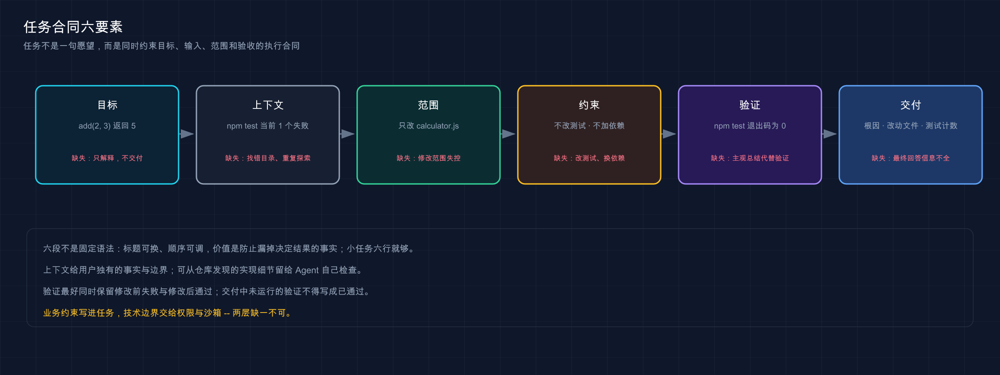

# 16 · 怎么给 Harness 下达任务

> 📚 **系列导航**：上一篇 [13 · Session 与 Trajectory 轨迹](./13-session-trajectory.md) 已经教你检查 Agent 做过什么。这一篇回到任务起点：怎样把一句需求写成 Harness 能持续推进、你也能独立验收的执行合同。

> [!WARNING] Developer Preview
> 本文已用同一真实 Provider 对照含糊指令与结构化指令，并如实记录极小任务中未出现明显效率差异；更大任务的对照结论可能不同，请以自己的任务复测。

「帮我把这个项目弄好。」

几分钟后，Agent 回你：「已经完成。」

这两句话看着都很顺，实际没有任何一条可验收信息。问题不在模型不会写代码，而在任务没有定义「好」是什么、能改哪里、用什么证明完成。

**给 Harness 下任务，不是研究一句神奇提示词，而是写一份最小执行合同。**

**看完这一篇，你会拿到：**

- 理解任务怎样进入 Turn，并在多个 Step 中持续推进
- 用目标、上下文、范围、约束、验证和交付写完整任务
- 分清该告诉 Agent 的事实与它应该自己检查的事实
- 避免把实现步骤写死，又避免无限授权
- 用失败基线和独立验证消除「模型说完成了」
- 知道中途补充、取消和新开 Session 分别适合什么
- 用同一项目对照含糊指令与可执行指令

---

## 01 任务不是一句愿望，而是一份执行合同

一条可执行任务至少要回答六个问题：

| 问题 | 任务里要写什么 | 缺失后的常见结果 |
|---|---|---|
| 要达到什么结果 | 明确目标 | Agent 只解释，不交付 |
| 在什么环境做 | 项目、入口、已知现象 | 找错目录或重复探索 |
| 哪些内容在范围内 | 文件、模块、接口 | 修改范围失控 |
| 哪些事情不能做 | 禁止项与安全边界 | 改测试、换依赖、扩大权限 |
| 怎样证明成功 | 命令、断言、退出码 | 用主观总结代替验证 |
| 最后交付什么 | 改动、证据、遗留问题 | 最终回答信息不完整 |

**类比：任务像装修合同。** 只说「把房子装好」，施工方可以从刷墙做到拆承重墙；写清房间、预算、不可拆位置、验收标准和交付清单，才有共同边界。

这不代表每次都要写一千字。小任务可能六行就够，关键是六类信息没有实质缺口。

我安排本教程用真实 `deepseek-v4-flash` 测过一句很含糊的指令：「测试好像坏了，你处理一下。」在那个只有一个文件、一个错误的极小夹具上，它没有翻车，仍然用 6 个 Step、8 次工具调用修对了文件。这个结果反而提醒我不要编一个「含糊提示一定失败」的故事：小任务里模型可能猜对，真正的风险是项目变大后，目标、范围和验收都没有被钉住，猜错时你也说不清它违背了哪条合同。

> 💡 **一句话总结**：任务质量取决于信息闭环，不取决于形容词数量。

---

## 02 Harness 怎样消费一条任务

用户发送任务后，固定版 Agent Loop 不会把一句话直接交给 Shell。它会先打开 Turn，再逐 Step 组装请求：

```text
用户任务进入 inbox
→ turn/start
→ 领取本 Step 的用户输入
→ step/start
→ 组装系统提示词、动态上下文和可见工具
→ 请求 Provider／Model
→ 执行 Tool Call
→ Tool Result 回灌
→ 下一 Step 重新组装请求
→ 自然停止
→ turn/end
```

每个 Step 会组装或确定的核心内容包括：

- 当前 Agent Preset 提供的系统提示词。
- 当前 Provider／Model 请求路由。
- Workspace `cwd` 等运行上下文。
- 当前作用域可见的工具 schema。
- Session 派生出的用户、Assistant、工具调用与结果历史。
- 权限、计划、Goal 等插件贡献的动态上下文。

系统提示词由插件按顺序组装，工具集合也按 Agent 作用域解析。因此同一句任务在不同 Preset 中可能看到不同工具形态，但用户目标本身仍应保持稳定。

| 用户负责 | Harness 负责 | 模型负责 |
|---|---|---|
| 目标、边界、成功标准 | 上下文、工具、安全、状态与记录 | 分析、选择工具、根据结果继续 |

> 💡 **一句话总结**：用户定义任务合同，Harness 组织执行环境，模型在每个 Step 基于真实结果作决定。

---

## 03 六段式任务模板

以后遇到需要修改代码的任务，可以直接套这份模板：

```text
目标：
<最终要达到的可观察结果>

上下文：
<项目位置、入口、已知现象、已有失败证据>

范围：
<允许读取或修改的文件、模块、接口>

约束：
<禁止修改、禁止新增依赖、权限和外部操作边界>

验证：
<必须实际执行的命令，以及成功输出或退出码>

交付：
<最终需要汇报的根因、改动、验证结果和未解决项>
```

这六段并非固定语法，标题可以换，顺序也可以根据任务调整。它们的价值是提醒你别漏掉决定结果的事实。

| 信息类型 | 示例 | 不推荐写法 |
|---|---|---|
| 目标 | `add(2, 3)` 返回 `5` | 让代码更好 |
| 上下文 | `npm test` 当前有 1 个失败 | 项目有点问题 |
| 范围 | 只改 `calculator.js` | 你看着办 |
| 约束 | 不改测试，不加依赖 | 尽量少改 |
| 验证 | 运行 `npm test`，退出码为 0 | 自己检查一下 |
| 交付 | 根因、修改文件、测试计数 | 完成后告诉我 |



这张图强调任务不是一句愿望，而是一份同时约束目标、输入、范围和验收的执行合同。

> 💡 **一句话总结**：六段式不是提示词仪式，而是防止遗漏目标、权责和验收的检查表。

---

## 04 动手：把一句含糊指令改成可执行任务

沿用 [11 · 跑通第一个代码任务](./11-first-task.md) 中的 `first-task` 项目。先把实现恢复为错误基线：

```bash
node -e 'require("node:fs").writeFileSync("calculator.js","export function add(a, b) {\n  return a - b;\n}\n")'
npm test
```

稳定事实应为：

```text
add returns sum
actual: -1
expected: 5
fail 1
```

含糊版本只有一句：

```text
帮我修一下这个项目。
```

可执行版本是：

```text
目标：修复当前项目唯一的测试失败，让 add(2, 3) 返回 5。

上下文：当前目录是一个零第三方依赖的 Node.js 项目，npm test 已确认有 1 个失败。

范围：先读取 package.json、calculator.js 和 calculator.test.js；只允许修改 calculator.js。

约束：不要修改测试、package.json 或新增依赖。不要执行与本任务无关的命令。

验证：修改后必须实际运行 npm test；成功标准是 1 个通过、0 个失败、退出码为 0。失败就根据真实输出继续修复。

交付：最终列出根因、实际修改文件、测试命令和精确结果；未运行的验证不得写成已通过。
```

两者的目标表面相同，但后者提前封住了三条错误捷径：改测试、加无关依赖、没跑测试就宣布完成。

第 78 篇审查任务给了我一个更有说服力的对照。第一轮虽然方向正确，却因为提示词没有列完整 severity 词表，Pro 自造了 `low`，还漏了统计字段，合同一次报出 6 条错误；第二轮把允许的词表和结构要求完整写进提示，报告才以 `{"ok":true}` 通过。这里真正减少的不是 Step，而是验收歧义：模型知道输出只能长什么样，校验器也能确定性拒绝越界结果。

> 💡 **一句话总结**：把隐含期待写成显式边界，Agent 才不需要用猜测填补任务空白。

---

## 05 上下文要给事实，不要替 Agent 做完调查

上下文的作用是消除无法从项目发现的歧义，不是把所有源码粘进提示词。

应该主动提供：

- 业务上「正确结果」是什么。
- 哪些文件或接口属于本次授权范围。
- 已知失败命令、错误码与稳定复现步骤。
- 用户才知道的兼容性、发布日期和取舍。
- 不能触碰的外部系统或敏感数据。

应该让 Agent 自己检查：

- 文件具体放在哪里。
- 项目已经使用哪套测试、格式化或依赖方案。
- 现有函数、命名和代码风格。
- 当前 Git 工作区有哪些修改。
- 某个错误由哪段实现造成。

| 做法 | 判断 | 原因 |
|---|---|---|
| 把错误输出关键段贴进去 | 推荐 | 降低错误入口搜索成本 |
| 粘贴整个仓库源码 | 不推荐 | 浪费上下文且很快过期 |
| 指定「必须新建五个类」 | 谨慎 | 可能替 Agent 做出错误设计 |
| 要求先检查现有实现 | 推荐 | 让方案基于真实项目 |

**上下文越多不一定越好，越准确才越好。** 过期日志、猜测根因和大段无关文件会让模型在错误前提上工作。

> 💡 **一句话总结**：提供用户独有的事实与边界，把可从仓库发现的实现细节留给 Agent 检查。

---

## 06 范围与约束要写成可执行规则

「尽量别乱改」不是约束，因为不同模型对「尽量」的理解完全不同。

有效约束通常落在四类边界：

| 边界 | 示例 |
|---|---|
| 文件范围 | 只修改 `src/parser.ts` 和对应测试 |
| 行为范围 | 保持公开 API 与错误码不变 |
| 依赖范围 | 不新增依赖，不升级现有包 |
| 外部副作用 | 不 push、不部署、不发消息、不改生产数据 |

权限预设不能替代任务约束。Workspace Write 可以限制文件写入范围，但它不知道「测试文件不能改」这种业务规则；反过来，提示词写了「不要碰主目录」，也不能替代沙箱强制执行。

任务中还要区分「必须」和「偏好」：

```text
必须：不改变公开 API，不新增依赖，npm test 必须通过。
偏好：优先复用现有函数，保持改动尽量小。
```

如果二者冲突，Agent 应优先满足必须条件，并在最终交付中说明偏好为什么没做到。

> 💡 **一句话总结**：业务约束写进任务，技术边界交给权限和沙箱，两层缺一不可。

---

## 07 验证要包含修改前和修改后

只写「完成后运行测试」还不够。修 Bug 最有说服力的证据是同一检查在修改前失败、修改后通过。

```text
修改前：npm test → 1 failed，退出码非 0
修改后：npm test → 1 passed，0 failed，退出码 0
```

一条好的验证说明包含：

1. 在哪个目录执行。
2. 使用哪条精确命令。
3. 预期看到什么稳定结果。
4. 退出码应该是什么。
5. 失败后是否继续迭代。
6. 哪些验证需要用户独立重跑。

| 验证写法 | 是否足够 |
|---|---|
| 确认代码没问题 | 否 |
| 跑一下测试 | 不完整，缺命令与成功标准 |
| 运行 `npm test` | 仍不完整，缺预期结果 |
| 运行 `npm test`，要求 1 passed、0 failed、退出码 0 | 足够用于本项目 |

Agent 的最终回答是报告，不是验证本身。真正权威的是 Tool Result、磁盘状态和用户独立执行结果。

> 💡 **一句话总结**：验证必须落到命令、稳定输出和退出码，最好同时保留修改前失败与修改后通过。

---

## 08 中途发现新信息时怎么办

固定版 Agent Loop 区分三类输入：

- `followup`：排入下一 Turn，并唤醒空闲 Agent。
- `steer`：送到下一 Step，并唤醒正在运行的 Agent。
- `inject`：送到下一 Step，但不单独唤醒。

这些是运行时语义，不代表每个 UI 都以同名按钮呈现。对普通用户，更实用的判断是：

| 新信息 | 处理方式 |
|---|---|
| 补充当前任务必须遵守的边界 | 尽快追加说明，让后续 Step 看到 |
| 当前方向会造成危险副作用 | 取消当前 Turn，再明确重开 |
| 与当前任务无关的新需求 | 新开 Session 或等待下一 Turn |
| Agent 能从仓库发现的事实 | 不要打断，让它继续检查 |

不要在工具仍执行时连续发送同一句催促。新的输入可能进入后续 Step，重复要求会变成重复约束或重复工作，不会让已经运行的命令加速。

如果任务目标发生根本变化，最干净的做法通常不是在旧 Turn 上不断打补丁，而是结束它，在新 Session 中重写合同。

> 💡 **一句话总结**：补边界可以中途追加，改目标应停止重开，无关需求不要污染当前 Session。

---

## 09 动手：设计含糊与完整指令的同任务对照

真实 Provider 补测时，创建两个全新 Session，使用完全相同的：

```text
Workspace：两个内容一致的 first-task 副本
Agent Preset：Standard
Provider／Model：相同
Reasoning：相同
Permission：Workspace Write
起始测试：均为 1 failed
```

Session A 发送含糊版本，Session B 发送六段式版本。分别记录：

| 指标 | Session A | Session B |
|---|---|---|
| 是否先读取目标文件 | 待测 | 待测 |
| 是否只修改 `calculator.js` | 待测 | 待测 |
| 是否运行 `npm test` | 待测 | 待测 |
| 最终测试结果 | 待测 | 待测 |
| Step 数 | 待测 | 待测 |
| Tool Call 数 | 待测 | 待测 |
| 总耗时 | 待测 | 待测 |
| 输入／输出 Token | 待测 | 待测 |
| 是否需要用户纠正 | 待测 | 待测 |

不能先假设完整指令一定 Token 更少或速度更快。它增加了首轮输入，但可能减少返工。最终结论必须来自同模型、同任务、同环境的实际数据。

含糊指令和六段式结构化指令使用相同的 `deepseek-official`、`deepseek-v4-flash`、失败基线和新鲜项目副本。两组都是 6 个 Step、8 次工具调用，耗时与 usage 量级接近，最终都只改 `calculator.js`，测试 1/1。我的最终判断是：这组数据不能证明结构化指令在极小任务上更快，但它能提前写清范围和验收；教程保留方法论，同时如实写明本次没有测出效率差异。

> 💡 **一句话总结**：指令质量要用同任务的执行结果衡量，不用主观感觉或单次漂亮回答下结论。

---

## 小结

这一篇建立了一套可复用的任务表达方法：

1. 任务是目标、边界和验收组成的执行合同。
2. Harness 会在每个 Step 重新组装提示词、工具和会话历史。
3. 六段式模板覆盖目标、上下文、范围、约束、验证与交付。
4. 上下文提供用户独有事实，不替 Agent 做完仓库调查。
5. 业务规则与权限沙箱分别负责语义边界和技术强制。
6. 验证要保留修改前失败与修改后通过。
7. 补充当前边界可以中途追加，根本换目标更适合停止重开。
8. 含糊／完整指令已用同一真实 Provider 对照，极小任务中未观察到可归因的效率差异。

你现在应该已经能把一句模糊需求，改写成 Agent 能执行、Harness 能记录、你能独立验收的任务合同。

---

下一篇：[17 · Standard Mode：完整编码 Agent](./17-standard-mode.md)。任务合同写清以后，咱们先看默认模式究竟把哪些原生工具交给模型。
