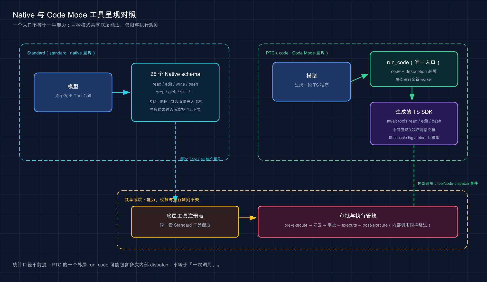
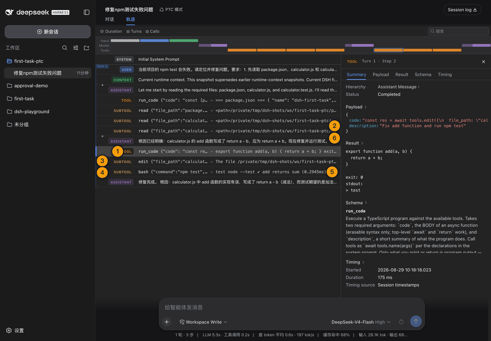

# 18 · PTC 模式（Code Mode）：让模型用代码编排工具

> 📚 **系列导航**：上一篇 [17 · Standard Mode](./17-standard-mode.md) 已经验证固定版向模型直接暴露 25 个原生工具。这一篇保持任务和能力不变，只把工具呈现切到 PTC 模式，观察一个 `run_code` 怎样编排内部调用。

> [!WARNING] Developer Preview
> 固定版已实测 `code` Preset 只暴露 `run_code` 的 Agent Loop；真实 Provider 下同任务 Standard／PTC 对照与浏览器 `SUBTOOL` 展示已验收。

PTC 模式不是把 25 个工具删成一个，也不是给模型一台绕过权限的万能终端。

它改变的是**工具呈现和编排层**：模型直接调用的入口收敛为 `run_code`，再由一段 TypeScript 程序通过生成的 SDK 调用 `read`、`edit`、`bash` 等底层能力。

**看完这一篇，你会拿到：**

- 认准 PTC 模式、Code Mode 与 Preset ID 的对应关系
- 看懂 `run_code` 的两个必填参数和 TypeScript SDK
- 理解内部工具调用怎样重新进入完整安全管线
- 知道 worker 隔离为什么不等于安全沙箱
- 判断什么任务适合用程序编排，什么任务仍适合 Standard
- 用同一项目、提示词和模型完成 Standard／PTC 公平对照
- 从 Trajectory 区分外层 `run_code` 与内部 dispatch

---

## 01 先认准 PTC 模式的真实身份

固定版四个系统 Preset 中，Code 组合的事实是：

```text
UI 名称：PTC 模式
Preset ID：code
排序：2
基础能力：与 Standard 相同
工具呈现：code
模型直接可调用工具：run_code
固定版直接工具数：1
```

官方 Preset 文案写的是：「具备标准模式的全部能力，并通过 Code Mode SDK 呈现工具，让模型用一个 TypeScript 程序组合多步操作。」

| 名称 | 用在哪里 | 本文口径 |
|---|---|---|
| PTC 模式 | 中文 Web UI 展示 | 首次写作「PTC 模式（Code Mode）」 |
| Code Mode | 官方子系统与配置术语 | 解释工具呈现和运行时机制 |
| `code` | Session 与配置记录 | 固定版真实 Preset ID |
| `run_code` | 模型直接调用的工具 | 外层程序入口 |

本文不自行展开 PTC 缩写。固定版 UI 只给出「PTC 模式」，官方技术文档则系统使用 Code Mode；把两者并列，既能对上界面，也能对上源码和运行文档。

G02 隔离实测中，`code` Preset 能创建 Session、完成 Mock Turn 并写出 `turn/end`；发给 Mock Provider 的工具目录只有 `run_code`。

本教程第一次用 DeepSeek Harness 的 PTC 模式跑真实任务，是 2026 年 8 月 29 日的同一份 `calculator.js` 修复。模型表面只调用了 3 次 `run_code`，程序内部再 dispatch 5 次读取、编辑和测试动作；最终改动与 Standard 完全一致，测试同样 1/1。最大的差异不在结果，而在行动表达：Standard 把每个工具直接摆在模型面前，PTC 让模型先写一段小程序，再由程序串起工具。

> 💡 **一句话总结**：界面叫「PTC 模式」，持久身份是 `code`，官方机制叫 Code Mode，模型的直接入口只有 `run_code`。

---

## 02 一个入口不等于一种能力

Standard 与 PTC 使用相同的基础 Preset 组装。区别只在 Code 组合额外声明：

```yaml
- id: tool-presentation
  name: '@deepseek-ai/dsh-agent-tool-presentation'
  config:
    mode: code
```

这个声明把「模型看到工具的方式」从 `native` 改为 `code`：

```text
Standard
模型 → read／edit／bash／其他原生 Tool Call → Harness

PTC
模型 → run_code → TypeScript 程序 → tools.read／tools.edit／tools.bash → Harness
```

| 对比项 | Standard | PTC |
|---|---|---|
| 模型直接看到的 schema | 每个原生工具各一份 | 一份 `run_code` schema |
| 底层能力 | Standard 工具集合 | 同一套 Standard 工具集合 |
| 编排者 | 多个模型 Step | 一次运行中的 TypeScript 程序 |
| 中间工具值 | 通常进入后续模型上下文 | 留在本次程序局部变量中 |
| 外层模型可见结果 | 每次 Tool Result | `console.log` 与最终 `return` |
| 审批与守卫 | 每个工具照常经过 | 每个内部调用仍照常经过 |

因此，「只暴露一个工具」只能说明模型的直接调用面收敛了，不能推导 PTC 只有一种能力。

反过来也不能说它必然更省 Token。Code Mode 用生成的 SDK 文本和一个传输 schema 替代原生 schema，固定请求成本会变化，但官方明确没有承诺普遍降低成本。



这张图只比较工具呈现与编排路径；两种模式仍共享底层能力、权限和执行规则。

> 💡 **一句话总结**：PTC 收敛的是入口，不是能力；它把多步工具编排从模型往返移进一次程序运行。

---

## 03 `run_code` 到底接收什么

`run_code` 有两个必填参数：

| 参数 | 类型 | 作用 |
|---|---|---|
| `code` | string | 一段异步 TypeScript 函数体 |
| `description` | string | 约 5～10 个英文单词的简短运行说明 |

固定版默认组合加载 TypeScript worker 后端。程序会被当成异步函数体，因此可以直接使用顶层 `await` 和 `return`；只支持可擦除类型语法，`enum` 与 namespace 会在启动 worker 前以 `exception` 失败。

模型收到的系统说明还会包含按当前工具集合生成的 SDK。调用形式统一为：

```ts
await tools.name(args)
```

特殊工具名可以写成：

```ts
await tools["my-tool"](args)
```

下面是第 11 篇 `first-task` 基线中，一次完整 PTC 调用可能携带的内容。普通使用者通常只发送自然语言任务，这段程序由模型生成，不需要手工粘进聊天框。

```yaml
description: "Fix calculator and run tests"
code: |
  const inputs = await Promise.all([
    tools.read({ file_path: "package.json" }),
    tools.read({ file_path: "calculator.js" }),
    tools.read({ file_path: "calculator.test.js" }),
  ]);

  console.log(`Read ${inputs.length} baseline files`);

  await tools.edit({
    file_path: "calculator.js",
    old_string: "return a - b;",
    new_string: "return a + b;",
  });

  const test = await tools.bash({
    command: "npm test",
    description: "Run the calculator test suite",
  });

  return { test };
```

这段程序展示了四个重要语义：

1. 三个互不依赖的读取用 `Promise.all` 提交。
2. 编辑依赖读取完成，所以放在读取之后。
3. 测试依赖编辑完成，所以继续顺序 `await`。
4. 只有打印与返回值会形成外层 `run_code` 结果。

如果既没有 `console.log`，也没有返回有效值，模型会收到：

```text
(run_code completed with no output)
```

> 💡 **一句话总结**：`run_code` 接收程序与说明，程序通过 `tools.*` 调用底层能力，只有主动打印或返回的内容才回到模型。

---

## 04 内部工具调用仍要过完整安全管线

最容易产生的错误理解是：既然调用发生在程序内部，它会不会绕过 Harness 的权限与审批？答案是否定的。

每次 `tools.read`、`tools.edit` 或 `tools.bash` 都会从 worker 回到宿主，再进入与 Native 调用相同的工具流水线：

```text
run_code 外层执行
→ tools.bash 内部调用
→ pre-execute
→ guards
→ 审批判断
→ execute
→ post-execute
→ 内部结果回传程序
→ 程序继续执行
→ 外层 run_code 返回模型
```

内部调用使用外层执行 token 作为 `parent`。每个已启动的子调用会留下两类日志事件：

- `tool/code-dispatch-start`：开始进入工具流水线。
- `tool/code-dispatch`：以完整模型可见内容记录最终结果。

这些内部事件用于日志和 UI 展示，不直接变成下一次模型请求中的独立 Tool Result。模型看到的是外层 `run_code` 的最终输出；成功且带图片的内部结果等附加上下文，会在外层结果之后按来源追加。

内部工具失败时，程序会收到 `ToolCallError`，其中：

- `toolName` 指出失败的工具。
- `message` 提供可读错误。

程序可以用 `try/catch` 处理并继续，也可以不捕获，让整个 `run_code` 失败。但已有副作用不会回滚：前面已经改过的文件，不会因为后面的测试报错自动恢复。

PTC 下如果模型绕过 `run_code`，直接请求 `read` 或 `bash`，注册表会在 pre-execute、审批和 guards 之前返回 `UNKNOWN_TOOL`，并提示必须从 `run_code` 内部调用。这是在约束模型调用协议，不是在跳过底层安全策略。

> 💡 **一句话总结**：程序负责排序和数据流，Harness 仍负责权限、审批、执行与记录；PTC 不是安全后门。

---

## 05 worker 隔离不是安全沙箱

固定版当前使用 worker-thread Code Runtime。默认配置是：

| 配置 | 默认值 | 含义 |
|---|---:|---|
| `computeMs` | 60,000 ms | worker 忙碌计算预算 |
| `maxWallMs` | 600,000 ms | 包含等待在内的墙钟上限 |
| `maxOutputBytes` | 67,108,864 bytes | 外层日志、返回值或失败消息的组合上限 |
| `maxOldGenerationSizeMb` | 512 MB | worker 老生代堆上限 |

每次 `run_code` 都启动一个全新 worker：

- 不复用上次运行的变量与内存。
- 环境变量为空，`execArgv` 也为空。
- 程序结束后 worker 随之终止。
- 超时、中止或异常有明确失败类型。

官方定义的六种失败是：

| `kind` | 含义 |
|---|---|
| `exception` | 程序解析、转换或执行抛错 |
| `timeout` | 计算或墙钟预算耗尽 |
| `abort` | 外部信号中止本次运行 |
| `worker-exit` | worker 未正常结算，例如 OOM |
| `invalid-output` | 完成值无法跨越无损 JSON 边界 |
| `output-limit` | 外层可变输出超过配置上限 |

这些设计减少跨运行状态泄漏，并限制失控程序，但**worker 线程不是安全边界**。官方把它的信任立场明确视为与 `bash` 等价；真正的访问控制仍由 Workspace、Permission、审批、沙箱和工具守卫承担。

还有两个不直观的限制：

1. 中间工具值不会进入模型上下文，但没有逐个绑定的字节上限，仍可能耗尽进程或 worker 内存。
2. `maxOutputBytes` 是拒绝边界，不是自动存档；超限内容不会神奇地保存到别处。

所以不要把 PTC 当持久 REPL，也不要在一段程序里无界收集大文件、大搜索结果或无限日志。

看到 PTC 使用 worker thread，最容易把「单独线程」理解成更安全。真正验收后我没有这样写：内部 `tools.read()`、编辑和命令仍然经过 Harness 的工具执行管线，worker 隔离不等于文件与网络权限边界。真实修复任务需要较高权限时，我要求只在可重建的 `/tmp` 副本里运行；涉及真实目录则回到 `read-only` 或 `workspace-write`，让沙箱和审批负责安全，而不是把希望寄托在线程隔离上。

> 💡 **一句话总结**：每次新 worker、空环境和资源上限提供运行隔离，但不替代 Workspace 权限、审批与真正的沙箱。

---

## 06 哪些任务更适合 PTC

PTC 更有价值的不是「任何任务都少一步」，而是让模型用局部变量、循环、分支和并发表达一段已知流程。

| 任务 | PTC 判断 | 原因 |
|---|---|---|
| 并行读取多份互不依赖的文件后汇总 | 合适 | 中间值留在程序内，可集中提取结果 |
| 按固定规则检查多个文件 | 合适 | 循环比反复模型往返更自然 |
| 先批量检索，再按条件读取命中项 | 合适 | 程序可以承接数据依赖 |
| 已知修复方式的读--改--测 | 可以对照 | 一次程序可表达完整顺序 |
| 陌生代码库的开放式探索 | Standard 通常更稳 | 每次结果都可能改变下一步策略 |
| 高风险命令密集任务 | 不因 PTC 更安全 | 内部调用照样需要逐项判断 |
| 只调用一次工具 | 收益很小 | 额外程序层没有明显价值 |
| 需要跨多轮保存程序变量 | 不适合 | 每次运行都是全新 worker |

PTC 对模型也提出更高要求：模型不仅要选对工具，还要生成语法正确、依赖顺序正确、输出克制的 TypeScript。如果程序写错，可能先消耗一次 `run_code`，再由下一 Step 修正。

因此更可靠的选择法是：

```text
任务开放、需要边看边决定 → 先用 Standard
流程明确、步骤多、数据适合局部处理 → 对照 PTC
只有真实 Provider 数据证明更好 → 再把 PTC 设为习惯模式
```

> 💡 **一句话总结**：PTC 擅长程序化编排，不保证开放式推理、成本或速度天然优于 Standard。

---

## 07 动手：用 PTC 执行同一任务

不要复用已经被 Standard 修好的目录。先准备一个全新的 `first-task-ptc` 项目副本，内容与第 11 篇初始状态完全一致。

进入目录执行：

```bash
npm test
```

预期基线仍是：

```text
add returns sum
actual: -1
expected: 5
fail 1
```

在 Web UI 添加该 Workspace，新建 Session：

```text
Preset：PTC 模式（code）
Permission：Workspace Write
Provider／Model：与 Standard 基线完全相同
Reasoning：与 Standard 基线完全相同
```

发送与上一篇逐字相同的任务：

```text
修复当前项目唯一的测试失败。

先读取 package.json、calculator.js 和 calculator.test.js。只修改 calculator.js，不修改测试、package.json，不新增依赖。修改后实际运行 npm test，失败就根据真实输出继续修复。

最终汇报根因、修改文件、测试计数和退出结果。未运行的验证不得写成已通过。
```

这里不要在提示词中强制模型必须生成某段具体程序。Preset 已经决定工具呈现；额外教它如何调用会污染模式自身的对照结果。

任务结束后，在普通终端独立执行：

```bash
npm test
```

成功标准与 Standard 完全一致：

```text
calculator.js：return a + b
修改文件：只有 calculator.js
测试：1 passed，0 failed
退出码：0
Trajectory：存在外层 run_code 与内部 code-dispatch 记录
```

> 💡 **一句话总结**：PTC 实验只换 Preset，不换项目状态、权限、模型、提示词和验收条件。

---



这张图展示 PTC 的一个模型 Tool Call 如何派生多次内部工具执行；内部 dispatch 不能与外层调用混为同一统计口径。

## 08 怎样做公平的 Standard／PTC 对照

两个模式必须使用两个独立但内容一致的项目副本和 Session。比较前记录：

| 控制变量 | Standard | PTC |
|---|---|---|
| 项目初始文件 | 相同失败基线 | 相同失败基线 |
| Provider／Model | 同一组合 | 同一组合 |
| Reasoning | 同一档位 | 同一档位 |
| Permission | Workspace Write | Workspace Write |
| 用户提示词 | 统一任务原文 | 统一任务原文 |
| 独立验证 | `npm test` | `npm test` |

结果表要同时记录质量、过程和成本：

| 指标 | Standard | PTC |
|---|---|---|
| 最终测试 | 待测 | 待测 |
| 修改文件 | 待测 | 待测 |
| Turn／Step | 待测 | 待测 |
| 模型请求次数 | 待测 | 待测 |
| 直接 Tool Call 数 | 待测 | 只计外层 `run_code` |
| 内部 dispatch 数 | 不适用 | 待测 |
| 审批次数 | 待测 | 待测 |
| 总耗时／TTFT | 待测 | 待测 |
| 输入／输出 Token | 待测 | 待测 |
| 程序或工具纠错次数 | 待测 | 待测 |

不要把「Standard 有 4 个 Tool Call，PTC 只有 1 个」直接写成 PTC 减少 75%。PTC 的一个外层调用里可能包含 5 个内部 dispatch，二者不是同一统计口径。

同样，不要用 G02 的 Mock Turn 决定胜负。Mock 只证明：

- `standard` 请求携带 25 个直接工具 schema。
- `code` 请求只携带 `run_code`。
- 两个 Preset 都能完成 Session／Turn 生命周期。

它没有真实模型的程序生成、工具选择、Token、质量或失败修正，因此不能支持性能结论。

Standard 与 PTC 使用同一 `deepseek-official`、`deepseek-v4-flash`、`reasoning: high`，两个新鲜副本运行前都确认测试失败。Standard 是 5 个 Step、7 次直接 Tool Call；PTC 是 4 个 Step、3 次外层 `run_code` 加 5 次内部 dispatch，两组墙钟都约 9 秒、usage 都在新鲜输入约 9k 量级。两者都没有审批或人工纠错，只改 `calculator.js`，最终测试 1/1；浏览器里 PTC 内部动作明确显示为 `SUBTOOL`。

> 💡 **一句话总结**：比较 PTC 要同时看外层调用和内部 dispatch，并把最终质量放在调用数量之前。

---

## 09 常见失败与排错

| 现象 | 真实含义 | 优先处理 |
|---|---|---|
| PTC 中直接调用 `read` 报错 | Code Mode 只允许直接调用 `run_code` | 让模型在程序内使用 `tools.read` |
| `run_code` 参数校验失败 | 缺少 `code` 或 `description` | 检查两个必填参数 |
| `enum`／namespace 报 `exception` | 当前只接受可擦除 TypeScript | 改用普通对象、联合类型或常量 |
| 工具调用抛 `ToolCallError` | 内部工具被拒绝或执行失败 | 查看 `toolName`、消息和审批记录 |
| 后续失败但文件已经变化 | 普通工具副作用不会回滚 | 检查 Git diff，按任务重新验证 |
| 只有 `(run_code completed with no output)` | 程序没有打印或返回 | 提取必要结果后 `return` 或打印 |
| `timeout` | 计算或墙钟预算耗尽 | 缩小循环和等待范围，拆分运行 |
| `output-limit` | 外层日志与结果太大 | 只返回摘要，不输出整份中间值 |
| `worker-exit` | worker 异常退出或可能 OOM | 检查数据规模，减少中间值 |
| 下一次运行读不到变量 | 每次都是全新 worker | 把必要状态持久化到允许的外部载体 |
| 内部调用看似没有 Tool Result | 子调用不直接进入模型历史 | 在 Trajectory 查 `code-dispatch`（UI 中显示为 `SUBTOOL` 行，2026-08-29 浏览器实测） |
| PTC 没有更快 | 程序生成和纠错也有成本 | 看真实 Steps、耗时、usage 与结果 |

排错顺序建议固定为：

```text
先看外层 run_code 失败 kind
→ 再看 Captured output
→ 再看内部 code-dispatch 及审批
→ 检查实际文件与进程副作用
→ 最后决定修程序、拆分任务或切回 Standard
```

这能避免把程序语法错误、工具权限拒绝、底层命令失败和模型任务判断混为一谈。

> 💡 **一句话总结**：PTC 多了一层程序边界，排错时必须同时检查外层失败、内部 dispatch 和真实副作用。

---

## 小结

这一篇完成了 PTC 模式的机制基线：

1. UI 名称是「PTC 模式」，Preset ID 是 `code`，官方机制叫 Code Mode。
2. PTC 保留 Standard 的底层能力，只把模型直接入口收敛为 `run_code`。
3. `run_code` 必须同时提供 TypeScript `code` 和简短 `description`。
4. 程序用 `tools.*` 调用底层工具，中间值留在运行局部，打印与返回值才进入模型历史。
5. 每个内部调用仍经过 pre-execute、guards、审批、execute 与 post-execute。
6. 普通工具副作用不会因后续程序失败而回滚。
7. 当前 worker 提供逐次隔离、空环境和资源限制，但不是安全边界。
8. PTC 适合流程明确的多步编排，不承诺普遍更快、更省 Token 或更高质量。
9. Standard／PTC 对照必须只换 Preset，并同时统计外层调用、内部 dispatch 和最终质量。
10. 真实 Provider 的同任务对照已于 2026-08-29 完成（REAL-KEY-ACCEPTANCE.md §五）。

你现在应该已经能区分「一个直接工具」与「一套底层能力」，也知道 PTC 的价值来自程序化编排，而不是绕过 Harness。

---

下一篇：[19 · Minimal 模式](./19-minimal-mode.md)。我们会继续缩小变量，只保留最小工具面，看看它为何适合边界测试与能力评测。
