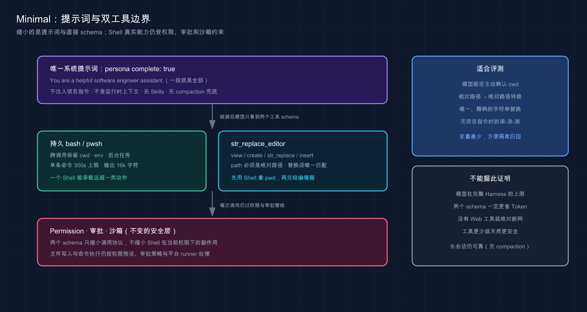

# 19 · Minimal Mode：最小工具集与模型评测

> 📚 **系列导航**：上一篇 [18 · PTC 模式（Code Mode）](./18-ptc-code-mode.md) 把多种能力收进一个 `run_code` 入口。这一篇继续做减法，但方向完全不同：Minimal 真的只给模型两件工具。

> [!WARNING] Developer Preview
> 固定版已实测 `minimal` Preset 的两个工具，并用真实 Provider 完成同任务回归，Step、工具次数、耗时、文件变化与测试均已核对。

Minimal 最容易被名字骗到。

它不是「功能稍少一点的 Standard」，也不是自动更便宜、更快的性能模式。它是一张刻意清空的实验台：固定一段极短系统提示词，只留下持久 Shell 和字符串编辑器，让你观察模型在最小工具面上怎样完成编码任务。

**看完这一篇，你会拿到：**

- 认准 Minimal 的 UI 名称、Preset ID 与真实工具数
- 理解完整系统提示词为什么会屏蔽其他上下文贡献
- 看懂持久 Shell 与 `str_replace_editor` 的准确边界
- 知道双工具不等于双能力，更不等于安全隔离
- 判断 Minimal 能评测什么、不能证明什么
- 用与 Standard 相同的失败项目建立 Minimal 基线
- 从绝对路径、唯一替换和持久状态中排查常见失败

---

## 01 Minimal 的真实身份

固定版随附 Preset 中，Minimal 的事实是：

```text
UI 名称：极简模式
Preset ID：minimal
排序：3
直接工具数：2
POSIX 工具：bash、str_replace_editor
Windows 工具：pwsh、str_replace_editor
```

| 名称 | 用在哪里 | 是否是稳定身份 |
|---|---|---|
| 极简模式 | 中文 Web UI 展示 | 否，展示文案可变化 |
| Minimal Mode | 本教程称呼 | 否，便于和其他模式并列 |
| `minimal` | Session 与配置记录 | 是，固定版真实 ID |

G02 隔离实测中，`agentPreset.list` 返回「极简模式」，使用 `minimal` 创建的 Session 保留正确 Preset，并完成一次 Mock Turn 与 `turn/end`。模型请求的工具 schema 只有两个。

2026 年 8 月 29 日，本教程第一次用真实 DeepSeek 模型跑 Minimal，工具面真的只有 `bash` 和 `str_replace_editor`。它处理的是同一个加法 Bug，没有因为工具少而失败，但过程拉长到 11 个 Step：`bash` 调了 6 次，编辑器调了 4 次，墙钟约 18 秒。最终仍然只改 `calculator.js`，测试 1/1。它没有出现致命卡点，代价主要是缺少专用读写工具后需要更多往返。

> 💡 **一句话总结**：界面叫「极简模式」，持久身份是 `minimal`，固定版工具面只有 Shell 和字符串编辑器。

---

## 02 两个工具不等于只能做两件事

Minimal 的工具少，但其中一个是 Shell。

Shell 可以读取文件、搜索文本、执行测试、调用 Git、启动程序，甚至在权限和网络允许时访问更广的系统能力。因此工具数量只能描述**模型直接看到几个 schema**，不能描述实际能力有多窄。

| 维度 | Minimal 的真实情况 | 不能推出的结论 |
|---|---|---|
| 工具 schema | 只有 2 个 | 只能完成 2 类动作 |
| 固定提示词 | 很短 | 请求一定更省 Token |
| 没有 Web 工具 | 没有专用 `web_search` | Shell 在任何环境都绝对断网 |
| 没有 Goal／Subagent | 不能直接调用对应工具 | 任务一定更简单 |
| 没有 Standard 文件工具 | 改用 `str_replace_editor` 或 Shell | 无法读写文件 |
| 工具面更小 | 变量更少 | 天然更安全 |

**类比：Minimal 像只给维修工一把瑞士军刀和一把螺丝刀。** 工具箱里确实只有两件，但瑞士军刀能展开很多功能；真正的安全边界仍是房门、授权区域和人工审批，不是工具数量。

会话的 Permission、审批策略与 Shell 沙箱仍然重要。`str_replace_editor` 的修改也会发出文件写入或编辑意图，交给挂载的策略与文件系统处理。

> 💡 **一句话总结**：Minimal 缩小了调用协议，不会自动缩小 Shell 在当前权限下能产生的副作用。

---

## 03 它连系统提示词也做了减法

Minimal 不只是删工具。固定版配置把 persona 声明为完整系统提示词：

```yaml
- id: persona
  name: '@deepseek-ai/dsh-persona'
  config:
    text: You are a helpful software engineer assistant.
    complete: true
    includeRuntimeContext: false
```

`complete: true` 的含义是：组装仍然运行，但这段 persona 最终成为唯一系统提示词段。全局 Harness identity、Web 指导、逐工具提示，以及后续监听器想追加的提示词段都不会进入最终系统提示词。

同时，这个 Preset：

- 不注入运行时上下文快照。
- 不加载 Workspace 的 Agent Instructions。
- 不加载 Skills。
- 不启用上下文压缩。
- 不提供计划、Goal、Todo、Subagent 或 Workflow 工具。

这带来两个直接结果：

1. 模型不会自动从提示词里知道当前 `cwd`，需要通过 Shell 的 `pwd` 或 `Get-Location` 确认。
2. 长会话没有 Minimal 自带的 compaction 兜底，不能把它当无限上下文会话使用。

| Standard | Minimal |
|---|---|
| Harness identity 与动态上下文完整组装 | 固定完整 persona |
| Workspace 指令进入上下文 | 不加载 Agent Instructions |
| 有 compaction 组合 | 不启用 compaction |
| 多类工具指导 | 只靠两个 schema 与 Shell 描述 |



这张图展示 Minimal 缩小的是提示词与直接 schema；Shell 真实能力仍受权限、审批和沙箱约束。

> 💡 **一句话总结**：Minimal 同时缩小工具面和提示词面，适合控制变量，但会主动放弃项目指令与长会话治理能力。

---

## 04 第一件工具：持久 Shell

在 macOS／Linux 上，模型看到的工具名是 `bash`；Windows 上同一位置换成 `pwsh`。它们不是 Standard 的一次性 Shell，而是按 Agent 隔离的持久 PTY Shell。

固定版 `bash` schema 只有一个必填参数：

```json
{
  "command": "pwd && npm test"
}
```

持久意味着这些状态可以跨多次调用保留：

- 当前目录。
- 已导出的环境变量。
- 已激活的虚拟环境。
- Shell 函数。
- 后台任务。

固定配置的单条命令墙钟上限是 300,000 ms，保留输出上限是 16,000 个字符。非零退出会附加退出码；显式 `exit`、超时或取消会重置 Shell，下次调用从新 Shell 开始。

Minimal 没有 `job_list`、`job_output` 和 `job_kill`。后台进程如果由持久 Shell 启动，仍要通过后续 Shell 命令管理，不能照搬 Standard 的后台任务工具流程。

| 场景 | 持久 Shell 行为 |
|---|---|
| 第一次 `cd subdir` | 后续调用继续位于 `subdir` |
| `export MODE=test` | 后续调用可继续读取 |
| 命令退出码非 0 | 返回输出并标明退出码 |
| Shell 自身退出 | 状态被丢弃，下次重建 |
| 输出过长 | 保留有界前缀并追加截断说明 |

> 💡 **一句话总结**：Minimal 的 Shell 会跨调用保留状态，排错时必须知道当前目录和环境可能来自前一次调用。

---

## 05 第二件工具：`str_replace_editor`

`str_replace_editor` 把查看、创建、替换和插入收在一个 schema 中，共四个命令：

| `command` | 用途 | 关键限制 |
|---|---|---|
| `view` | 查看文件或浅层目录 | `path` 必须是绝对路径 |
| `create` | 创建新文件 | 目标文件已存在时拒绝 |
| `str_replace` | 唯一字面量替换 | `old_str` 必须恰好匹配一次 |
| `insert` | 按行边界插入文本 | 不自动补文件末尾换行 |

查看文件第 11～20 行的参数是：

```json
{
  "command": "view",
  "path": "/absolute/path/to/project/calculator.js",
  "view_range": [11, 20]
}
```

替换错误实现的参数是：

```json
{
  "command": "str_replace",
  "path": "/absolute/path/to/project/calculator.js",
  "old_str": "return a - b;",
  "new_str": "return a + b;"
}
```

四个细节最容易踩坑：

1. 路径必须是绝对路径，所以先通过 Shell 获取 `pwd`。
2. `view_range` 从 1 开始计行，`[start, -1]` 表示看到文件末尾。
3. `insert_line` 选择的是零基插入边界，`0` 表示插到第一行之前。
4. `str_replace` 没有 `replace_all`；零匹配和多匹配都会拒绝，必须扩大 `old_str` 上下文使其唯一。

目录 `view` 只列非隐藏、非依赖与非 Python 缓存条目，并最多下探两层。它适合快速看结构，不等于完整仓库扫描。

> 💡 **一句话总结**：字符串编辑器可完成精确文本修改，但绝对路径、唯一匹配和两套行号语义必须分清。

---

## 06 Minimal 适合评测什么

Minimal 的价值是减少 Harness 变量，让模型能力与最小工具协议更容易观察。

优先用它验证：

- 模型能否主动确认工作目录。
- 模型能否用 Shell 探索项目并读取真实错误。
- 模型能否把相对项目路径转换成编辑器所需的绝对路径。
- 模型能否构造唯一、精确的字符串替换。
- 模型能否在缺少项目指令与专门工具指导时完成读--改--测。
- 持久 Shell 状态是否帮助或干扰后续调用。

不应该用它单独证明：

- 某个模型在完整 Harness 中的上限。
- Standard／PTC 的性能一定更差。
- 两个 schema 一定比 25 个 schema 更省总 Token。
- 没有 Web 工具就不会发生网络访问。
- 工具更少就不会产生高风险 Shell 副作用。
- 一次小任务成功就适合长期复杂会话。

我把 Minimal 当成控制变量，而不是日常性能模式。四模式对照里，Provider、模型、reasoning、提示词、失败基线和项目副本全部一致，只改变 Preset，并记录 Step、工具调用、墙钟、文件变化和测试。Minimal 最终也一次成功，因此可以排除「任务必须依赖 Standard 的专用工具才能完成」这个因素；但它更慢、往返更多，不能据此反推工具越少越好。

> 💡 **一句话总结**：Minimal 适合隔离变量，不适合代表完整产品能力或直接得出成本、安全结论。

---

## 07 动手：用 Minimal 跑同一个失败项目

准备一个全新的 `first-task-minimal` 项目副本，内容与第 11 篇初始状态一致。在普通终端先执行：

```bash
npm test
```

稳定失败事实应为：

```text
add returns sum
actual: -1
expected: 5
fail 1
```

在 Web UI 添加该 Workspace，新建 Session：

```text
Preset：极简模式（minimal）
Permission：Workspace Write
Provider／Model：与其他模式回归相同
Reasoning：与其他模式回归相同
```

发送统一任务：

```text
修复当前项目唯一的测试失败。

先读取 package.json、calculator.js 和 calculator.test.js。只修改 calculator.js，不修改测试、package.json，不新增依赖。修改后实际运行 npm test，失败就根据真实输出继续修复。

最终汇报根因、修改文件、测试计数和退出结果。未运行的验证不得写成已通过。
```

理想轨迹应包含：

```text
bash：确认 pwd 并运行失败测试
str_replace_editor view：使用绝对路径读取文件
str_replace_editor str_replace：唯一替换错误实现
bash：运行 npm test
最终回答：报告精确结果
```

模型可以选择用 Shell 读取文件，不能因为它没有按理想顺序调用编辑器就判失败。真正的成功标准仍是：

```text
calculator.js：return a + b
修改文件：只有 calculator.js
测试：1 passed，0 failed
退出码：0
```

任务结束后，由用户在普通终端独立重跑 `npm test`。

> 💡 **一句话总结**：Minimal 基线只换 Preset，项目、模型、权限、提示词和最终验收都保持一致。

---

## 08 应该记录哪些数据

真实 Provider 回归时，至少记录：

| 指标 | Minimal 记录 |
|---|---|
| Provider／Model／Reasoning | 待测 |
| 最终测试与修改文件 | 待测 |
| Turn／Step | 待测 |
| `bash`／`pwsh` 次数 | 待测 |
| `str_replace_editor` 次数 | 待测 |
| 是否先确认绝对路径 | 待测 |
| 字符串替换失败次数 | 待测 |
| 审批次数 | 待测 |
| 总耗时／TTFT | 待测 |
| 输入／输出 Token | 待测 |
| 是否需要人工纠正 | 待测 |

对照 Standard 时，不能只比较 Tool Call 数。Standard 的三个 `read` 可能在同一 Step 并行，而 Minimal 也可能把读取、搜索和测试合进一次 Shell 命令。

对照 PTC 时，不能把一个外层 `run_code` 当成一次底层能力。要把 PTC 内部 dispatch、Minimal Shell 中组合的子命令和最终任务质量同时展开。

G02 的 Mock 数据只证明两个 schema 确实进入请求、Session 能完成 Turn。它没有让真实模型自主使用这两个工具，因此不能写成 Minimal 已完成真实编码回归。

这组 Minimal 回归使用 `deepseek-official`、`deepseek-v4-flash`、`reasoning: high`，共 11 个 Step，模型直接调用 `bash`×6、`str_replace_editor`×4。它先用 Shell 确认工作目录和失败测试，再通过绝对路径编辑；墙钟约 18 秒，没有触发审批，也没有记录到需要人工纠正的替换失败。最终只改 `calculator.js`，独立测试 1/1。TTFT 与精确 usage 未单独固化，所以不在这里补估算。

> 💡 **一句话总结**：Minimal 的评测要展开 Shell 内部动作，不能用表面的两个工具名简化真实工作量。

---

## 09 常见失败与排错

| 现象 | 真实含义 | 优先处理 |
|---|---|---|
| 编辑器提示路径无效 | `path` 不是绝对路径 | 先用 `pwd`／`Get-Location` |
| `str_replace` 零匹配 | 空白或原文不一致 | 重新 `view`，复制精确文本 |
| `str_replace` 多匹配 | `old_str` 不唯一 | 增加上下文行 |
| `create` 拒绝 | 目标文件已经存在 | 改用 `str_replace` 或 `insert` |
| 目录列表缺少深层文件 | `view` 只下探两层且会过滤 | 用 Shell 的搜索命令 |
| 下一次 Shell 目录变了 | 持久 Shell 保留上次 `cd` | 每个关键命令前确认 `pwd` |
| `bash` 变成 `pwsh` | 当前平台是 Windows | 改用 PowerShell 语法与路径 |
| 找不到 `read`／`edit` | Minimal 不提供 Standard 工具名 | 用编辑器命令或 Shell |
| 看不到项目 AGENTS 指令 | Minimal 不加载 Agent Instructions | 把必要边界写进本次任务 |
| 长会话上下文压力升高 | Preset 不启用 compaction | 缩短会话或换 Standard |
| 两个工具仍触发审批 | 工具数量不替代权限策略 | 检查动作、路径和 Permission |
| 最终回答说测试通过 | 只是模型报告 | 查 Shell 结果并独立重跑 |

不要为了让 Minimal「像 Standard」而在提示词里重新塞入整套 Harness 说明。那会改变你想控制的变量。缺什么能力就记录什么，必要时直接换回 Standard。

> 💡 **一句话总结**：先检查绝对路径、唯一匹配与持久 Shell 状态，再判断问题来自模型还是工具组合。

---

## 小结

这一篇建立了 Minimal Mode 的真实边界：

1. UI 名称是「极简模式」，Preset ID 是 `minimal`。
2. 固定版 POSIX 直接暴露 `bash` 与 `str_replace_editor`，Windows 用 `pwsh` 替换 `bash`。
3. Minimal 使用唯一完整 persona，不加载运行时上下文、项目指令、Skills 或 compaction。
4. 持久 Shell 会保留目录、环境和后台状态，也能承载远超一个 schema 名称的能力。
5. 字符串编辑器提供 `view`、`create`、`str_replace` 与 `insert`，并要求绝对路径。
6. 双工具减少的是实验变量，不是权限风险或实际能力种类。
7. Minimal 适合最小协议评测，不代表完整 Harness 的能力上限。
8. 真实 Provider 的双工具任务回归已完成，11 个 Step、约 18 秒，最终测试 1/1。

你现在应该已经知道 Minimal 为什么有价值，也知道什么时候不该拿它替代 Standard。

---

下一篇：[20 · Creator／创造模式](./20-creator-mode.md)。我们会从最小工具面跳到最大工具面，让 Harness 开始读取和扩展自己的运行时。
