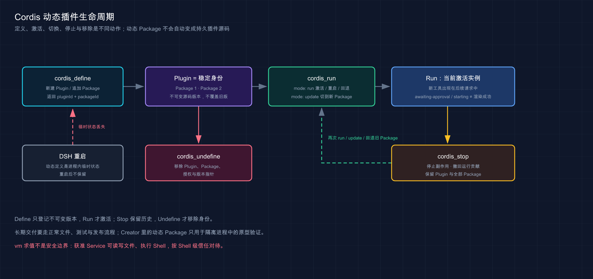
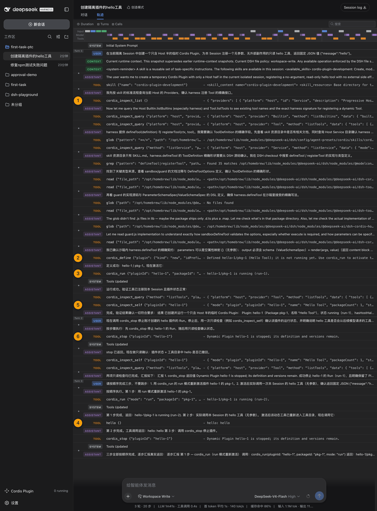

# 20 · Creator／创造模式：让 Harness 帮你开发 Harness

> 📚 **系列导航**：上一篇 [19 · Minimal Mode](./19-minimal-mode.md) 把工具面压缩到两个。这一篇走到另一个极端：Creator 在 Standard 之上加入运行时检查与动态插件工具，让 Agent 开始观察和扩展 Harness 本身。

> [!WARNING] Developer Preview
> 固定版已实测 `cordis` Preset 的 32 个工具，并用真实 Provider 完成 Inspect、Define、Run、工具调用、Stop 与重启生命周期。

Creator 不是「更强的日常编码模式」。

它是一把打开机盖的钥匙：Standard 负责修普通项目，Creator 还能检查当前 Harness 的服务、事件、工具和 UI 槽位，并把模型生成的 Host／Client 插件临时装进正在运行的 DSH 进程。

**看完这一篇，你会拿到：**

- 认准 Creator、创造模式与 `cordis` 的对应关系
- 看懂固定版 32 个工具是怎样组成的
- 掌握 7 个 `cordis_*` 工具的准确分工
- 理解 Host／Client 两个运行平面
- 分清 Plugin、不可变 Package 与 Run 的生命周期
- 知道 vm 隔离、审批和临时定义各自不能保证什么
- 完成一次不改变运行时的只读 Inspect
- 设计一个可停止、可检查的动态插件回归

---

## 01 先认准 Creator 的真实身份

固定版随附 Preset 中，Creator 的事实是：

```text
UI 名称：创造模式
Preset ID：cordis
排序：4
工具呈现：native
固定版 macOS 工具数：32
基础：Standard 的 25 个工具
新增：7 个 cordis_* 工具
```

| 名称 | 用在哪里 | 本文口径 |
|---|---|---|
| 创造模式 | 中文 Web UI 展示 | 当前产品名 |
| Creator Mode | 教程中的功能定位 | 强调扩展 Harness |
| Cordis Preset | 官方配置语境 | 强调架构与运行时 |
| `cordis` | Session 与配置记录 | 固定版真实 ID |

教程标题保留「Creator／创造模式」，但所有配置、日志和 Session 身份都写 `cordis`。把目录命名成 `creator` 或在设置里寻找 Creator ID，都会和真实产品错位。

G02 隔离实测中，`cordis` Session 保留正确 Preset，向 Mock Provider 发出的请求包含 32 个工具 schema，并正常结束 Turn。

我安排本教程第一次让 DeepSeek Harness 扩展自己，是做一个最小 `hello` 动态插件。前两轮的难点不是业务逻辑，而是要让 Agent 先看清 Host、Package 和 Run 三层身份，再定义、启动并真正调用新工具；到第三轮才把完整生命周期和截图都收稳。最终 `hello` 工具真实返回 `hello: hello`，但我没有因此把它直接投入长期工作流--目前它仍是隔离验收用例，用来证明 Creator 确实能动态增加能力。

> 💡 **一句话总结**：界面叫「创造模式」，配置身份是 `cordis`，它是 Standard 加自引用 Cordis 工具的开发组合。

---

## 02 32 个工具是怎样组成的

Creator 把 Standard 的组装完整保留，再增加 Cordis 工具集和一份组合创作 Skill：

```text
Standard 原生工具：25
Cordis 新增工具：7
固定版合计：32
```

新增的 7 个工具是：

| 分组 | 工具 | 作用 |
|---|---|---|
| 外部运行时检查 | `cordis_inspect_list` | 列出可查询的 Host／Client Inspect Provider |
| 外部运行时检查 | `cordis_inspect_query` | 按 Provider、method 与 schema 执行只读查询 |
| 自有对象检查 | `cordis_inspect_self` | 查看当前 Session 创建的 Plugin、Package 与诊断 |
| 定义 | `cordis_define` | 创建 Plugin 的首个不可变 Package，或为现有 Plugin 追加版本 |
| 激活 | `cordis_run` | 运行、重启、回退或更新到指定 Package |
| 暂停 | `cordis_stop` | 停止当前 Run，但保留 Plugin 与所有 Package |
| 删除 | `cordis_undefine` | 移除 Plugin、Package、授权与版本指针 |

固定版生成工具目录与 G02 的 32 工具请求互相印证。需要注意，`packages/extensions/tool-cordis/README.zh.md` 的说明仍使用较早的 5 工具口径，把 Inspect 写成一个 `cordis_inspect`；但它自己指向的生成 Schema 目录已经拆成三个 Inspect 工具。

**本教程以模型实际收到的 schema 和生成目录为准：固定版是 7 个，不是 5 个。** 这也是 Developer Preview 阶段必须锁版本、不能只读一份说明文档的典型例子。

Creator 的 32 同样不是永久产品规格。平台会让 `bash`／`pwsh` 互换，插件和后续版本也可能改变工具集合。

> 💡 **一句话总结**：32 = Standard 25 + Cordis 7；遇到文档口径冲突时，以固定版实际请求和生成 Schema 目录为准。

---

## 03 三个 Inspect 工具为什么要拆开

Creator 不鼓励模型凭记忆猜当前运行时。正确顺序是先发现，再精确查询，最后检查自己创建的对象。

```text
cordis_inspect_list
→ 发现真实 Provider 与 method
→ cordis_inspect_query
→ 按 schema 查询服务、事件、工具或 UI 槽位
→ cordis_define
→ cordis_inspect_self
→ 检查自己创建的 Plugin／Package／Run
```

三个工具的边界是：

| 工具 | 查什么 | 不能做什么 |
|---|---|---|
| `cordis_inspect_list` | 当前已知 Inspect Provider 目录 | 不返回所有详细运行时数据 |
| `cordis_inspect_query` | 某个 Provider 声明的只读 method | 不能调用业务 Service 或修改运行时 |
| `cordis_inspect_self` | 当前 Session 拥有的动态对象 | 不检查任意其他会话的源码 |

`cordis_inspect_query` 的 `platform`、`provider` 和 `method` 必须来自 list 结果，`input` 也必须符合 method schema。模型应该先做宽查询，再缩到精确 Service、Event、Builtin、Tool、主题 token 或 Slot 子树。

`cordis_inspect_self` 则按 ID 逐层增加细节：

```text
无 ID：列出当前 Session 的 Plugin 摘要
pluginId：查看版本指针、最新 Run、全部 Package 摘要
pluginId + packageId：查看该不可变 Package 的源码与诊断
```

Package ID 不能脱离 Plugin ID 单独查询。

> 💡 **一句话总结**：先 list 找真实入口，再 query 查外部契约，最后用 self 检查自己定义的动态对象。

---

## 04 Host 与 Client 是两个运行平面

Creator 可以定义两半代码：

| 平面 | 运行位置 | 典型能力 |
|---|---|---|
| Host | DSH 的 Node 进程 | 服务、工具、事件监听、提示词贡献 |
| Client | 打开的 Web 页面 | UI 槽位、交互组件、浏览器侧状态 |

**类比：Host 是餐厅后厨，Client 是前台大厅。** 后厨负责数据和能力，前台负责展示与交互；一个插件可以只改后厨、只改前台，也可以两边配合，但两边的服务和生命周期不能混用。

Creator 自带 persona 会要求模型先判断配置属于哪一层：

- Host composition 保存跨 Session 共用的注册表、持久化、沙箱、审批与模型路由等能力。
- Agent Preset 保存单个会话贡献的工具、persona 和提示词段。
- 确实只属于 Preset 的服务需要放入隔离 realm，避免多个 Preset 的同名服务碰撞。

`cordis_define` 的 `code.host` 与 `code.client` 至少提供一个。二者都是返回 Cordis Plugin 的纯 JavaScript 函数体，不经过 TypeScript、JSX 或 import 转换。

这也是为什么 Creator 附带 `editing-cordis-compositions` Skill，并在 persona 中要求修改 composition 前先加载它。不能只靠通用 JavaScript 经验猜 Harness 的服务归属。

> 💡 **一句话总结**：先判断能力属于 Host、Client 还是 Agent Preset，再写插件；平面选错会造成服务不可见或跨会话冲突。

---

## 05 Plugin、Package 与 Run 的生命周期

固定版动态扩展使用三层身份：

```text
Plugin：稳定身份
└── Package 1：不可变源码版本
└── Package 2：不可变源码版本
    └── Run：当前激活实例
```

新建时，`cordis_define` 使用：

```text
plugin.kind：new
plugin.idPrefix：3～6 位小写英文字母语义前缀
name：可读名称
purpose：一句用途
code.host／code.client：至少一个
```

Host 会返回最终 `pluginId` 和 `packageId`。修改现有 Plugin 时使用 `kind: existing` 与精确 `pluginId`，追加新的不可变 Package，不覆盖旧版本。

激活时：

- 首次激活、重启当前版本或回退，`mode` 使用 `run`。
- 从当前版本切到另一个 Package，`mode` 使用 `update`。
- `cordis_stop` 停止副作用但保留版本，可再次运行或回退。
- `cordis_undefine` 才会移除整个 Plugin 及其 Package、授权和版本指针。

带 Client 半的 Package 可能进入审批和异步激活。`cordis_run` 返回 `awaiting-approval` 或 `starting` 都不代表 React 已经正确渲染；后续拒绝、技术失败或渲染崩溃需要通过状态 steering 与 `cordis_inspect_self` 继续检查。

| 目标 | 应用工具 |
|---|---|
| 暂停插件、稍后恢复 | `cordis_stop` |
| 切到新版本 | `cordis_define` 追加 Package，再 `cordis_run mode:update` |
| 回到旧版本 | `cordis_run mode:run` 指向旧 Package |
| 永久移除临时定义 | `cordis_undefine` |



这张图展示定义、激活、切换、停止与移除是不同动作，动态 Package 也不会自动变成持久插件源码。

> 💡 **一句话总结**：Define 只登记不可变版本，Run 才激活；Stop 保留历史，Undefine 才移除身份。

---

## 06 vm 隔离不是安全边界

动态 Host 代码在 vm 中求值，但官方明确要求像对待 Shell 访问一样对待这套工具。

原因包括：

- Host 代码作用于正在运行的 DSH 进程。
- 获准 Service 可以读写文件、调用 Web、执行 Shell 或改变注册表。
- host realm helper 让 vm 不能作为对恶意代码的安全边界。
- 运行中的 Package 可以新增工具、提示词贡献或监听器，改变后续模型请求。
- 根据作用域设计，副作用可能影响同一进程中的其他 Session。

动态定义还是**进程内临时状态**：

- 它不会自动创建插件文件。
- 不会自动修改 `cordis.yml`。
- 不会自动变成本地或项目插件。
- DSH 重启后不会保留。
- `cordis_stop`／`cordis_undefine` 或工具集卸载也会撤回运行贡献。

Creator persona 还明确禁止直接修改或删除随安装附带的 Preset。升级会覆盖这些文件，破坏 `cordis` 自身还可能让创造模式无法再次启动。要长期修改，应把 Preset 复制到用户目录，再编辑副本：

```text
${DSH_HOME:-$HOME/.dsh}/.agent-presets/<id>/
```

这次动态插件试验使用独立 `DSH_HOME` 和 `/tmp` 工作区，真实 Key 只从环境变量进入，插件定义、Package 和 Run 都不写进我的真实 Harness 配置。副作用只有隔离 Session 里的动态对象和事件记录；验证完我们先执行 `cordis_stop`，确认 Run 停止，再重启实例检查没有把临时运行状态带进个人环境。我的原则是先证明能撤回，再讨论持久化，否则热加载很容易从方便变成难以追踪的状态污染。

> 💡 **一句话总结**：Creator 能修改活运行时，因此要用隔离进程和最小权限；vm、临时状态与可撤回都不等于安全。

---

## 07 动手：先做一次只读 Inspect

第一次进入创造模式，不要立即让模型定义并运行插件。先建立只读检查基线。

新建 Session：

```text
Preset：创造模式（cordis）
Workspace：可丢弃的隔离目录
Permission：Read Only
Provider／Model：已经完成最小 Turn 的真实组合
```

发送：

```text
只读检查当前 DeepSeek Harness 的 Cordis 扩展面，不修改文件，不定义、运行、停止或删除任何动态 Plugin。

先调用 cordis_inspect_list，列出实际可用的 Host／Client Inspect Provider。然后选择与工具 Schema 相关的 Host Provider，严格按照它返回的 method 和 input schema 做一次由宽到窄的 cordis_inspect_query。最后调用一次不带 ID 的 cordis_inspect_self，确认当前 Session 是否已经拥有动态 Plugin。

最终汇报实际使用的 platform、provider、method、返回的关键信息和当前动态 Plugin 数。没有调用的能力不要写成已验证。
```

成功标准：

```text
Trajectory：出现 cordis_inspect_list
Trajectory：出现至少一次 cordis_inspect_query
Trajectory：出现一次 cordis_inspect_self
动态 Plugin：没有新增
文件变化：0
cordis_define／run／stop／undefine：0 次
```

Provider 名称和 method 不要写死在教程里。Inspect 设计的目的就是让模型从当前运行时发现真实目录，未来版本可能变化。

> 💡 **一句话总结**：Creator 的第一步应该是只读发现，而不是凭记忆把模型生成代码直接装进活进程。

---

## 08 再设计一个完整动态插件回归

只读基线通过后，才能在独立 DSH 进程与可丢弃 Session 中验证完整生命周期。统一任务可以写成：

```text
在当前隔离 Session 中创建一个只含 Host 半的临时 Cordis Plugin，为本 Session 注册一个无参数、无外部副作用的只读 hello 工具，返回固定 JSON 值 {"message":"hello"}。

先用 cordis_inspect_list／query 查询当前工具注册所需的精确 Service API、Tool Schema 和输出约定，不凭记忆猜。然后用 cordis_define 创建新 Plugin，idPrefix 使用 hello；用返回的真实 pluginId 与 packageId 调用 cordis_run。下一次模型请求中确认新工具已经出现并实际调用它，再用 cordis_inspect_self 检查 Package 与 Run。

验证完成后调用 cordis_stop，确认新工具从后续请求头撤回，但不要调用 cordis_undefine，保留定义供用户检查。最终汇报每个 ID、工具结果、请求头变化、停止结果和未验证项。
```

这个回归必须记录：

| 指标 | 记录内容 |
|---|---|
| Provider／Model／Reasoning | 待测 |
| 初始／最终工具数 | 待测 |
| Inspect 调用 | 待测 |
| `pluginId`／`packageId`／Run | 待测，公开材料需脱敏 |
| Define／Run／Stop 结果 | 待测 |
| 新工具返回值 | 待测 |
| 请求头 schema 变化 | 待测 |
| 审批／拒绝 | 待测 |
| 总耗时／usage | 待测 |
| DSH 重启后是否消失 | 待测 |

Host-only 固定返回工具不应需要文件、Shell、Web 或 Client UI。模型如果试图扩大能力，先停止任务，不要为了跑通实验提高权限。

完整回归使用 `deepseek-v4-flash` 跑了 3 个 Turn：轨迹包含 `cordis_inspect_list`×1、`cordis_inspect_query`×5、`cordis_define`×1、`cordis_run`×2、`cordis_inspect_self`×2 和 `cordis_stop`×2。Agent 定义了 `hello-1`／`pkg-1`，启动后真实调用新增工具并得到固定返回 `hello: hello`，随后停止、再次启动、再次调用并最终停止，3 个 Turn 都正常结束。全程在隔离目录中完成，没有 Key 入镜，也没有需要批准的真实目录写入；精确耗时和 usage 没有单独作为这张截图的验收指标。

> 💡 **一句话总结**：完整回归必须覆盖 Inspect、Define、Run、调用、Self 检查和 Stop，而不是看见「定义成功」就结束。

---



这张图展示一个动态 Package 如何进入活运行时并被撤回；Define 成功不等于 Run 成功，Stop 也不等于永久删除。

## 09 什么时候该用 Creator

优先选择 Creator：

- 检查当前 Harness 的 Service、Event、Tool 或 Client Slot 契约。
- 设计或验证自定义 Agent Preset。
- 在进程内快速试验一个可撤回的工具、提示词段或 UI 扩展。
- 调试动态 Plugin 的 Host／Client 装载与版本切换。
- 为正式插件实现收集当前运行时证据。

不应选择 Creator：

| 任务 | 更合适的模式 | 原因 |
|---|---|---|
| 修普通业务代码 | Standard | 不需要 7 个高权限 schema |
| 明确的多步机械操作 | PTC | 重点是程序编排，不是改 Harness |
| 最小工具协议评测 | Minimal | Creator 变量最多 |
| 只查看项目文件 | Standard／Minimal | 无需触碰运行时扩展面 |
| 长期交付生产插件 | Creator 做原型，随后常规开发 | 动态 Package 不跨重启持久化 |

常见排错：

| 现象 | 优先判断 |
|---|---|
| 只看到 5 个旧 Cordis 名称 | 文档口径过期，检查实际 schema |
| `cordis_inspect_query` 拒绝 | Provider、method 或 input 没来自 list |
| Define 成功但能力没出现 | Define 不执行，仍需 Run |
| Run 返回 starting | Client 激活可能仍在异步进行 |
| Run 成功但 UI 崩溃 | 用 `cordis_inspect_self` 查事后诊断 |
| Stop 后不能更新 | 检查 current Package 与 `mode` 选择 |
| 重启后定义消失 | 动态对象只在进程内存在 |
| 修改随附 Preset 后升级丢失 | 应复制到用户 Preset 目录 |

> 💡 **一句话总结**：Creator 只在「任务对象就是 Harness」时优先使用，普通编码不应为多 7 个工具承担额外复杂度与风险。

---

## 小结

这一篇建立了 Creator／创造模式的事实基线：

1. UI 名称是「创造模式」，真实 Preset ID 是 `cordis`。
2. 固定版使用 Native 呈现，共 32 个工具，即 Standard 25 加 Cordis 7。
3. 三个 Inspect 工具分别负责发现目录、查询外部契约和检查自有对象。
4. `cordis_define` 追加不可变 Package，`cordis_run` 激活，`cordis_stop` 保留版本，`cordis_undefine` 移除身份。
5. Host 与 Client 是两个运行平面，代码都是纯 JavaScript 函数体。
6. 动态 Package 可以改变活运行时，但不会自动写成正式插件，也不跨 DSH 重启保留。
7. vm 不是安全边界，这套能力应按 Shell 级信任处理。
8. 第一次使用先做只读 Inspect，完整生命周期只在隔离进程验证。
9. 真实 Provider 的 Inspect／Define／Run／工具调用／Stop 回归已经完成，临时运行状态也已正常撤回。

你现在应该已经能判断 Creator 是在开发项目，还是在开发「负责开发项目的 Harness」。

---

下一篇：[21 · 四种模式应该怎么选](./21-mode-selection.md)。我们会把 Standard、PTC、Minimal 和 Creator 放进同一张选择树，不再按名字猜模式。
