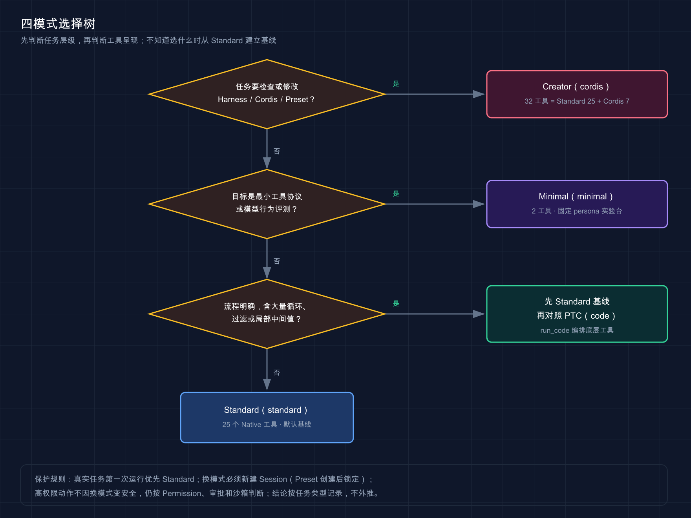

# 21 · 四种模式应该怎么选

> 📚 **系列导航**：前四篇已经分别拆开 [Standard](./17-standard-mode.md)、[PTC](./18-ptc-code-mode.md)、[Minimal](./19-minimal-mode.md) 和 [Creator](./20-creator-mode.md)。这一篇不再重复功能清单，而是回答真正影响日常使用的问题：当前任务应该选哪一个。

> [!WARNING] Developer Preview
> 固定版四种 Preset 均已完成 Session、Mock Provider 往返和真实 Provider 同任务回归，Step、工具动作、耗时、文件变化与测试均已对照。

先给结论：**不知道选什么，就用 Standard。**

PTC、Minimal 和 Creator 都不是从低到高的三个升级档位，而是针对不同问题改变工具呈现、提示词和运行时能力。模式选错，常见结果不是「跑慢一点」，而是用高权限工具做普通任务，或者为了评测而主动丢掉项目上下文。

**看完这一篇，你会拿到：**

- 一张四种 Preset 的固定版事实总表
- 按任务对象而不是模式名称做选择的方法
- Standard、PTC、Minimal 与 Creator 的优先场景
- 一棵可以直接照着走的选择树
- 一套普通编码任务的四模式公平回归方案
- 一套不混淆外层调用与内部动作的计数口径
- 知道何时应该新建 Session 换模式

---

## 01 四种模式先放到同一张表里

固定版 macOS 实测事实是：

| UI 名称 | Preset ID | 模型直接工具 | 核心变化 | 优先任务 |
|---|---|---:|---|---|
| 标准模式 | `standard` | 25 | 完整 Native 编码工具 | 通用开发 |
| PTC 模式 | `code` | 1 | `run_code` + 生成 SDK | 明确的多步编排 |
| 极简模式 | `minimal` | 2 | 固定 persona + 持久 Shell／编辑器 | 最小协议评测 |
| 创造模式 | `cordis` | 32 | Standard + 7 个 Cordis 工具 | 扩展 Harness |

Windows 上 Standard／Creator 的 `bash` 换成 `pwsh`，Minimal 的持久 `bash` 也换成持久 `pwsh`；这属于平台工具名变化，不改变选择逻辑。

四个数字不能直接排出能力强弱：

- PTC 只有一个直接入口，但内部仍可使用 Standard 底层能力。
- Minimal 只有两个工具，但 Shell 能承载多类系统动作。
- Creator 有 32 个 schema，但普通修 Bug 通常不需要 7 个 Cordis 工具。
- Standard 工具最多被直接看见，不代表每个任务都要全部调用。

如果只看工具数量，很容易把「Creator 有 32 个工具」理解成能力最强，把「Minimal 只有两个工具」理解成能力最弱。我安排同一个 Bug 的四模式实测后，这个排序站不住了：四种模式全部一次成功，改动和测试完全一致；Minimal 只是用了更多 Step，Creator 也没有因为工具最多而修得更好。从那以后我的选择不再依据名字和工具数量，普通编码任务先回到 Standard。

> 💡 **一句话总结**：工具数量描述调用面，不是排行榜；四种 Preset 解决的是四类不同问题。

---

## 02 第一问：任务对象到底是什么

选模式前先判断你要改变的是哪一层：

| 任务对象 | 典型问题 | 首选模式 |
|---|---|---|
| 普通项目代码 | 修 Bug、重构、写测试、跨文件功能 | Standard |
| 已知数据与步骤 | 批量读取、筛选、聚合、条件执行 | PTC |
| 模型与最小协议 | 工具选择、路径处理、字符串替换评测 | Minimal |
| Harness 本身 | Preset、Service、Event、Tool、UI Slot | Creator |

**类比：四种模式不是四辆马力不同的车，而是轿车、自动化流水线、实验台和维修车间。** 你不会因为维修车间工具最多，就把每天通勤搬到车间里完成。

如果一个任务同时落在两层，先拆开：

```text
普通项目中有大量机械步骤
→ 先确认项目目标与边界
→ Standard 建立正确基线
→ 再用 PTC 对照编排效率

要为 Harness 开发正式插件
→ Creator 检查和试验运行时契约
→ 常规项目工作流实现、测试与持久化源码
```

模式不应替代任务拆解。一个需求同时包含业务改动、生产部署和 Harness 插件开发时，应该拆成不同 Session，而不是寻找「全都能做」的万能模式。

> 💡 **一句话总结**：先确定任务作用在哪一层，再选工具呈现；跨层任务应拆分，不应靠高权限模式硬包在一起。

---

## 03 Standard：默认起点

Standard 最适合：

- 第一次进入陌生仓库。
- 需要边读、边测试、边决定下一步。
- 修改范围小，希望每个工具调用清楚可见。
- 任务可能使用 Skills、Goal、Subagent 或 Workflow。
- 需要一条可信的通用执行基线。

它的主要优势是透明：模型直接发出 `read`、`edit`、`bash` 等 Tool Call，审批和结果容易逐项检查。

它的主要代价是：多步依赖流程可能需要更多模型--工具往返，每次请求也要携带当前可见的原生工具 schema。

| 判断 | 选择 Standard |
|---|---|
| 不清楚下一步，要根据结果调整 | 是 |
| 只有一次或少量工具调用 | 是 |
| 希望轨迹容易人工审查 | 是 |
| 已知几十步机械流程 | 可以，但应对照 PTC |
| 目标是修改 Harness 运行时 | 不优先 |

**不知道选哪个时从 Standard 开始，不是保守，而是先建立可解释基线。** 只有真实轨迹显示往返、上下文或机械步骤成为瓶颈，才需要换模式。

> 💡 **一句话总结**：Standard 是通用基线和默认起点，适合需要根据每一步真实结果继续判断的任务。

---

## 04 PTC：流程明确时再程序化

PTC 与 Standard 共享底层能力，但模型直接入口只剩 `run_code`。它适合把独立读取、循环、过滤、分支和顺序依赖放进一段 TypeScript 程序。

优先考虑 PTC：

- 多份独立文件可以并行读取。
- 中间工具值只需在局部计算，不必全部进入模型历史。
- 步骤已经明确，模型不需要每次看完结果重新规划。
- 需要用循环或条件减少机械往返。

暂时留在 Standard：

- 陌生仓库的开放式探索。
- 每次测试结果都可能改变修复方向。
- 只有一个工具调用。
- 模型生成 TypeScript 的稳定性尚未建立。
- 审批者希望逐个直接查看模型 Tool Call。

PTC 的一个外层 `run_code` 可能包含多次 `tool/code-dispatch`。因此选择 PTC 的证据应是最终质量、Step、模型请求、总耗时和 usage，而不是「直接 Tool Call 从 5 个变成 1 个」。

> 💡 **一句话总结**：任务流程明确、局部数据处理多时对照 PTC；开放式推理和小任务仍优先 Standard。

---

## 05 Minimal：为了控制变量，不是为了日常省事

Minimal 同时删掉大部分工具、动态运行上下文、项目指令和 compaction，只保留固定 persona、持久 Shell 与字符串编辑器。

它适合回答：

- 模型能否在最小提示下主动确认目录。
- 模型能否只靠 Shell 与绝对路径编辑器完成任务。
- 失败来自模型、工具 schema，还是完整 Harness 的其他上下文。
- 同一个模型在最小协议与 Standard 下行为有何差异。

它不适合作为默认日常模式：

- 项目 AGENTS 指令不会自动进入提示词。
- 没有专门的搜索、图片、Skills、Plan、Goal、Subagent 等能力。
- 长会话没有该 Preset 自带的 compaction。
- 持久 Shell 状态本身又会引入目录和环境变量变量。

Minimal 工具少并不自动更安全。真正高风险的系统动作仍可能从 Shell 发出，权限与审批必须照常检查。

> 💡 **一句话总结**：Minimal 是实验台，不是轻量版 Standard；用它隔离变量，不用它代替完整项目工作流。

---

## 06 Creator：只有任务对象是 Harness 才打开

Creator 保留 Standard 全部能力，再增加 7 个 Cordis 工具和组合创作指导。

优先使用：

- 查询当前 Harness 的 Service、Event、Tool 或 Client Slot 契约。
- 创作或修改用户自有 Agent Preset。
- 在隔离进程临时定义并验证动态 Plugin。
- 检查 Host／Client 装载、审批与渲染失败。

不应因为以下理由使用：

- 「32 比 25 多，应该更强」。
- 普通项目缺一个文件编辑工具。
- 想让修 Bug 速度更快。
- 想绕过 Standard 的权限或审批。

动态 Host 代码被官方视为 Shell 级信任，运行中的 Package 还能改变后续工具和提示词。Creator 多出来的不只是 schema 成本，也是活运行时副作用和排错复杂度。

Creator 做出的动态 Package 不跨 DSH 重启保存，也不会自动变成正式源码。适合先 Inspect 和原型验证，长期交付仍要进入正常的文件、测试、版本控制与发布流程。

> 💡 **一句话总结**：Creator 是 Harness 开发模式，不是日常编码增强档；只有要检查或扩展运行时时才打开。

---

## 07 一棵可以直接使用的选择树

按下面顺序判断：

```text
任务是否要检查或修改 Harness／Cordis／Preset／运行时 UI？
├─ 是 → Creator
└─ 否
   └─ 目标是否是最小工具协议或模型行为评测？
      ├─ 是 → Minimal
      └─ 否
         └─ 流程是否已经明确，且包含大量循环、过滤或局部中间值？
            ├─ 是 → 先有 Standard 基线，再对照 PTC
            └─ 否 → Standard
```

再加四条保护规则：

1. 真实任务第一次运行优先 Standard，保留透明基线。
2. 换模式必须新建 Session，已经产生历史的 Session 不能热切换 Preset。
3. 高权限动作不会因为换了模式就变安全，仍按 Permission、审批和沙箱判断。
4. 模式结论按任务类型记录，不把一个小项目的结果外推到所有仓库。



这张图先判断任务层级，再判断工具呈现；不知道选什么时从 Standard 建立基线。

我现在的选择规则来自三组真实任务。普通单文件修 Bug 用 Standard，5 个 Step 就完成，没有必要换；需要把读取、编辑、测试编成程序时用 PTC，外层 3 次 `run_code` 就能组织 5 次内部动作；做工具面控制实验时用 Minimal，哪怕 11 个 Step 也接受；只有定义 `hello` 动态插件、检查 Package 和 Run 生命周期时才进 Creator。模式服务任务，不拿一套模式包打天下。

> 💡 **一句话总结**：Harness 开发选 Creator，协议评测选 Minimal，明确机械流程对照 PTC，其余从 Standard 开始。

---

## 08 动手：四模式跑同一个普通编码任务

为了比较通用编码行为，分别创建四个内容一致的项目副本：

```text
first-task-standard
first-task-code
first-task-minimal
first-task-cordis
```

每个副本执行前都必须确认：

```text
npm test：1 个失败、0 个通过
calculator.js：return a - b
Git／文件哈希：四份初始内容一致
```

分别新建四个 Session，只改变 Preset：

| 控制变量 | 四个 Session 必须相同 |
|---|---|
| Provider／Model／Reasoning | 是 |
| Permission | Workspace Write |
| 用户提示词 | 逐字相同 |
| 项目起始内容 | 是 |
| 网络与机器负载条件 | 尽量相同并记录 |
| 独立验收命令 | `npm test` |

统一提示词：

```text
修复当前项目唯一的测试失败。

先读取 package.json、calculator.js 和 calculator.test.js。只修改 calculator.js，不修改测试、package.json，不新增依赖。修改后实际运行 npm test，失败就根据真实输出继续修复。

最终汇报根因、修改文件、测试计数和退出结果。未运行的验证不得写成已通过。
```

普通编码任务中，Creator 不需要 `cordis_*`。如果模型调用它们，应记录为无关动作，而不是 Creator 的额外优势。

四份任务结束后，分别在对应目录独立运行：

```bash
npm test
```

最终质量标准完全一致：

```text
calculator.js：return a + b
修改文件：只有 calculator.js
测试：1 passed，0 failed
退出码：0
```

> 💡 **一句话总结**：公平回归只改变 Preset；Creator 的额外工具在普通任务里如果无关，就应保持不用。

---

## 09 用统一口径记录结果

四种模式的调用形态不同，必须同时记录外层与内部动作：

| 指标 | Standard | PTC | Minimal | Creator |
|---|---|---|---|---|
| 最终测试／修改文件 | 待测 | 待测 | 待测 | 待测 |
| Turn／Step／模型请求 | 待测 | 待测 | 待测 | 待测 |
| 直接 Tool Call | 待测 | 外层 `run_code` | 待测 | 待测 |
| 内部动作 | 原生工具 | `code-dispatch` | Shell 子命令／编辑器 | 原生工具／Cordis 调用 |
| 审批／拒绝 | 待测 | 待测 | 待测 | 待测 |
| 总耗时／TTFT | 待测 | 待测 | 待测 | 待测 |
| 输入／输出 Token | 待测 | 待测 | 待测 | 待测 |
| 人工纠正／重试 | 待测 | 待测 | 待测 | 待测 |
| 无关动作 | 待测 | 待测 | 待测 | 待测 |

这组普通任务只能回答「四个 Preset 处理一个小型明确 Bug 时怎样表现」，不能覆盖各自专长。还需要分开做模式原生任务：

| 模式 | 原生回归任务 |
|---|---|
| Standard | 陌生仓库探索后修复失败测试 |
| PTC | 多文件读取、筛选与条件执行 |
| Minimal | 绝对路径与唯一替换的最小协议评测 |
| Creator | Inspect、Define、Run、Self 检查与 Stop |

不同原生任务的指标不能直接放进一张速度排行榜。它们用于确认各模式在设计场景中是否工作，不用于宣布全局赢家。

G02 Mock Provider 只能支持工具面和生命周期事实。它不能提供模型选择、程序质量、任务成功率或真实 Token 成本。

四模式回归统一使用 `deepseek-official`、`deepseek-v4-flash`、`reasoning: high`、相同提示词和相同失败基线，每组都从新鲜副本开始。Standard 为 5 Step／约 9 秒，PTC 为 4 Step／3 次 `run_code`＋5 次内部 dispatch／约 9 秒，Minimal 为 11 Step／约 18 秒，Creator 为 5 Step／约 9 秒；四组都只改 `calculator.js`，测试 1/1，没有审批。我的结论不是排冠军，而是把 Standard 作为默认、PTC 用于机械编排、Minimal 用于控制变量、Creator 用于扩展 Harness。

> 💡 **一句话总结**：先统一质量标准，再展开各模式的真实内部动作；不要用表面调用数或不同任务的耗时制造排名。

---

## 小结

四种模式的选择可以收敛为九条：

1. Standard 是默认通用基线，不知道选什么就从它开始。
2. PTC 与 Standard 能力相近，差别是用 `run_code` 编排底层工具。
3. 流程明确、局部数据多时再对照 PTC，不预设它一定更快。
4. Minimal 同时缩小工具和提示词，用于控制变量与协议评测。
5. Minimal 有 Shell，不代表工具少就更安全。
6. Creator 是 Standard 加 7 个 Cordis 工具，只用于检查或扩展 Harness。
7. Creator 的动态代码是 Shell 级信任，不能当普通编码增强功能。
8. Preset 创建 Session 后锁定，换模式要新开 Session。
9. 四模式真实 Provider 回归已经完成；结果只支持按任务选模式，不支持发布全局质量、速度或成本排名。

你现在应该能根据任务对象、流程确定性与风险边界选择模式，而不是盯着工具数量猜强弱。

---

下一篇：[22 · 探索陌生仓库](./22-explore-repository.md)。选好 Standard 之后，下一步是在不改代码的前提下建立入口、数据流、测试和风险地图。
